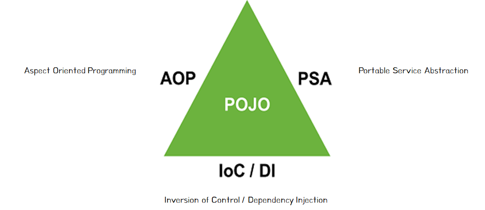

# POJO Plain Old Java Object

POJO란 직역하면 오래된 방식의 간단한 자바 오브젝트라는 의미로, Java로 생성하는 순수한 객체를 의미합니다. <br>
Spring에서 POJO는 IoC/DI, AOP, PSA를 통해 달성할 수 있습니다. <br>
<br>
객체 지향적인 원리에 충실하면서 환경과 기술에 종속되지 않고, 필요에 따라 재활용될 수 있는 방식으로 설계된 객체를 의미합니다. <br>
이러한 POJO에 애플리케이션의 핵심 로직과 기능을 담아 설계하고 개발하는 방법을 POJO 프로그래밍이라고 합니다. <br>

## [POJO 프로그래밍](https://ittrue.tistory.com/211)

POJO 프로그래밍은 POJO를 이용하여 프로그래밍 코드를 작성하는 것입니다. <br>
순수 자바 객체만을 사용한다고 해서 POJO 프로그래밍이라고 볼 수는 없고, 기본적인 규칙들을 지켜야 합니다. <br>

```java
✅ POJO 프로그래밍 규칙

1️⃣ Java나 Java 스펙에 정의된 것 이외에는 다른 기술이나 규약에 얽매이지 않아야 합니다.
자바 이외에 웹 프레임워크에서 지원하는 클래스 등을 사용하게 되면, 기술을 변경해야 할 때 객체지향 설계 기법을 적용하기 어려워지기 때문입니다.

2️⃣ 특정 환경에 종속적이지 않아야 합니다.
특정한 프레임워크에서만 동작이 가능하면 안된다는 의미로, 환경에 독립적이어야 합니다.
따라서 웹 기반의 환경 정보나 웹 기술을 담고 있는 클래스 또는 인터페이스를 사용하면 안됩니다.
```

## 목적

특적 환경이나 기술에 종속적이지 않기 때문에 재사용이 가능하고 확장 가능한 유연한 코드를 작성할 수 있습니다.<br>
저수준 레벨의 기술과 환경에 종속적인 코드를 제거하여 코드가 간결해지며 디버깅이 보다 편리해집니다. <br>
테스트 또한 단순해지며, **객체 지향적인 설계를 제한없이 적용할 수 있습니다.** <br>
