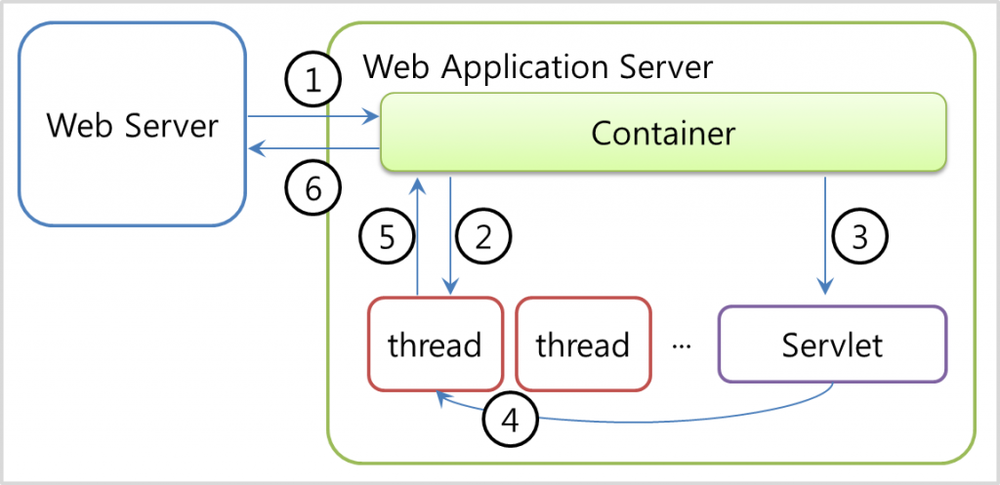

# [WS, WAS](https://velog.io/@bky373/Web-%EC%9B%B9-%EC%84%9C%EB%B2%84%EC%99%80-WAS)

서버란 네트워크를 통해 클라이언트에게 정보나 서비스를 제공하는 컴퓨터 시스템을 의미합니다. <br>

## WS (Web Server)

웹 서버는 인터넷을 기반으로 클라이언트에게 웹 서비스를 제공하는 컴퓨터를 의미합니다. <br>
클라이언트 입장에서는 웹 서버에게 URL 주소를 통해 HTTP 통신 규약에 맞게 요청하면 HTML 내용을 응답받게 됩니다. <br>
서버 입장에서는 HTTP 웹 요청이 들어왔을 때 알맞은 데이터를 만들어 응답하는데, 그 데이터는 웹에서 처리할 수 있는 HTML, CSS, js, jpg 등 정적인 데이터로 한정됩니다. <br>
대표적으로 Apache, Nginx 등이 있습니다. <br>

## WAS (Web Application Server)

웹 서버에서는 정적인 데이터만 다룰 수 있으므로, 이를 보완하기 비즈니스 로직 처리, DB 연동 등의 문제를 해결하기 위해 WAS가 등장하게 되었습니다. <br>
WAS는 웹 어플리케이션을 실행시켜 기능을 수행하고 그 결과를 웹 서버에 전달하는 일종의 미들웨어로, 동적인 데이터를 제공할 수 있습니다. <br>
웹 서버와 웹 컨테이너의 역할을 합친 형태로, 프로그램 실행 환경 설정, 데이터베이스 접속, 비즈니스 로직 수행 등을 맡습니다. <br>
대표적으로 Tomcat, JEUS, IBM WebSphere가 있습니다. <br>



```
✅ WAS의 내부구조
① 웹서버로 부터 요청이 들어오면 가장 먼저 컨테이너가 이를 알맞게 처리한다.
② 컨테이너는 배포서술자(web.xml)를 참조하여 해당 서블릿에 대한 스레드를 생성하고 요청(httpServletRequest) 및 응답(httpServeletResponse) 객체를 생성하여 전달한다.
③ 다음으로 컨테이너는 서블릿을 호출(service())한다.
④ 호출된 서블릿의 작업을 담당하게 된 스레드(미리 생성된 스레드)는 요청에 따라 doPost() 또는 doGet()을 호출한다.
⑤ 호출된 doPost() 또는 doGet() 메소드는 생성된 동적페이지를 Response객체에 실어서 컨테이너에 전달한다.
⑥ 컨테이너는 전달받은 Response객체를 HTTPResponse형태로 전환하여 웹서버에 전달하고 생성되었던 스레드를 종료하고 요청(httpServletRequest) 및 응답(httpServeletResponse) 객체를 소멸시킨다.
```
