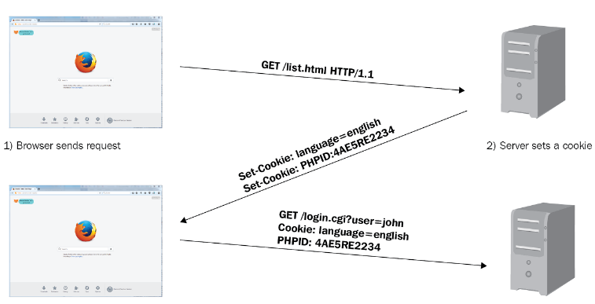
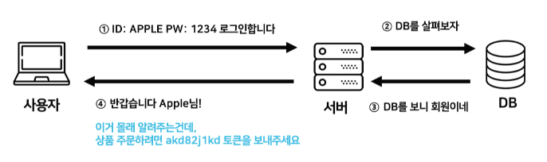
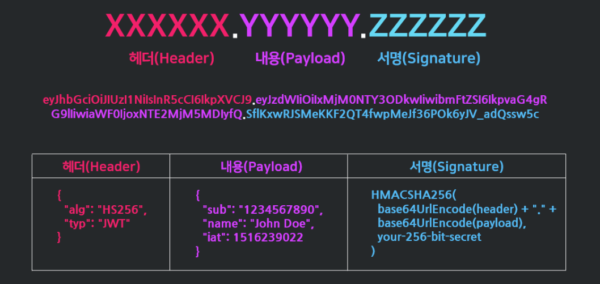

# [Cookie, Session, Token, JWT](https://inpa.tistory.com/entry/WEB-%F0%9F%93%9A-JWTjson-web-token-%EB%9E%80-%F0%9F%92%AF-%EC%A0%95%EB%A6%AC), Spring Security

## Cookie

쿠키란 클라이언트에 저장된 목적으로 생성한 key-value 형식의 문자열 덩어리를 의미합니다. <br>
HTTP는 Stateless 무상태, Connectionless 비연결성의 특성을 가지기 때문에, 상태 정보를 유지하기 위해 사용합니다. <br>
클라이언트가 서버에 요청을 보내면, 서버는 응답 헤더의 Set-Cookie에 정보를 담고, 이후 클라이언트는 매번 저장된 쿠키를 요청 헤더에 담아 보냅니다. <br>
서버는 쿠키에 담긴 정보를 바탕으로 클라이언트가 누군지 식별하거나 정보를 바탕으로 추천 광고를 띄울 수 있습니다. <br><br>

각 사용자의 고유 정보 유출 및 조작 위험이 있어 보안에 취약합니다. <br>
또한 용량 제한이 있고, 웹 브라우저 간 공유가 불가능합니다.<br>


## Session

쿠키와 같이 상태 정보를 유지하기 위한 목적으로 사용되지만, <br>
다른 점은 서버에서 클라이언트의 세션 ID를 부여하여 브라우저가 종료되기 전까지 상태 정보를 유지하게 됩니다. <br>
즉 브라우저가 아닌 서버 측에 인증 정보를 저장하고 관리합니다. <br><br>

유저가 웹사이트에 접속하면 세션이 서버 메모리에 저장되고, 부여된 Session ID를 브라우저 쿠키에 저장합니다.<br>
브라우저는 해당 사이트에 대한 모든 Request에 Session ID를 쿠키에 담아 전송하고, 서버는 그 값을 서버 메모리의 값과 비교하여 인증을 수행합니다. <br><br>

하지만 여전히 Session ID의 탈취 가능성이 있기 때문에 보안 문제가 남아있고,<br>
서버에서 세션 저장소를 사용하기 때문에 요청이 많아지면 서버에 부하가 심해질 수 있습니다. <br>

## Token

토큰 기반 인증 시스템은 클라이언트가 서버에 접속했을 때 인증되었다는 의미로 토큰을 부여받는 방식으로 진행됩니다. <br>
이 토큰은 유일한 값으로, 서버에서 클라이언트를 식별할 수 있는 값입니다. <br><br>

기존 세션 기반 인증은 서버 메모리에 세션 정보를 저장하고 이를 조회하는 과정으로 오버헤드가 발생하지만, <br>
토큰은 자체에 데이터가 들어있고 위조 판별만 하면 되기 때문에, 서버가 아닌 클라이언트에 저장되기 때문에 서버의 부담을 덜 수 있습니다.<br><br>

이 방식은 로그인 시 보편적으로 사용되는 방식입니다. <br>
사용자가 로그인을 하면 서버 측에서 토큰을 발생하고, 클라이언트에서는 이 토큰을 쿠키나 스토리지에 저장한 후 HTTP 요청 헤더에 포함시켜 매번 요청을 수행합니다. <br>
서버는 토큰을 검증하고 요청에 응답하게 됩니다. <br>
토큰 자체에 요청한 사람의 정보가 담겨 있기 때문에 DB를 조회하지 않고도 유저를 식별할 수 있습니다. <br><br>

하지만 토큰은 데이터 길이가 길어, 요청이 많아지면 네트워크 부하가 심해질 수 있습니다. <br>
또한 Payload 자체는 암호화되지 않기 때문에 유저의 중요한 정보를 담을 수 없습니다. <br>
토큰 탈취 위험성이 있기 때문에, 이를 대비하기 위해 사용 기간 제한을 설정하는 식으로 극복할 수 있습니다. <br>

## JWT (JSON Web Token)

JWT란 인증에 필요한 정보들을 암호화시킨 JSON 토큰을 의미합니다. <br>
JSON 데이터를 Base64 URL-safe Encode 방식으로 인코딩하여 직렬화한 것입니다. <br>
위변조 방지를 위한 개인키 전자서명도 포함되어 있어, 서버에서는 서명을 검증하는 과정을 거치게 됩니다.<br>


```
💡 Base64 URL-safe Encode
일반적인 Base64 Encode 에서 URL 에서 오류없이 사용하도록 '+', '/' 를 각각 '-', '_' 로 표현한 것이다.
```

JWT는 Header, Payload, Signature로 이루어져 있습니다. <br>
<br>

### Header

헤더에는 JWT에서 사용할 타입과 해시 알고리즘의 종류가 담겨 있습니다.<br>

```json
{
  "alg": "HS256", // 서명 암호화 알고리즘 ex. HMAC SHA256, RSA
  "typ": "JWT" // 토큰 유형
}
```

### Payload

페이로드에는 서버에서 첨부한 사용자 권한 정보와 데이터가 담겨 있습니다.<br>
서버와 클라이언트가 주고 받는 시스템에서 실제로 사용될 정보에 대한 내용을 담게 됩니다. <br>

```json
{
  "sub": "1234",
  "name": "JaeHui Kim",
  "iat": 1344534634
}
```

### Signature

시그니처 부분에는 Header, PayloadFmf Base64 URL-safe Encode를 한 이후 Header에 명시된 해시함수를 적용하고,<br>
개인키 Private key로 서명한 전자서명이 담겨 있습니다. <br>

```json
HMACSHA256(
  base54UrlEncode(header) + "." + base64UrlEncode(payload), 256-bit-secret-key
)
```

## Spring Security

Spring Security란 Spring 기반의 애플리케이션 보안, 특히 인증, 권한, 인가 등을 담당하는 스프링 하위 프레임워크입니다. <br>
Dispatcher Servlet 가기 전에 가장 먼저 URL 요청을 받게 되는 Filter에서 인증과 권한을 처리하고 있습니다. <br>
자체적으로 보안과 관련된 많은 옵션을 제공하기 때문에 개발자 입장에서 일일이 관련 로직을 작성하지 않아도 된다는 장점이 있습니다. <br>
<br>

```
💡 인증 Authentication
해당 사용자가 본인이 맞는지를 확인하는 절차

💡 인가 Authorization
인증된 사용자가 요청한 자원에 접근 가능한지를 결정하는 절차

즉, 인증 -> 성공 -> 인가 순서로 진행됩니다.
```
