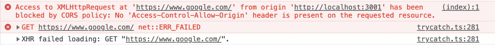

# [CORS](https://escapefromcoding.tistory.com/724) (Cross-Origin Resource Sharing)

CORS란 출처가 다른 자원들을 공유한다는 의미로, 한 출처에서 있는 다른 자원에서 다른 출처에 있는 다른 자원에 접근하도록 하는 개념입니다. <br>
웹 애플리케이션은 리소스가 자신의 출처, 즉 도메인, 프로토콜, 포트 등과 다를 때 CORS HTTP 요청을 실행합니다. <br>
<br>
위 URL에서 Protocol, Host, Port가 같으면 동일 출처(Origin)이라고 합니다. <br><br>

## 동일 출처 정책 Same-Origin Policy

초기 웹에서는 동일 출처, 다른 출처 모두 호출이 가능했습니다. <br>
이는 은행 계좌 거래 등 치명적인 보안 문제를 발생시킬 수 있기 때문에 동일 출처 정책이 등장하게 됩니다. <br>

동일 출처 정책이란 다른 출처로부터 조회된 자원들의 읽기 접근을 막아 다른 출처 공격을 예방합니다. <br>
하지만 이는 다른 출처 자원을 가져오는 것을 제한적으로 허용했기 때문에, 다른 출처 리소스에 접근성을 높이기 위해 CORS가 등장했습니다. <br>

## 다른 출처 정책 Cross-Origin Policy

1️⃣ 단순 요청 (Simple Request): GET, HEAD, POST 요청만 가능하며, Contet-Type 헤더는 application/x-www-form-urlencoded, multipart/form-data and text/plain만 가능합니다.<br>
<br>
특히 access-control-allow-origin은 헤더의 중요 요소 중 하나로, 어떤 요청을 허용할지 결정합니다.<br><br>

2️⃣ 프리 플라이트 (Prelight Rqeust): OPTIONS 메서드로 HTTP 요청을 미리 보내 실제 요청이 전송하기 안전한지 미리 확인합니다.<br>

```
💡 요청 헤더
origin : 어디서 요청을 했는지 서버에 알려주는 주소
access-control-request-method : 실제 요청이 보낼 HTTP 메서드
access-control-request-headers : 실제 요청에 포함된 header

💡 응답 헤더
access-control-allow-origin : 서버가 허용하는 출처
access-control-allow-methods : 서버가 허용하는 HTTP 메서드 리스트
access-control-allow-headers : 서버가 허용하는 header 리스트
access-control-max-age : 프리 플라이트 요청의 응답을 캐시에 저장하는 시간
```

3️⃣ 신용 요청 (Credentialed Request): 쿠키, 인증 헤더, TLS 클라이언트 읹으서 등의 신용 정보와 함께 요청합니다.<br>
기본적으로, CORS 정책은 다른 출처 요청에 인증정보 포함을 허용하지 않습니다. <br>
요청에 인증을 포함하는 플래그가 있거나 access-control-allow-credentials가 true로 설정 한다면 요청할 수 있습니다. <br><br>
