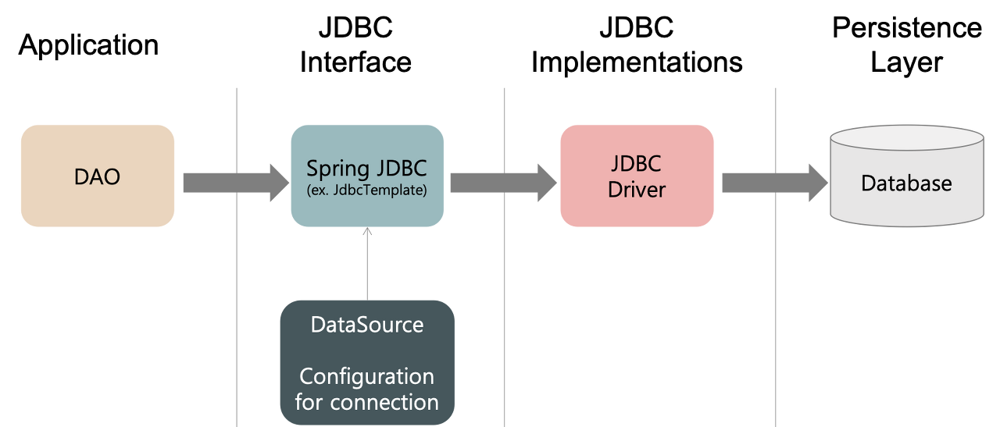
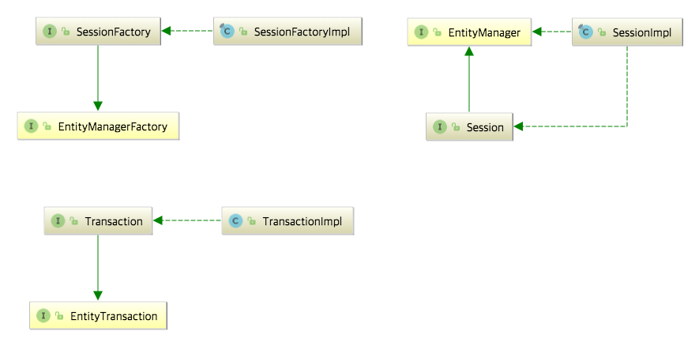

# SQL Mapper vs ORM

## JDBC (Java Database Connectivity)

JDBC는 DB에 접근할 수 있도록 Java에서 제공하는 API입니다.<br>
모든 Java Data Access 기술의 근간으로, 모든 Persistence Framework는 내부적으로 JDBC API를 사용합니다. <br>

<br>

Persistence Framework는 데이터를 데이터베이스에 저장하는 과정을 도와주고 자동화하는 매개 소프트웨어로,<br>
데이터를 가공하는 자바 객체 층과 데이터를 저장하는 데이터베이스 층 사이를 매끄럽게 연결하는 역할을 합니다. <br>
크게 SQL Mapper와 ORM으로 나뉩니다. <br>

```
💡 영속성 Persistence
데이터를 생성한 프로그램이 종료되더라도 사리지지 않는 데이터의 특성으로,
영속성을 갖지 않는 데이터는 단지 메모리에서만 존재하기 때문에 프로그램이 종료되면 모두 잃어버리게 됩니다.
따라서 파일 시스템, 관계형 데이터베이스 혹은 객체 데이터베이스 등을 활용하여 데이터를 영구적으로 저장하여 영속성을 부여해야 합니다.

💡 Persistence Layer
1️⃣ 프레젠테이션 계층(Presentation layer), UI계층
2️⃣ 애플리케이션 계층(Application layer), 서비스계층
3️⃣ 비즈니스 논리 계층(Business logic layer), 도메인계층
4️⃣ 데이터 접근 계층(Data access layer), 영속계층
```

## SQL Mapper - MyBatis

SQL Mapper란 Object와 SQL의 필드를 매핑하여 데이터를 객체화하는 기술입니다. <br>
객체와 테이블 간의 관계를 매핑하는 것이 아니라, SQL문을 직접 작성하고 쿼리 수행 결과를 어떠한 객체에 매핑할지 바인딩하는 방법입니다. <br>
대표적으로 JdbcTemplate, Mybatis가 있으며, DBMS에 종속적인 문제가 있다는 단점이 있습니다. <br><br>

MyBatis는 자바에서 SQL Mapper를 지원해주는 프레임워크로, SQL문을 직접 작성하여 쿼리 수행 결과를 객체화할 수 있습니다. <br>
쿼리문을 xml로 분리할 수 있으며 복잡한 쿼리를 작성할 수 있다는 장점이 있습니다. <br>
그러나 객체와 쿼리문을 모두 관리해야 하며, DB CRUD 메소드를 직접 다 구현해야 하는 번거로움이 있습니다. <br>

---

## ORM(Object Relational Mapping) - JPA(Java Persistence API)

ORM이란 Object와 DB 테이블을 매핑하여 데이터를 객체화하는 기술입니다. <br>
개발자가 반복적인 SQL을 직접 작성하지 않아도 되어 편리하며 DBMS에 종속적이지 않습니다. <br>
대표적으로 JPA가 있으며, 복잡한 쿼리의 경우 JPQL을 사용하거나 SQL Mapper를 혼용하여 사용 가능합니다. <br>

## JPA

JPA란 자바 어플리케이션에서 관계형 데이터베이스를 사용하는 방식을 정의한 인터페이스입니다. <br>
자바 ORM의 기술 표준으로, CRUD 메소드를 기본으로 제공합니다.<br>
쿼리를 직접 만들지 않아도 되며 객체 중심으로 개발이 가능합니다. <br>
쿼리가 수정되어 데이터 정보가 바뀌면 객체만 수정하면 되어 편리하지만, 복잡한 쿼리 작성이 어렵다는 단점이 있습니다. <br><br>

Spring Data JPA는 Spring에서 제공하는 모듈 중 하나로, 개발자가 JPA를 더 쉽고 편하게 사용할 수 있도록 도와줍니다. <br>
이는 JPA를 한 단계 추상화시킨 Repository라는 인터페이스를 제공함으로써 이루어집니다. <br>
사용자가 Repository 인터페이스에 정해진 규칙대로 메소드를 입력하면, Spring이 알아서 해당 메소드 이름에 적합한 쿼리를 날리는 구현체를 만들어서 Bean으로 등록해줍니다. <br>

### [Hibernate](https://suhwan.dev/2019/02/24/jpa-vs-hibernate-vs-spring-data-jpa/)

Hibernate는 JPA라는 명세의 구현체입니다. <br>
javax.persistence.EntityManager와 같은 인터페이스를 직접 구현한 라이브러리로, <br>
쉽게 말하면, JPA와 Hibernate는 마치 자바의 interface와 해당 interface를 구현한 class와 같은 관계입니다. <br>

<br>

위 사진은 JPA와 Hibernate의 상속 및 구현 관계를 나타낸 것입니다. <br>
JPA의 핵심인 EntityManagerFactory, EntityManager, EntityTransaction을 Hibernate에서는 <br>
각각 SessionFactory, Session, Transaction으로 상속받고 각각 Impl로 구현하고 있음을 확인할 수 있습니다.<br>

### 💡 [JPQL](https://ittrue.tistory.com/270) (Java Persistence Query Language) <br>

JPA는 SQL을 추상화한 JPQL이라는 객체 지향 쿼리 언어를 제공합니다.<br>
따라서 테이블을 대상으로 쿼리 하는 것이 아닌 엔티티 객체를 대상으로 쿼리하게 됩니다.<br>
JPQL은 SQL을 추상화했기 때문에 특정 데이터베이스 SQL에 의존하지 않는 장점이 있습니다.<br>
따라서 JPQL과 SQL의 가장 뚜렷한 차이점은 JPQL은 엔티티 객체를 대상으로 쿼리문을 작성하며, SQL은 데이터베이스 테이블을 대상으로 쿼리문을 작성하는 것입니다.<br>

```java
String username = "java";
String jpql = "select m from Member m where m.username = :username";

List<Member> result = em.createQuery(query, Member.class).getResultList();
```

JPQL은 기본 문자열로 작성되기 때문에 컴파일 시 에러를 발생하지 않는다는 단점이 있습니다.<br>
또한 동적으로 쿼리 언어를 작성하는 데 효율적이지 못합니다.<br><br>

### 💡 QueryDSL<br>

QueryDSL이란 정적 타입을 이용해서 SQL, JPQL을 코드로 작성할 수 있도록 도와주는 오픈소스 빌더 API입니다. <br>
하이버네이트 쿼리 언어(HQL: Hibernate Query Language)의 쿼리를 타입에 안전하게 생성 및 관리해주는 프레임워크입니다. <br>
JPQL의 단점을 보완하기 위해 등장하여 컴파일 시 오류를 발견하는 것이 가능하며, 복잡하고 동적인 쿼리 작성이 가능합니다. <br>

```java
String username = "java";

List<Member> result = queryFactory
        .select(member)
        .from(member)
        .where(usernameEq(username))
        .fetch();
```
