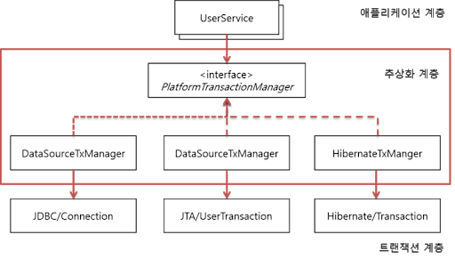

# [Transaction](https://mangkyu.tistory.com/154)

트랜잭션이란 여러 작업을 진행하다가 문제가 생겼을 경우 이전 상태로 롤백하기 위해 사용되는 것을 말합니다. <br>
더 이상 쪼갤 수 없는 최소 작업 단위이며, commit으로 성공하거나 또는 rollback으로 실패 이후 취소 되어야 합니다. <br>

```
💡 Transaction ACID

- 원자성 Atomicity: 트랜잭션 내의 작업들은 모두 성공 또는 모두 실패한다.
- 일관성 Consistency: 모든 트랜잭션은 일관성 있는 DB 상태를 유지한다. (ex: DB의 무결성 제약 조건 항상 만족)
- 격리성 Isolation: 동시에 실행되는 트랜잭션들은 서로 영향을 미치지 않는다. (ex: 동시에 같은 데이터 수정 X)
- 지속성 Durability: 트랜잭션이 성공적으로 끝나면 그 결과는 항상 기록되어야 한다.
```

스프링은 트랜잭션 관련 3가지 핵심 기술을 제공하고 있습니다. <br>

## 1. 트랜잭션 동기화

트랜잭션 동기화란 트랜잭션을 시작하기 위한 Connection 객체를 특별한 저장소에 보관해두고 필요할 때 꺼내쓸 수 있도록 하는 기술입니다. <br>
JDBC를 이용하는 개발자가 직접 여러 개의 작업을 하나의 트랜잭션으로 관리하려면 Connection 객체를 공유하는 등 불필요한 작업들이 생길 수 있습니다. <br>
따라서 이를 보완하기 위해 동기화 저장소는 작업 스레드마다 Connection 객체를 독립적으로 관리하고, 멀티스레드 환경에서도 충돌이 발생하지 않도록 합니다.<br>

```java
// 동기화 시작
TransactionSynchronizeManager.initSynchronization();
Connection c = DataSourceUtils.getConnection(dataSource);
... // 작업 진행
// 동기화 종료
DataSourceUtils.releaseConnection(c, dataSource);
TransactionSynchronizeManager.unbindResource(dataSource);
TransactionSynchronizeManager.clearSynchronization();
```

하지만 JDBC가 아닌 Hibernate와 같은 기술을 쓴다면

## 2. 트랜잭션 추상화

Spring은 트랜잭션 기술의 공통점을 담은 트랜잭션 추상화 기술을 제공하고 있습니다. <br>
이를 이용함으로써 애플리케이션에 각 기술마다(JDBC, JPA, Hibernate 등) 종속적인 코드를 이용하지 않고도 일관되게 트랜잭션을 처리할 수 있도록 해주고 있습니다. <br>

<br>

Spring이 제공하는 트랜잭션 경계 설정을 위한 추상 인터페이스는 PlatformTransactionManager입니다. <br>
예를 들어 만약 JDBC의 로컬 트랜잭션을 이용한다면 DataSourceTxManager를 이용하면 됩니다. <br>
이로써 사용하는 기술과 무관하게 PlatformTransactionManager를 통해 다음의 코드와 같이 트랜잭션을 공유하고, 커밋하고, 롤백할 수 있게 됩니다.<br>

```java
public Object invoke(MethodInvoation invoation) throws Throwable {
	TransactionStatus status = this.transactionManager.getTransaction(new DefaultTransactionDefinition());

	try {
		Object ret = invoation.proceed();
		this.transactionManager.commit(status);
		return ret;
	} catch (Exception e) {
		this.transactionManager.rollback(status);
		throw e;
	}
}
```

## 3. AOP를 이용한 트랜잭션 분리

Spring에서는 마치 트랜잭션 코드와 같은 부가 기능 코드가 존재하지 않는 것 처럼 보이기 위해 <br>
해당 로직을 클래스 밖으로 빼내서 별도의 모듈로 만드는 AOP(Aspect Oriented Programming, 관점 지향 프로그래밍)를 고안 및 적용할 수 있습니다.<br>
이를 적용한 트랜잭션 어노테이션(@Transactional)을 지원하게 되었다. 이를 적용하면 위와 같은 코드를 핵심 비지니스 로직만 다음과 같이 남길 수 있습니다.<br>

```java
@Service
@RequiredArgsConstructor
@Transactional
public class UserService {

   private final UserRepository userRepository;

   public void addUsers(List<User> userList) {
       for (User user : userList) {
           if (isEmailNotDuplicated(user.getEmail())) {
               userRepository.save(user);
           }
       }
   }
}
```
