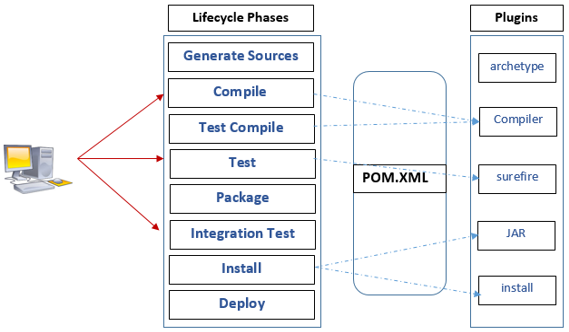

# [build tool](https://velog.io/@leesomyoung/Maven%EA%B3%BC-Gradle%EC%9D%98-%EC%B0%A8%EC%9D%B4-%EB%B0%8F-%EB%B9%84%EA%B5%90) - Maven vs Gradle

빌드란 소스코드 파일을 컴퓨터에서 실행할 수 있는 독립적인 형태로 변환하는 과정과 결과를 의미합니다. <br>
즉 작성한 소스코드와 파일 및 자원을 JVM이나 Tomcat과 같은 WAS가 인식할 수 있도록 패키징하는 과정 및 결과물을 나타냅니다. <br>
빌드 관리 도구란 이런 빌드 과정에서 필요한 라이브러리들을 자동으로 관리해주는 도구로, 다음과 같은 작업을 수행합니다. <br>

1. 종속성 다운로드 - 전처리(Preprocessing)
2. 소스코드를 바이너리 코드로 컴파일(Compile)
3. 바이너리 코드를 패키징(Packaging)
4. 테스트 실행(Testing)
5. 프로덕션 시스템에 배포(distribution)

## Maven

Maven은 Java 전용 프로젝트 관리 도구로, Lifecycle 관리 목적 빌드 도구이며, Apache Ant의 대안으로 만들어졌습니다. <br>
아파치 라이센스로 배포되는 오프 소스 소프트웨어이고, pom.xml에 종속 관계를 명시합니다. <br>
<br>
clean - validate - compile - test - package - verify - install - site - deploy의 라이프 사이클을 가집니다. <br>

```
💡 Maven Lifecycle
(1) clean : 빌드 시 생성되어있었던 파일들을 삭제한다.
(2) validate : 프로젝트가 올바른지 확인하고 필요한 모든 정보를 사용할 수 있는지 확인하는 단계
(3) compile : 프로젝트 소스코드를 컴파일 하는 단계
(4) test : 단위 테스트를 수행하는 단계. 테스트 실패 시 빌드 실패로 처리하며, 스킵이 가능하다.
(5) package : 실제 컴파일된 소스 코드와 리소스들을 jar, war 등의 파일의 배포를 위한 패키지로 만든다.
(6) verify : 통합 테스트 결과에 대한 검사를 실행하여 품질 기준을 충족하는지 확인한다.
(7) site : 프로젝트 문서와 사이트 작성, 생성하는 단계
(8) deploy : 만들어진 package를 원격 저장소에 release하는 단계
```

## Gradle

Gradle은 Maven을 대체할 수 있는 프로젝트 구성 관리 및 범용 빌드 툴입니다. <br>
Ant Builder와 Groovy script를 기반으로 구축되어 기존 Ant의 역할과 배포 스크립트의 기능 모두 사용 가능하며, SpringBoot와 Android에서 주로 사용됩니다. <br>
Maven에 비해 빌드 속도가 10~100배 가량 빠르며, Java, C/C++, Python 등을 지원합니다. <br>

```
✅ Groovy
Groovy는 JVM에서 실행되는 스크립트 언어로, JVM에서 동작하지만 소스코드를 컴파일할 필요 없다는 특징을 가집니다.
Java와 호환되며, Java class file들을 Groovy class로 사용 가능합니다.
Java 문법과 유사하여 빌드 처리를 관리할 수 있습니다.
```

Gradle을 사용할 경우 간결한 정의가 가능하여 가독성이 좋습니다. <br>
설정 주입 방식(Configuration Injection)을 사용하기 때문에 재사용에 용이하고 멀티 프로젝트에 유리합니다. <br>

```
💡 Maven vs Gradle
Gradle은 작업 의존성 그래프에 기반, Maven은 고정적이고 선형적인 단계의 모델에 기반한다는 빌드 접근 방식의 차이점이 있습니다.
Gradle은 캐시를 사용하기 때문에 Maven보다 속도가 훨씬 빠릅니다.
Maven은 멀티 프로젝트에서 특정 설정을 다른 모듈에서 사용하려면 상속 받아야하지만, Gradle은 설정 주입 방식을 사용하므로 멀티 프로젝트에 적합합니다.
```
