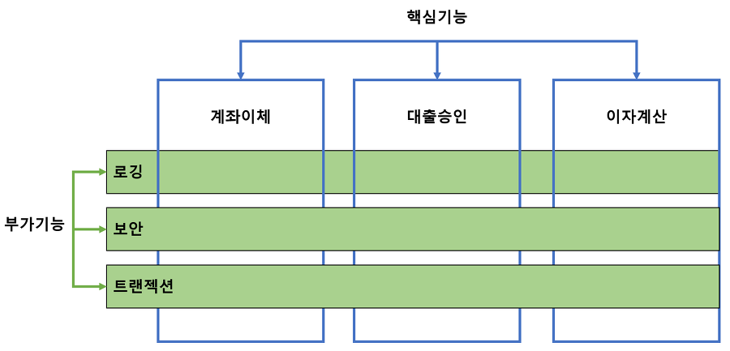

# Filter vs Interceptor vs AOP

애플리케이션을 개발할 때 세션 및 권한 체크, XSS 방어, 분기처리, 로그, 페이지 인코딩 변환 등 공통 업무에 관련된 중복된 코드가 많아질 수 있습니다. <br>
이는 프로젝트가 커질수록 서버에 부하를 줄 수 있고 소스 코드 관리가 어렵습니다. <br>
따라서 공통 부분을 따로 빼서 관리해야 할 필요성이 있습니다. <br><br>

[공통 처리](https://goddaehee.tistory.com/154)를 위해 활용할 수 있는 것에는 3가지가 있습니다. <br>

1. Filter
2. Interceptor
3. AOP

<br>
위 그림과 같이 요청이 들어오면 Filter -> Servlet -> Interceptor -> AOP 순서로 실행됩니다. <br>
init -> doFilter -> preJandler -> postHandler -> after Completion -> do Filter -> destroy<br>

## Filter

Filter는 요청과 응답을 거른 뒤 정제하는 역할을 합니다. <br>
DispatcherServlet 이전 혹은 맨 마지막에 실행되기 때문에 <br>
요청 내용 변경, 전처리 또는 응답 내용 변경, 인코딩 변환, XSS 방어 등을 수행할 수 있습니다. <br><br>

WAS 구동 시 FilterMap이라는 배열에 등록되고, 실행 시 Filter chain을 구성하여 순차적으로 실행됩니다. <br>
Spring Context 외부에 존재하여 Spring과 무관한 자원에 대해 동작합니다. <br>
일반적으로 web.xml에서 설정하며, 예외 발생 시 Web Applicatio에서 예외 처리를 합니다. <br>

```java
✅ Filter 실행 메소드
- init(): 필터 인스턴스 초기화
- doFilter(): 실제 처리 로직
- destroy(): 필터 인스턴스 종료
```

## Interceptor

Interceptor는 요청에 대한 작업 전/후를 가로채서(끼어들어) 기능을 수행하게 됩니다. <br>
Spring Context 내부에서 Controller의 요청과 응답에 관여하며 모든 Bean에 접근이 가능합니다. <br>
로그인 체크, 권한 체크, 로그 확인 등의 작업을 주로 수행합니다. <br><br>

일반적으로 servlet-context.xml에서 설정하며, 예외 발생 시 @ControllerAdvice에서 @ExceptionHandler를 사용해 예외 처리를 합니다. <br>

```java
✅ Interceptor 실행 메소드
- preHandler(): Controller 실행 전
- postHandler(): Controller 실행 후
- afterCompetion(): view Rendering 후
```

```
💡 Filter vs Interceptor
- Filter는 WAS단에 설정되어 Spring과 무관한 자원에 대해 동작하고, Interceptor는 Spring Context 내부에 설정되어 컨트롤러 접근 전, 후에 가로채서 기능을 수행합니다.
Filter는 doFilter() 메소드만 있지만, Interceptor는 pre와 post로 명확하게 분리되어 있습니다.
Interceptor는 handlerMethod(@RequestMapping을 사용해 매핑 된 @Controller의 메소드)를 파라미터로 제공하여 메소드 시그니처 등 추가 정보를 파악해 로직 실행 여부 판단 가능하기 때문에 AOP와 유사하게 구현할 수 있습니다.
```

## AOP(Aspect Oriented Programming)

AOP란 OOP를 보완하기 위해 나온 개념으로, 관점(종단면)을 기준으로 묶어 개발하는 방식을 의미합니다. <br>
관점이란 어떤 기능을 구현할 때 그 기능을 핵심 기능과 부가 기능으로 구분해 각각을 하나의 관점으로 보는 것을 의미합니다. <br><br>

핵심 기능은 비즈니스 로직을 구현하는 과정에서 비즈니스 로직이 처리하려는 목적 기능을 말합니다 <br>
클라이언트로부터 요청을 받아 DB에 저장하고, 정보를 조회하는 비즈니스 로직을 구현하는 코드가 핵심 기능이라고 할 수 있습니다. <br>
<br>
실제 애플리케이션을 개발할 때 핵심 기능에 부가 기능을 추가해야 할 상황이 생깁니다. <br>
예를 들어 핵심 기능인 비즈니스 로직 사이에 로깅 처리를 하거나 트랜잭션을 처리하는 코드 또는 데이터베이스 연결, 파일 입출력 등이 있습니다. <br><br>

부가 기능은 핵심 기능이 어떤 기능인지에 무관하게 로직이 수행되기 전 또는 후에 수행되도록 함으로서,<br>
소스 코드에서 여러번 반복해서 쓰는 코드, 즉 흩어진 관심사(Corcern)을 Aspect로 모듈화하여 핵심 로직에서 분리하고 재사용이 용이하도록 합니다. <br>
모듈화된 객체를 편하게 적용할 수 있게 함으로써 개발자가 비즈니스 로직을 구현하는 데만 집중할 수 있게 도와줍니다. <br>

```
💡 Aspect란?
부가 기능을 정의한 Advice와 어드바이스를 어디에 적용할지 결정하는 PointCut을 합친 개념입니다.
AOP 개념을 적용하면 핵심 기능 코드 사이에 침투된 부가 기능을 독립적인 Aspect로 구분하고, 런타임 싱 필요한 위치에 동적으로 참여하게 할 수 있습니다.

📝 Target: Aspect를 적용하는 곳 ex. Class, Method
📝 Advice: 실질적으로 수행해야 하는 기능을 담은 구현체
📝 JoinPoint: Advice가 적용될 위치로,메소드 직입, 생성자 호출 등의 끼어들 수 있는 지점을 말합니다.
📝 PointCut: JoinPoint의 상세 스펙을 정의하여 구체적으로 Advice가 실행될 지점을 지정합니다.
📝 Weaving: PointCut에 의해 결정된 Target의 JointPoint에 Advice를 삽입하는 과정을 의미합니다.
```

### Spring AOP

AOP를 구현하는 방법은 컴파일 과정에 삽입하는 방식, 바이트코드를 메모리에 로드하는 과정에 삽입하는 방식, Proxy 패턴을 이용한 방식, 총 3가지로 나뉩니다. <br>
이 중 스프링은 Proxy 패넡을 통해 AOP 기능을 제공합니다. <br>
접근 제어 및 부가 기능 추가를 위한 Target 객체에 대한 프록시 객체를 런타임 시 생성하여 제공합니다. <br>
프록시가 타겟 객체의 호출을 가로채 Advice 수행 전/후 핵심 로직을 호출합니다. <br>
스프링 Bean에만 AOP가 적용 가능하고, Method JoinPoint만 지원하여 메소드가 호출되는 런타임 시점에만 Advice 적용이 가능합니다 <br>
