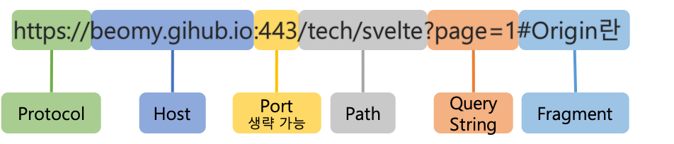

# Spring

## [WS, WAS](https://velog.io/@bky373/Web-%EC%9B%B9-%EC%84%9C%EB%B2%84%EC%99%80-WAS)

서버란 네트워크를 통해 클라이언트에게 정보나 서비스를 제공하는 컴퓨터 시스템을 의미합니다. <br>

### WS (Web Server)

웹 서버는 인터넷을 기반으로 클라이언트에게 웹 서비스를 제공하는 컴퓨터를 의미합니다. <br>
클라이언트 입장에서는 웹 서버에게 URL 주소를 통해 HTTP 통신 규약에 맞게 요청하면 HTML 내용을 응답받게 됩니다. <br>
서버 입장에서는 HTTP 웹 요청이 들어왔을 때 알맞은 데이터를 만들어 응답하는데, 그 데이터는 웹에서 처리할 수 있는 HTML, CSS, js, jpg 등 정적인 데이터로 한정됩니다. <br>
대표적으로 Apache, Nginx 등이 있습니다. <br>

### WAS (Web Application Server)

웹 서버에서는 정적인 데이터만 다룰 수 있으므로, 이를 보완하기 비즈니스 로직 처리, DB 연동 등의 문제를 해결하기 위해 WAS가 등장하게 되었습니다. <br>
WAS는 웹 어플리케이션을 실행시켜 기능을 수행하고 그 결과를 웹 서버에 전달하는 일종의 미들웨어로, 동적인 데이터를 제공할 수 있습니다. <br>
웹 서버와 웹 컨테이너의 역할을 합친 형태로, 프로그램 실행 환경 설정, 데이터베이스 접속, 비즈니스 로직 수행 등을 맡습니다. <br>
대표적으로 Tomcat, JEUS, IBM WebSphere가 있습니다. <br>


```
✅ WAS의 내부구조
① 웹서버로 부터 요청이 들어오면 가장 먼저 컨테이너가 이를 알맞게 처리한다.
② 컨테이너는 배포서술자(web.xml)를 참조하여 해당 서블릿에 대한 스레드를 생성하고 요청(httpServletRequest) 및 응답(httpServeletResponse) 객체를 생성하여 전달한다.
③ 다음으로 컨테이너는 서블릿을 호출(service())한다.
④ 호출된 서블릿의 작업을 담당하게 된 스레드(미리 생성된 스레드)는 요청에 따라 doPost() 또는 doGet()을 호출한다.
⑤ 호출된 doPost() 또는 doGet() 메소드는 생성된 동적페이지를 Response객체에 실어서 컨테이너에 전달한다.
⑥ 컨테이너는 전달받은 Response객체를 HTTPResponse형태로 전환하여 웹서버에 전달하고 생성되었던 스레드를 종료하고 요청(httpServletRequest) 및 응답(httpServeletResponse) 객체를 소멸시킨다.
```

---

## Spring Security ([Cookie, Session, Token, JWT](https://inpa.tistory.com/entry/WEB-%F0%9F%93%9A-JWTjson-web-token-%EB%9E%80-%F0%9F%92%AF-%EC%A0%95%EB%A6%AC))

### Cookie

쿠키란 클라이언트에 저장된 목적으로 생성한 key-value 형식의 문자열 덩어리를 의미합니다. <br>
HTTP는 Stateless 무상태, Connectionless 비연결성의 특성을 가지기 때문에, 상태 정보를 유지하기 위해 사용합니다. <br>
클라이언트가 서버에 요청을 보내면, 서버는 응답 헤더의 Set-Cookie에 정보를 담고, 이후 클라이언트는 매번 저장된 쿠키를 요청 헤더에 담아 보냅니다. <br>
서버는 쿠키에 담긴 정보를 바탕으로 클라이언트가 누군지 식별하거나 정보를 바탕으로 추천 광고를 띄울 수 있습니다. <br><br>

각 사용자의 고유 정보 유출 및 조작 위험이 있어 보안에 취약합니다. <br>
또한 용량 제한이 있고, 웹 브라우저 간 공유가 불가능합니다.<br>


### Session

쿠키와 같이 상태 정보를 유지하기 위한 목적으로 사용되지만, <br>
다른 점은 서버에서 클라이언트의 세션 ID를 부여하여 브라우저가 종료되기 전까지 상태 정보를 유지하게 됩니다. <br>
즉 브라우저가 아닌 서버 측에 인증 정보를 저장하고 관리합니다. <br><br>

유저가 웹사이트에 접속하면 세션이 서버 메모리에 저장되고, 부여된 Session ID를 브라우저 쿠키에 저장합니다.<br>
브라우저는 해당 사이트에 대한 모든 Request에 Session ID를 쿠키에 담아 전송하고, 서버는 그 값을 서버 메모리의 값과 비교하여 인증을 수행합니다. <br><br>

하지만 여전히 Session ID의 탈튀 가능성이 있기 때문에 보안 문제가 남아있고,<br>
서버에서 세션 저장소를 사용하기 때문에 요청이 많아지면 서버에 부하가 심해질 수 있습니다. <br>

### Token

토큰 기반 인증 시스템은 클라이언트가 서버에 접속했을 때 인증되었다는 의미로 토큰을 부여받는 방식으로 진행됩니다. <br>
이 토큰은 유일한 값으로, 서버에서 클라이언트를 식별할 수 있는 값입니다. <br><br>

기존 세션 기반 인증은 서버 메모리에 세션 정보를 저장하고 이를 조회하는 과정으로 오버헤드가 발생하지만, <br>
토큰은 자체에 데이터가 들어있고 위조 판별만 하면 되기 때문에, 서버가 아닌 클라이언트에 저장되기 때문에 서버의 부담을 덜 수 있습니다.<br><br>

이 방식은 로그인 시 보편적으로 사용되는 방식입니다. <br>
사용자가 로그인을 하면 서버 측에서 토큰을 발생하고, 클라이언트에서는 이 토큰을 쿠키나 스토리지에 저장한 후 HTTP 요청 헤더에 포함시켜 매번 요청을 수행합니다. <br>
서버는 토큰을 검증하고 요청에 응답하게 됩니다. <br>
토큰 자체에 요청한 사람의 정보가 담겨 있기 때문에 DB를 조회하지 않고도 유저를 식별할 수 있습니다. <br><br>

하지만 토큰은 데이터 길이가 길어, 요청이 많아지면 네트워크 부하가 심해질 수 있습니다. <br>
또한 Payload 자체는 암호화되지 않기 때문에 유저의 중요한 정보를 담을 수 없습니다. <br>
토큰 탈취 위험성이 있기 때문에, 이를 대비하기 위해 사용 기간 제한을 설정하는 식으로 극복할 수 있습니다. <br>

### JWT (JSON Web Token)

JWT란 인증에 필요한 정보들을 암호화시킨 JSON 토큰을 의미합니다. <br>
JSON 데이터를 Base64 URL-safe Encode 방식으로 인코딩하여 직렬화한 것입니다. <br>
위변조 방지를 위한 개인키 전자서명도 포함되어 있어, 서버에서는 서명을 검증하는 과정을 거치게 됩니다.<br>


```
💡 Base64 URL-safe Encode
일반적인 Base64 Encode 에서 URL 에서 오류없이 사용하도록 '+', '/' 를 각각 '-', '_' 로 표현한 것이다.
```

JWT는 Header, Payload, Signature로 이루어져 있습니다. <br>
<br>

#### Header

헤더에는 JWT에서 사용할 타입과 해시 알고리즘의 종류가 담겨 있습니다.<br>

```json
{
  "alg": "HS256", // 서명 암호화 알고리즘 ex. HMAC SHA256, RSA
  "typ": "JWT" // 토큰 유형
}
```

#### Payload

페이로드에는 서버에서 첨부한 사용자 권한 정보와 데이터가 담겨 있습니다.<br>
서버와 클라이언트가 주고 받는 시스템에서 실제로 사용될 정보에 대한 내용을 담게 됩니다. <br>

```json
{
  "sub": "1234",
  "name": "JaeHui Kim",
  "iat": 1344534634
}
```

#### Signature

시그니처 부분에는 Header, PayloadFmf Base64 URL-safe Encode를 한 이후 Header에 명시된 해시함수를 적용하고,<br>
개인키 Private key로 서명한 전자서명이 담겨 있습니다. <br>

```json
HMACSHA256(
  base54UrlEncode(header) + "." + base64UrlEncode(payload), 256-bit-secret-key
)
```

### Spring Security

Spring Security란 Spring 기반의 애플리케이션 보안, 특히 인증, 권한, 인가 등을 담당하는 스프링 하위 프레임워크입니다. <br>
Dispatcher Servlet 가기 전에 가장 먼저 URL 요청을 받게 되는 Filter에서 인증과 권한을 처리하고 있습니다. <br>
자체적으로 보안과 관련된 많은 옵션을 제공하기 때문에 개발자 입장에서 일일이 관련 로직을 작성하지 않아도 된다는 장점이 있습니다. <br>
<br>

```
💡 인증 Authentication
해당 사용자가 본인이 맞는지를 확인하는 절차

💡 인가 Authorization
인증된 사용자가 요청한 자원에 접근 가능한지를 결정하는 절차

즉, 인증 -> 성공 -> 인가 순서로 진행됩니다.
```

---

## [CORS](https://escapefromcoding.tistory.com/724) (Corss-Origin Resource Sharing)

CORS란 출처가 다른 자원들을 공유한다는 의미로, 한 출처에서 있는 다른 자원에서 다른 출처에 있는 다른 자원에 접근하도록 하는 개념입니다. <br>
웹 애플리케이션은 리소스가 자신의 출처, 즉 도메인, 프로토콜, 포트 등과 다를 때 CORS HTTP 요청을 실행합니다. <br>
<br>
위 URL에서 Protocol, Host, Port가 같으면 동일 출처(Origin)이라고 합니다. <br><br>

### 동일 출처 정책 Same-Origin Policy

초기 웹에서는 동일 출처, 다른 출처 모두 호출이 가능했습니다. <br>
이는 은행 계좌 거래 등 치명적인 보안 문제를 발생시킬 수 있기 때문에 동일 출처 정책이 등장하게 됩니다. <br>

동일 출처 정책이란 다른 출처로부터 조회된 자원들의 읽기 접근을 막아 다른 출처 공격을 예방합니다. <br>
하지만 이는 다른 출처 자원을 가져오는 것을 제한적으로 허용했기 때문에, 다른 출처 리소스에 접근성을 높이기 위해 CORS가 등장했습니다. <br>

### 다른 출처 정책 Cross-Origin Policy

1️⃣ 단순 요청 (Simple Request): GET, HEAD, POST 요청만 가능하며, Contet-Type 헤더는 application/x-www-form-urlencoded, multipart/form-data and text/plain만 가능합니다.<br>
<br>
특히 access-control-allow-origin은 헤더의 중요 요소 중 하나로, 어떤 요청을 허용할지 결정합니다.<br><br>

2️⃣ 프리 플라이트 (Prelight Rqeust): OPTIONS 메서드로 HTTP 요청을 미리 보내 실제 요청이 전송하기 안전한지 미리 확인합니다.<br>

```
💡 요청 헤더
origin : 어디서 요청을 했는지 서버에 알려주는 주소
access-control-request-method : 실제 요청이 보낼 HTTP 메서드
access-control-request-headers : 실제 요청에 포함된 header

💡 응답 헤더
access-control-allow-origin : 서버가 허용하는 출처
access-control-allow-methods : 서버가 허용하는 HTTP 메서드 리스트
access-control-allow-headers : 서버가 허용하는 header 리스트
access-control-max-age : 프리 플라이트 요청의 응답을 캐시에 저장하는 시간
```

3️⃣ 신용 요청 (Credentialed Request): 쿠키, 인증 헤더, TLS 클라이언트 읹으서 등의 신용 정보와 함께 요청합니다.<br>
기본적으로, CORS 정책은 다른 출처 요청에 인증정보 포함을 허용하지 않습니다. <br>
요청에 인증을 포함하는 플래그가 있거나 access-control-allow-credentials가 true로 설정 한다면 요청할 수 있습니다. <br><br>

---

## SQL Mapper vs ORM

### JDBC (Java Database Connectivity)

JDBC는 DB에 접근할 수 있도록 Java에서 제공하는 API입니다.<br>
모든 Java Data Access 기술의 근간으로, 모든 Persistence Framework는 내부적으로 JDBC API를 사용합니다. <br>

<br>

Persistence Framework는 데이터를 데이터베이스에 저장하는 과정을 도와주고 자동화하는 매개 소프트웨어로,<br>
데이터를 가공하는 자바 객체 층과 데이터를 저장하는 데이터베이스 층 사이를 매끄럽게 연결하는 역할을 합니다. <br>
크게 SQL Mapper와 ORM으로 나뉩니다. <br>

```
💡 영속성 Persistence
데이터를 생성한 프로그램이 종료되더라도 사리지지 않는 데이터의 특성으로,
영속성을 갖지 않는 데이터는 단지 메모리에서만 존재하기 때문에 프로그램이 종료되면 모두 잃어버리게 됩니다.
따라서 파일 시스템, 관계형 데이터베이스 혹은 객체 데이터베이스 등을 활용하여 데이터를 영구적으로 저장하여 영속성을 부여해야 합니다.

💡 Persistence Layer
1️⃣ 프레젠테이션 계층(Presentation layer), UI계층
2️⃣ 애플리케이션 계층(Application layer), 서비스계층
3️⃣ 비즈니스 논리 계층(Business logic layer), 도메인계층
4️⃣ 데이터 접근 계층(Data access layer), 영속계층
```

### SQL Mapper - MyBatis

SQL Mapper란 Object와 SQL의 필드를 매핑하여 데이터를 객체화하는 기술입니다. <br>
객체와 테이블 간의 관계를 매핑하는 것이 아니라, SQL문을 직접 작성하고 쿼리 수행 결과를 어떠한 객체에 매핑할지 바인딩하는 방법입니다. <br>
대표적으로 JdbcTemplate, Mybatis가 있으며, DBMS에 종속적인 문제가 있다는 단점이 있습니다. <br><br>

MyBatis는 자바에서 SQL Mapper를 지원해주는 프레임워크로, SQL문을 직접 작성하여 쿼리 수행 결과를 객체화할 수 있습니다. <br>
쿼리문을 xml로 분리할 수 있으며 복잡한 쿼리를 작성할 수 있다는 장점이 있습니다. <br>
그러나 객체와 쿼리문을 모두 관리해야 하며, DB CRUD 메소드를 직접 다 구현해야 하는 번거로움이 있습니다. <br>

---

### ORM(Object Relational Mapping) - JPA(Java Persistence API)

ORM이란 Object와 DB 테이블을 매핑하여 데이터를 객체화하는 기술입니다. <br>
개발자가 반복적인 SQL을 직접 작성하지 않아도 되어 편리하며 DBMS에 종속적이지 않습니다. <br>
대표적으로 JPA가 있으며, 복잡한 쿼리의 경우 JPQL을 사용하거나 SQL Mapper를 혼용하여 사용 가능합니다. <br>

### JPA

JPA란 자바 어플리케이션에서 관계형 데이터베이스를 사용하는 방식을 정의한 인터페이스입니다. <br>
자바 ORM의 기술 표준으로, CRUD 메소드를 기본으로 제공합니다.<br>
쿼리를 직접 만들지 않아도 되며 객체 중심으로 개발이 가능합니다. <br>
쿼리가 수정되어 데이터 정보가 바뀌면 객체만 수정하면 되어 편리하지만, 복잡한 쿼리 작성이 어렵다는 단점이 있습니다. <br><br>

Spring Data JPA는 Spring에서 제공하는 모듈 중 하나로, 개발자가 JPA를 더 쉽고 편하게 사용할 수 있도록 도와줍니다. <br>
이는 JPA를 한 단계 추상화시킨 Repository라는 인터페이스를 제공함으로써 이루어집니다. <br>
사용자가 Repository 인터페이스에 정해진 규칙대로 메소드를 입력하면, Spring이 알아서 해당 메소드 이름에 적합한 쿼리를 날리는 구현체를 만들어서 Bean으로 등록해줍니다. <br>

### [Hibernate](https://suhwan.dev/2019/02/24/jpa-vs-hibernate-vs-spring-data-jpa/)

Hibernate는 JPA라는 명세의 구현체입니다. <br>
javax.persistence.EntityManager와 같은 인터페이스를 직접 구현한 라이브러리로, <br>
쉽게 말하면, JPA와 Hibernate는 마치 자바의 interface와 해당 interface를 구현한 class와 같은 관계입니다. <br>

<br>

위 사진은 JPA와 Hibernate의 상속 및 구현 관계를 나타낸 것입니다. <br>
JPA의 핵심인 EntityManagerFactory, EntityManager, EntityTransaction을 Hibernate에서는 <br>
각각 SessionFactory, Session, Transaction으로 상속받고 각각 Impl로 구현하고 있음을 확인할 수 있습니다.<br>

#### 💡 [JPQL](https://ittrue.tistory.com/270) (Java Persistence Query Language) <br>

JPA는 SQL을 추상화한 JPQL이라는 객체 지향 쿼리 언어를 제공합니다.<br>
따라서 테이블을 대상으로 쿼리 하는 것이 아닌 엔티티 객체를 대상으로 쿼리하게 됩니다.<br>
JPQL은 SQL을 추상화했기 때문에 특정 데이터베이스 SQL에 의존하지 않는 장점이 있습니다.<br>
따라서 JPQL과 SQL의 가장 뚜렷한 차이점은 JPQL은 엔티티 객체를 대상으로 쿼리문을 작성하며, SQL은 데이터베이스 테이블을 대상으로 쿼리문을 작성하는 것입니다.<br>

```java
String username = "java";
String jpql = "select m from Member m where m.username = :username";

List<Member> result = em.createQuery(query, Member.class).getResultList();
```

JPQL은 기본 문자열로 작성되기 때문에 컴파일 시 에러를 발생하지 않는다는 단점이 있습니다.<br>
또한 동적으로 쿼리 언어를 작성하는 데 효율적이지 못합니다.<br><br>

#### 💡 QueryDSL<br>

QueryDSL이란 정적 타입을 이용해서 SQL, JPQL을 코드로 작성할 수 있도록 도와주는 오픈소스 빌더 API입니다. <br>
하이버네이트 쿼리 언어(HQL: Hibernate Query Language)의 쿼리를 타입에 안전하게 생성 및 관리해주는 프레임워크입니다. <br>
JPQL의 단점을 보완하기 위해 등장하여 컴파일 시 오류를 발견하는 것이 가능하며, 복잡하고 동적인 쿼리 작성이 가능합니다. <br>

```java
String username = "java";

List<Member> result = queryFactory
        .select(member)
        .from(member)
        .where(usernameEq(username))
        .fetch();
```

---

## [Transaction](https://mangkyu.tistory.com/154)

트랜잭션이란 여러 작업을 진행하다가 문제가 생겼을 경우 이전 상태로 롤백하기 위해 사용되는 것을 말합니다. <br>
더 이상 쪼갤 수 없는 최소 작업 단위이며, commit으로 성공하거나 또는 rollback으로 실패 이후 취소 되어야 합니다. <br>

```
💡 Transaction ACID

- 원자성 Atomicity: 트랜잭션 내의 작업들은 모두 성공 또는 모두 실패한다.
- 일관성 Consistency: 모든 트랜잭션은 일관성 있는 DB 상태를 유지한다. (ex: DB의 무결성 제약 조건 항상 만족)
- 격리성 Isolation: 동시에 실행되는 트랜잭션들은 서로 영향을 미치지 않는다. (ex: 동시에 같은 데이터 수정 X)
- 지속성 Durability: 트랜잭션이 성공적으로 끝나면 그 결과는 항상 기록되어야 한다.
```

스프링은 트랜잭션 관련 3가지 핵심 기술을 제공하고 있습니다. <br>

### 1. 트랜잭션 동기화

트랜잭션 동기화란 트랜잭션을 시작하기 위한 Connection 객체를 특별한 저장소에 보관해두고 필요할 때 꺼내쓸 수 있도록 하는 기술입니다. <br>
JDBC를 이용하는 개발자가 직접 여러 개의 작업을 하나의 트랜잭션으로 관리하려면 Connection 객체를 공유하는 등 불필요한 작업들이 생길 수 있습니다. <br>
따라서 이를 보완하기 위해 동기화 저장소는 작업 스레드마다 Connection 객체를 독립적으로 관리하고, 멀티스레드 환경에서도 충돌이 발생하지 않도록 합니다.<br>

```java
// 동기화 시작
TransactionSynchronizeManager.initSynchronization();
Connection c = DataSourceUtils.getConnection(dataSource);
... // 작업 진행
// 동기화 종료
DataSourceUtils.releaseConnection(c, dataSource);
TransactionSynchronizeManager.unbindResource(dataSource);
TransactionSynchronizeManager.clearSynchronization();
```

하지만 JDBC가 아닌 Hibernate와 같은 기술을 쓴다면

### 2. 트랜잭션 추상화

Spring은 트랜잭션 기술의 공통점을 담은 트랜잭션 추상화 기술을 제공하고 있습니다. <br>
이를 이용함으로써 애플리케이션에 각 기술마다(JDBC, JPA, Hibernate 등) 종속적인 코드를 이용하지 않고도 일관되게 트랜잭션을 처리할 수 있도록 해주고 있습니다. <br>

<br>

Spring이 제공하는 트랜잭션 경계 설정을 위한 추상 인터페이스는 PlatformTransactionManager입니다. <br>
예를 들어 만약 JDBC의 로컬 트랜잭션을 이용한다면 DataSourceTxManager를 이용하면 됩니다. <br>
이로써 사용하는 기술과 무관하게 PlatformTransactionManager를 통해 다음의 코드와 같이 트랜잭션을 공유하고, 커밋하고, 롤백할 수 있게 됩니다.<br>

```java
public Object invoke(MethodInvoation invoation) throws Throwable {
	TransactionStatus status = this.transactionManager.getTransaction(new DefaultTransactionDefinition());

	try {
		Object ret = invoation.proceed();
		this.transactionManager.commit(status);
		return ret;
	} catch (Exception e) {
		this.transactionManager.rollback(status);
		throw e;
	}
}
```

### 3. AOP를 이용한 트랜잭션 분리

Spring에서는 마치 트랜잭션 코드와 같은 부가 기능 코드가 존재하지 않는 것 처럼 보이기 위해 <br>
해당 로직을 클래스 밖으로 빼내서 별도의 모듈로 만드는 AOP(Aspect Oriented Programming, 관점 지향 프로그래밍)를 고안 및 적용할 수 있습니다.<br>
이를 적용한 트랜잭션 어노테이션(@Transactional)을 지원하게 되었다. 이를 적용하면 위와 같은 코드를 핵심 비지니스 로직만 다음과 같이 남길 수 있습니다.<br>

```java
@Service
@RequiredArgsConstructor
@Transactional
public class UserService {

   private final UserRepository userRepository;

   public void addUsers(List<User> userList) {
       for (User user : userList) {
           if (isEmailNotDuplicated(user.getEmail())) {
               userRepository.save(user);
           }
       }
   }
}
```

---

## [Cache](https://kchanguk.tistory.com/145)

캐싱(Caching)은 애플리케이션의 처리 속도를 높여줍니다. <br>
이미 가져온 데이터나 계산된 결과값의 복사본을 저장함으로써 처리 속도를 향상시키며, 이를 통해 향후 요청을 더 빠르게 처리할 수 있습니다. <br>
대부분의 프로그램이 동일한 데이터나 명령어에 반복해서 엑세스하기 때문에 캐싱은 효율적인 아키텍처 패턴입니다.<br>

```
💡 cache hit
참조하려는 데이터가 캐시에 존재할 때 cache hit라고 합니다.
💡 cache miss
참조하려는 데이터가 캐시에 존재 하지 않을 때 cache miss라고 합니다.
💡cache hit ratio(캐시 히트율)
(cache hit 횟수)/(전체참조횟수) = (cache hit 횟수)/(cache hit 횟수 + cache miss 횟수)
```

### [Local Cache](https://velog.io/@qotndus43/Cache)

Local Cache는 서버마다 캐시를 따로 저장하는 방식으로, Memory, Disk와 같은 로컬 서버 장비의 Resource를 이용합니다. <br>
<br>
서버 내에서 작동하기 때문에 속도가 빠른 장점이 있지만, 다른 서버의 캐시를 참조하기 어렵다는 단점도 존재합니다. <br>
캐시에 저장된 데이터가 변경되는 경우에는 해당 서버를 제외한 모든 peer에 변경사항을 전달하고 복사하는 과정을 거칩니다.<br>
이 때문에 WAS 인스턴스가 늘어나고, 만약 캐시 저장 데이터 크기가 커지면 성능이 저하되기도 합니다.<br>

#### Ehcache

EhCache는 Spring에서 사용 가능한 자바 기반 오픈 소스 기반의 Local Cache입니다. <br>
기본 JVM메모리에 저장되어, 레디스처럼 별도의 서버 설치 없이 가볍게 사용하기 편리합니다. <br>
EHcache는 로컬캐시로서 특정 서버에 종속되기 때문에, 멀티 서버 환경에서는 데이터 싱크가 필요합니다. <br>
따라서 동기화가 속도에 영향을 줄 수 있고, 데이터 유실 가능성이 있다는 단점이 있습니다. <br>

```java
@Cacheable: 캐시할 수 있는 메소드를 지정
@CachePut: 메소드 실행에 영향을 주지 않고 캐시를 갱신
@CacheEvict: 캐시에서 오래되거나 사용하지 않는 데이터를 제거하는 메소드를 지정, void 반환형에서만 사용 가능
@Caching 어노테이션을 여러 개 사용할 때 사용
```

### Global Cache - Redis

Global Cache는 여러 서버에서 캐시 서버에 접근하여 참조하는 방법입니다. <br>
별도의 캐시 서버를 이용하기 때문에 서버 간 데이터 공유가 쉽고 데이터를 분산하여 저장할 수 있습니다. <br>
<br>
하지만 네트워크 트래픽을 사용해야 해서 Local Cache보다는 속도가 느립니다. <br>
Local Cache와 다르게 캐시에 저장된 데이터가 변경되더라도 추가적인 작업이 별도로 필요하지 않습니다.<br>

#### Redis

Redis란 Key, Value 구조의 비정형 데이터를 저장하고 관리하기 위한 오픈 소스 기반의 비관계형 데이터 베이스 관리 시스템 (DBMS)입니다. <br>
데이터베이스, 캐시, 메세지 브로커로 사용되며 인메모리 데이터 구조를 가진 저장소입니다.<br>

```
✅ 캐시 서버 구현 패턴
💡 Look aside cache
1. 클라이언트가 데이터를 요청
2. 웹서버는 데이터가 존재하는지 Cache 서버에 먼저 확인
3. Cache 서버에 데이터가 있으면 DB에 데이터를 조회하지 않고 Cache 서버에 있는 결과값을 클라이언트에게 바로 반환 (Cache Hit)
4. Cache 서버에 데이터가 없으면 DB에 데이터를 조회하여 Cache 서버에 저장하고 결과값을 클라이언트에게 반환 (Cache Miss)

💡 Write Back
1. 웹서버는 모든 데이터를 Cache 서버에 저장
2. Cache 서버에 특정 시간 동안 데이터가 저장됨
3. Cache 서버에 있는 데이터를 DB에 저장
4. DB에 저장된 Cache 서버의 데이터를 삭제
```

---

## [build tool](https://velog.io/@leesomyoung/Maven%EA%B3%BC-Gradle%EC%9D%98-%EC%B0%A8%EC%9D%B4-%EB%B0%8F-%EB%B9%84%EA%B5%90) - Maven vs Gradle

빌드란 소스코드 파일을 컴퓨터에서 실행할 수 있는 독립적인 형태로 변환하는 과정과 결과를 의미합니다. <br>
즉 작성한 소스코드와 파일 및 자원을 JVM이나 Tomcat과 같은 WAS가 인식할 수 있도록 패키징하는 과정 및 결과물을 나타냅니다. <br>
빌드 관리 도구란 이런 빌드 과정에서 필요한 라이브러리들을 자동으로 관리해주는 도구로, 다음과 같은 작업을 수행합니다. <br>

1. 종속성 다운로드 - 전처리(Preprocessing)
2. 소스코드를 바이너리 코드로 컴파일(Compile)
3. 바이너리 코드를 패키징(Packaging)
4. 테스트 실행(Testing)
5. 프로덕션 시스템에 배포(distribution)

### Maven

Maven은 Java 전용 프로젝트 관리 도구로, Lifecycle 관리 목적 빌드 도구이며, Apache Ant의 대안으로 만들어졌습니다. <br>
아파치 라이센스로 배포되는 오프 소스 소프트웨어이고, pom.xml에 종속 관계를 명시합니다. <br>
<br>
clean - validate - compile - test - package - verify - install - site - deploy의 라이프 사이클을 가집니다. <br>

```
💡 Maven Lifecycle
(1) clean : 빌드 시 생성되어있었던 파일들을 삭제한다.
(2) validate : 프로젝트가 올바른지 확인하고 필요한 모든 정보를 사용할 수 있는지 확인하는 단계
(3) compile : 프로젝트 소스코드를 컴파일 하는 단계
(4) test : 단위 테스트를 수행하는 단계. 테스트 실패 시 빌드 실패로 처리하며, 스킵이 가능하다.
(5) package : 실제 컴파일된 소스 코드와 리소스들을 jar, war 등의 파일의 배포를 위한 패키지로 만든다.
(6) verify : 통합 테스트 결과에 대한 검사를 실행하여 품질 기준을 충족하는지 확인한다.
(7) site : 프로젝트 문서와 사이트 작성, 생성하는 단계
(8) deploy : 만들어진 package를 원격 저장소에 release하는 단계
```

### Gradle

Gradle은 Maven을 대체할 수 있는 프로젝트 구성 관리 및 범용 빌드 툴입니다. <br>
Ant Builder와 Groovy script를 기반으로 구축되어 기존 Ant의 역할과 배포 스크립트의 기능 모두 사용 가능하며, SpringBoot와 Android에서 주로 사용됩니다. <br>
Maven에 비해 빌드 속도가 10~100배 가량 빠르며,Java, C/C++, Python 등을 지원합니다. <br>

```
✅ Groovy
Groovy는 JVM에서 실행되는 스크립트 언언로, JVM에서 동작하지만 소스코드를 컴파일할 필요 없다는 특징을 가집니다.
Java와 호환되며, Java class file들을 Groovy class로 사용 가능합니다.
Java 문법과 유사하여 빌드 처리를 관리할 수 있습니다.
```

Gradle을 사용할 경우 간결한 정의가 가능하여 가독성이 좋습니다. <br>
설정 주입 방식(Configuration Injection)을 사용하기 때문에 재사용에 용이하고 멀티 프로젝트에 유리합니다. <br>

```
💡 Maven vs Gradle
Gradle은 작업 의존성 그래프에 기반, Maven은 고정적이고 선형적인 단계의 모델에 기반한다는 빌드 접근 방식의 차이점이 있습니다.
Gradle은 캐시를 사용하기 때문에 Maven보다 속도가 훨씬 빠릅니다.
Maven은 멀티 프로젝트에서 특정 설정을 다른 모듈에서 사용하려면 상속 받아야하지만, Gradle은 설정 주입 방식을 사용하므로 멀티 프로젝트에 적합합니다.
```

---

## Filter vs Interceptor vs AOP

애플리케이션을 개발할 때 세션 및 권한 체크, XSS 방어, 분기처리, 로그, 페이지 인코딩 변환 등 공통 업무에 관련된 중복된 코드가 많아질 수 있습니다. <br>
이는 프로젝트가 커질수록 서버에 부하를 줄 수 있고 소스 코드 관리가 어렵습니다. <br>
따라서 공통 부분을 따로 빼서 관리해야 할 필요성이 있습니다. <br><br>

[공통 처리](https://goddaehee.tistory.com/154)를 위해 활용할 수 있는 것에는 3가지가 있습니다. <br>

1. Filter
2. Interceptor
3. AOP

<br>
위 그림과 같이 요청이 들어오면 Filter -> Servlet -> Interceptor -> AOP 순서로 실행됩니다. <br>
init -> doFilter -> preJandler -> postHandler -> after Completion -> do Filter -> destroy<br>

### Filter

Filter는 요청과 응답을 거른 뒤 정제하는 역할을 합니다. <br>
DispatcherServlet 이전 혹은 맨 마지막에 실행되기 때문에 <br>
요청 내용 변경, 전처리 또는 응답 내용 변경, 인코딩 변환, XSS 방어 등을 수행할 수 있습니다. <br><br>

WAS 구동 시 FilterMap이라는 배열에 등록되고, 실행 시 Filter chain을 구성하여 순차적으로 실행됩니다. <br>
Spring Context 외부에 존재하여 Spring과 무관한 자원에 대해 동작합니다. <br>
일반적으로 web.xml에서 설정하며, 예외 발생 시 Web Applicatio에서 예외 처리를 합니다. <br>

```java
✅ Filter 실행 메소드
- init(): 필터 인스턴스 초기화
- doFilter(): 실제 처리 로직
- destroy(): 필터 인스턴스 종료
```

### Interceptor

Interceptor는 요청에 대한 작업 전/후를 가로채서(끼어들어) 기능을 수행하게 됩니다. <br>
Spring Context 내부에서 Controller의 요청과 응답에 관여하며 모든 Bean에 접근이 가능합니다. <br>
로그인 체크, 권한 체크, 로그 확인 등의 작업을 주로 수행합니다. <br><br>

일반적으로 servlet-context.xml에서 설정하며, 예외 발생 시 @ControllerAdvice에서 @ExceptionHandler를 사용해 예외 처리를 합니다. <br>

```java
✅ Interceptor 실행 메소드
- preHandler(): Controller 실행 전
- postHandler(): Controller 실행 후
- afterCompetion(): view Rendering 후
```

```
💡 Filter vs Interceptor
- Filter는 WAS단에 설정되어 Spring과 무관한 자원에 대해 동작하고, Interceptor는 Spring Context 내부에 설정되어 컨트롤러 접근 전, 후에 가로채서 기능을 수행합니다.
Filter는 doFilter() 메소드만 있지만, Interceptor는 pre와 post로 명확하게 분리되어 있습니다.
Interceptor는 handlerMethod(@RequestMapping을 사용해 매핑 된 @Controller의 메소드)를 파라미터로 제공하여 메소드 시그니처 등 추가 정보를 파악해 로직 실행 여부 판단 가능하기 때문에 AOP와 유사하게 구현할 수 있습니다.
```

### AOP(Aspect Oriented Programming)

AOP란 OOP를 보완하기 위해 나온 개념으로, 관점(종단면)을 기준으로 묶어 개발하는 방식을 의미합니다. <br>
관점이란 어떤 기능을 구현할 때 그 기능을 핵심 기능과 부가 기능으로 구분해 각각을 하나의 관점으로 보는 것을 의미합니다. <br><br>

핵심 기능은 비즈니스 로직을 구현하는 과정에서 비즈니스 로직이 처리하려는 목적 기능을 말합니다 <br>
클라이언트로부터 요청을 받아 DB에 저장하고, 정보를 조회하는 비즈니스 로직을 구현하는 코드가 핵심 기능이라고 할 수 있습니다. <br>
<br>
실제 애플리케이션을 개발할 때 핵심 기능에 부가 기능을 추가해야 할 상황이 생깁니다. <br>
예를 들어 핵심 기능인 비즈니스 로직 사이에 로깅 처리를 하거나 트랜잭션을 처리하는 코드 또는 데이터베이스 연결, 파일 입출력 등이 있습니다. <br><br>

부가 기능은 핵심 기능이 어떤 기능인지에 무관하게 로직이 수행되기 전 또는 후에 수행되도록 함으로서,<br>
소스 코드에서 여러번 반복해서 쓰는 코드, 즉 흩어진 관심사(Corcern)을 Aspect로 모듈화하여 핵심 로직에서 분리하고 재사용이 용이하도록 합니다. <br>
모듈화된 객체를 편하게 적용할 수 있게 함으로써 개발자가 비즈니스 로직을 구현하는 데만 집중할 수 있게 도와줍니다. <br>

```
💡 Aspect란?
부가 기능을 정의한 Advice와 어드바이스를 어디에 적용할지 결정하는 PointCut을 합친 개념입니다.
AOP 개념을 적용하면 핵심 기능 코드 사이에 침투된 부가 기능을 독립적인 Aspect로 구분하고, 런타임 싱 필요한 위치에 동적으로 참여하게 할 수 있습니다.

📝 Target: Aspect를 적용하는 곳 ex. Class, Method
📝 Advice: 실질적으로 수행해야 하는 기능을 담은 구현체
📝 JoinPoint: Advice가 적용될 위치로,메소드 직입, 생성자 호출 등의 끼어들 수 있는 지점을 말합니다.
📝 PointCut: JoinPoint의 상세 스펙을 정의하여 구체적으로 Advice가 실행될 지점을 지정합니다.
📝 Weaving: PointCut에 의해 결정된 Target의 JointPoint에 Advice를 삽입하는 과정을 의미합니다.
```

#### Spring AOP

AOP를 구현하는 방법은 컴파일 과정에 삽입하는 방식, 바이트코드를 메모리에 로드하는 과정에 삽입하는 방식, Proxy 패턴을 이용한 방식, 총 3가지로 나뉩니다. <br>
이 중 스프링은 Proxy 패넡을 통해 AOP 기능을 제공합니다. <br>
접근 제어 및 부가 기능 추가를 위한 Target 객체에 대한 프록시 객체를 런타임 시 생성하여 제공합니다. <br>
프록시가 타겟 객체의 호출을 가로채 Advice 수행 전/후 핵심 로직을 호출합니다. <br>
스프링 Bean에만 AOP가 적용 가능하고, Method JoinPoint만 지원하여 메소드가 호출되는 런타임 시점에만 Advice 적용이 가능합니다 <br>
