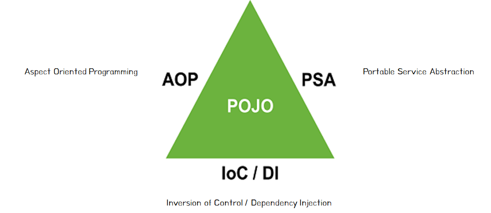
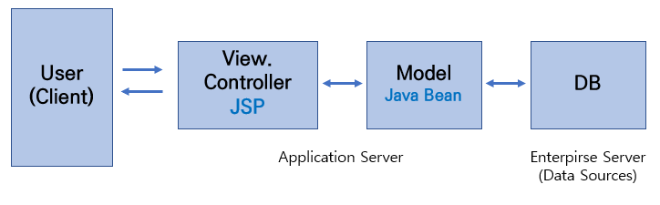

# Spring

## POJO Plain Old Java Object

POJO란 직역하면 오래된 방식의 간단한 자바 오브젝트라는 의미로, Java로 생성하는 순수한 객체를 의미합니다. <br>
Spring에서 POJO는 IoC/DI, AOP, PSA를 통해 달성할 수 있습니다. <br>
<br>
객체 지향적인 원리에 충실하면서 환경과 기술에 종속되지 않고, 필요에 따라 재활용될 수 있는 방식으로 설계된 객체를 의미합니다. <br>
이러한 POJO에 애플리케이션의 핵심 로직과 기능을 담아 설계하고 개발하는 방법을 POJO 프로그래밍이라고 합니다. <br>

### [POJO 프로그래밍](https://ittrue.tistory.com/211)

POJO 프로그래밍은 POJO를 이용하여 프로그래밍 코드를 작성하는 것입니다. <br>
순수 자바 객체만을 사용한다고 해서 POJO 프로그래밍이라고 볼 수는 없고, 기본적인 규칙들을 지켜야 합니다. <br>

```java
✅ POJO 프로그래밍 규칙

1️⃣ Java나 Java 스펙에 정의된 것 이외에는 다른 기술이나 규약에 얽매이지 않아야 합니다.
자바 이외에 웹 프레임워크에서 지원하는 클래스 등을 사용하게 되면, 기술을 변경해야 할 때 객체지향 설계 기법을 적용하기 어려워지기 때문입니다.

2️⃣ 특정 환경에 종속적이지 않아야 합니다.
특정한 프레임워크에서만 동작이 가능하면 안된다는 의미로, 환경에 독립적이어야 합니다.
따라서 웹 기반의 환경 정보나 웹 기술을 담고 있는 클래스 또는 인터페이스를 사용하면 안됩니다.
```

### 목적

특적 환경이나 기술에 종속적이지 않기 때문에 재사용이 가능하고 확장 가능한 유연한 코드를 작성할 수 있습니다.<br>
저수준 레벨의 기술과 환경에 종속적인 코드를 제거하여 코드가 간결해지며 디버깅이 보다 편리해집니다. <br>
테스트 또한 단순해지며, **객체 지향적인 설계를 제한없이 적용할 수 있습니다.** <br>

---

## IoC Inversion of Control 제어의 역전

IoC란 직역하면 제어의 역전이라는 의미로, 제어권이 사용자에게 있지 않고 프레임워크에 있는 것을 의미합니다. <br>
객체의 생성부터 생명 주기의 관리까지 모든 객체에 대한 제어권이 바뀐 것으로, 대부분의 프레임워크에서 사용하는 방법입니다. <br>
개발자는 프레임워크에 필요한 부분을 개발해서 끼워 넣기의 형태로 조립하는 방식의 개발을 하게 됩니다. <br>
이렇게 조립된 코드의 최종 호출은 프레임워크 내부에서 결정된 대로 이루어지는 것을 제어의 역전이라고 표현합니다. <br
Spring Framework에서 지원하는 IoC Container는 POJO의 생명주기를 관리하며, 생성된 인스텐스들에게 추가적인 기능들을 제공합니다. <br>

```
💡 Library vs Framework
- IoC가 적용된 것을 Framework라고 합니다.
- 라이브러리는 애플리케이션의 흐름을 개발자가 직업 제어하고, 동작 중에 필요한 기능이 있을 때 능동적으로 라이브러리를 사용하는 형태입니다.
- 프레임워크는 애플리케이션 코드가 프레임워크에 의해 사용됩니다.
- 프레임워크 위에 개발한 클래스를 등록한 뒤, 프레임워크가 흐름을 주도하는 중에 개발자가 만든 애플리케이션 코드를 사용하도록 만드는 방식입니다.
```

---

## DI Dependency Injection 의존성 주입

DI란 Spring Framework에서 지원하는 IoC의 형태입니다. <Br>
클래스 사이의 의존관계를 Bean 설정 정보를 바탕으로 컨테이너가 자동적으로 연결해주는 것을 의미합니다. <br>
개발자는 제어를 직접 담당할 필요 없이, Bean 설정 파일에 의존 관계가 필요하다는 정보를 추가하는 형태로 구현하게 됩니다. <br>
Container가 실행 흐름의 주체가 되어 애플리케이션 코드에 의존 관계를 주입해주게 됩니다. <br>

```
✅ 의존성 Dependency 란?
현재 객체가 다른 객체와 상호작용, 즉 참조하고 있다면 다른 객체들을 현재 객체의 의존이라고 합니다.

⛔️ 의존성이 위험한 이유
하나의 모듈이 바뀌면 의존한 다른 모듈까지 변경되어야 합니다.
Unit Test 목적 자체가 다른 모듈로부터 독립적으로 테스트하는 것을 요구하기 때문에,
테스트 가능한 어플을 만들 때 의존성이 있으면 Unit Test 작성이 어렵습니다.
```

`new` 키워드를 사용해 다른 모듈을 초기화하지 않기 위해서는, 객체 생성은 다른 곳에서 하고 이미 생성된 객체를 참조하는 식으로 구현하게 됩니다. <br>
DI는 IoC 개념을 바탕으로 하여, 클래스가 외부로부터 의존성을 가져야 합니다. <br>

```
💡 DI가 필요한 이유
클래스 재사용 가능성을 높이고, 다른 클래스와 독립적으로 클래스를 테스트할 수 있도록 합니다.
비즈니스 로직의 특정 구현이 아닌 클래스를 생성하는 데 매우 효과적입니다.
```

### [DI의 3가지 방법](https://www.nextree.co.kr/p11247/)

1️⃣ 생성자 삽입 Contructor Injection<br>
필요한 의존성을 모두 포함하는 클래스의 생성자를 만들고 그 생성자를 통해 의존성을 주입합니다. <br>
즉 생성자에 파라미터를 만들어두고 이를 통해 DI 컨테이너가 의존할 객체의 참조를 넘겨주는 방식입니다. <br><br>

```
✅ 생성자 주입의 장점
💡 순환 참조 방지 가능
생성자 주입은 생성자로 객체를 생성하는 시점에 생성자의 인자에 사용되는 빈을 찾거나 생성하여 빈의 생성자를 호출합니다.
그 외의 의존성 주입 방식은 빈을 먼저 생성한 후 어노테이션이 붙은 필드에 해당하는 빈을 찾아서 주입하거나 Setter의 객체를 호출해 주입하게 됩니다.
위와 같은 방식은 객체가 실제로 사용되기 전까지는 에러가 발생하지 않게 되어 문제를 찾기 어렵습니다.

💡 final 키워드
불변하는 객체를 생성할 수 있습니다.
런타임에 중에 객체가 변하는 것을 막아 불변성을 유지할 수 있어 오류를 사전에 방지할 수 있습니다.
```

2️⃣ setter 메소드를 이용한 매개 변수 삽입 Method(Setter) Injection <br>
의존성을 입력 받는 setter method를 만들고 이를 통해 의존성을 주입합니다.<br>
setter 메소드는 외부에서 오브젝트 내부의 attribute 값을 변경하려는 용도로 사용됩니다. <br>
핵심 기능은 파라미터로 전달된 값을 내부의 인스턴스 변수에 저장하는 것입니다. <br>
스프링에서 지지하는 DI 방식으로, 외부에서 제공받은 오브젝트 레퍼런스를 저장해뒀다가, 내부의 메소드에서 사용하게 하는 DI 방식에 활용하기 적합합니다. <br><br>

3️⃣ 초기화 인터페이스를 이용한 멤버 변수 삽입 Field Injection <br>
의존성을 주입하는 함수를 포함한 인터페이스를 작성하고 이 인터페이스를 구현하도록 함으로써 실행시에 의존성을 주입합니다.<br>
Injection을 하기 위한 인터페이스 정의 후 구현 시 DI가 이루어지도록 하는데, 이는 스프링이 지원하지 않는 방식입니다.<br>

---

## [Spring Framework](https://programforlife.tistory.com/68)

Spring Framework란 자바 엔터프라이즈 개발을 편하게 해주는 경량급 오픈소스 애플리케이션 프레임워크입니다. <br>
POJO 기반의 Enterprise Application 개발을 쉽고 편하게 할 수 있도록 하는 것이 목표입니다. <br>
자바 애플리케이션을 개발하는 데 필요한 하부 구조(Infrastructure)를 포괄적으로 제공하기 때문에, 개발자는 개발에 집중할 수 있습니다. <br>
동적인 웹 사이트를 개발하기 위한 여러가지 서비스를 제공하며, <br>
대한민국 공공기관의 웹 서비스 개발 시 사용을 권장하고 있는 전자 정보 표준 프레임워크의 기반 기술입니다. <br><br>

하지만 Spring Legacy 프로젝트는 denpendency를 설정해줄 때 설정 파일이 매우 길고, <br>
모든 denpendency에 대해 버전 관리를 하나 하나 직접 해주어야 하는 번거로움이 있습니다. <br>
또한 configuration 설정을 할 때도 모든 어노테이션 및 Bean 등록 등을 직접 설정해야 합니다. <br>

---

## Spring Boot

### [Spring Boot](https://www.codestates.com/blog/content/%EC%8A%A4%ED%94%84%EB%A7%81-%EC%8A%A4%ED%94%84%EB%A7%81%EB%B6%80%ED%8A%B8)

스프링은 기존 기술의 복잡성을 크게 줄인 프레임워크지만, 그럼에도 불구하고 여러 가지의 사항들을 설정해주어야 합니다. <br>
Spring Boot는 이를 보완하기 위해 스프링으로 애플리케이션을 만들 때 필요한 설정을 간편하게 처리해주는 별도의 프레임워크입니다. <br>
설정 정보를 간략화할 수 있는 이유는 Spring Boot가 기존 복잡한 설정을 대신하고 있기 때문입니다. <br>
초기 설정에 쏟아야 하는 시간과 노력을 절약하여 개발자는 비즈니스 로직을 구현하는 데에 집중할 수 있습니다. <br><br>

또한 기존 배포 시 별도의 외장 웹 서버를 설치 후 프로젝트를 war 파일로 필드해야 해서 느리고 번거로웠습니다. <br>
Spring Boot는 자체적인 웹 서버를 내장하고 있어 빠르고 간편하게 배포를 진행할 수 있습니다. <br>
독립적으로 실행 가능한 jar 파일로 프로젝트를 빌드할 수 있어 클라우드 서비스 및 도커와 같은 가상화 환경에 빠르게 배포할 수 있습니다. <br><br>

Spring Framework와 달리 Spring Boot에는 AutoConfiguration이 있습니다. <br>
SpringBoot로 애플리케이션을 만들면 클래스에 @SpringBootApplication이라는 어노테이션을 확인할 수 있습니다. <br>
이 어노테이션 덕분에 많은 외부 라이브러리, 내장 톰캣 서버 등이 실행될 수 있습니다.<br>
이를 제거하고 실행하면 일반적인 자바 프로그램과 동일하게 실행됩니다. <br>

```java
💡 @SpringBootApplication 내부 들여다보기
@ComponentScan: @Component, @Controller, @Repository, @Service 어노테이션이 붙어있는 객체들을 스캔하여 자동으로 Bean에 등록해 줍니다.
@EnableAutoConfiguration: @ComponentScan 이후 사전에 정의한 라이브러리들을 Bean에 등록해줍니다.
```

---

## Bean

Bean이란 컨테이너 안에 들어있는 자바 객체를 의미합니다. <br>
컨테이너에 담겨있으며, 필요할 때 컨테이너에서 가져와서 사용하게 됩니다. <br>
`@Bean`을 사용하거나 xml 설정을 통해 일반 객체를 Bean으로 등록할 수 있고, Bean으로 등록된 객체는 쉽게 주입하여 사용 가능합니다. <br>

```
💡 Bean 생명 주기
스프링 컨테이너에 의해 생명주기가 관리되며 다음과 같은 순서로 진행됩니다.
1️⃣ 객체 생성: 스프링 컨테이너 초기화 시 빈 객체 생성
2️⃣ 의존 설정: 의존 객체 주입
3️⃣ 초기화
4️⃣ 사용
5️⃣ 소멸: 스프링 컨테이너 종료 시 빈 객체 소멸
```

### 초기화 및 소멸 방법 3가지

1️⃣ 사용 방법이 간결하며 코드에서 초기화 메소드가 존재함을 쉽게 파악 가능하여 xml 설정 방법보다 직관적입니다. (권장)<br>
초기화: 빈 초기화 메소드에 `@PostConstruct` 사용하여 xml에 `<context:annotation-config></context:annotation-config>` 추가<br>
소멸: 빈 소멸 메소드에 `@PreDestroy` 사용하여 xml에 `<context:annotation-config></context:annotation-config>` 추가<br>
<br>

2️⃣ 간결하지 않고 빈 코드에 스프링 인터페이스가 노출되어 권장하지 않는 방법입니다. (지양)<br>
초기화: `InitializingBean` 인터페이스의 `afterPropertiesSet()` 메소드 오버라이드<br>
소멸: DisposableBean 인터페이스의 destroy() 메소드 오버라이드<br><br>

3️⃣ 빈 코드에 스프링 인터페이스는 노출되지 않지만, 코드만으로 초기화 메소드 호출 여부를 알 수 없는 방법입니다. <br>
초기화: 커스텀 init() 메소드 정의<br>
xml에 init-method 속성으로 메소드 이름을 지정하거나, 빈 초기화 메소드에 `@Bean(init-method="init")`를 지정합니다.<br>
소멸 : 커스텀 destroy() 메소드 정의<br>
xml에 `destroy-method` 속성으로 메소드 이름 지정<br>

### [Bean Scope](https://gmlwjd9405.github.io/2018/11/10/spring-beans.html)

- singleton(default): Spring IoC 컨테이너 당 한 개의 인스턴스만 생성하는 것으로, 컨테이너가 Bean을 주입할 때 항상 같은 객체를 사용하여 메모리나 성능 최적화에 유리합니다.
- prototype: 컨테이너가 Bean을 주입할 때 항상 다른 인스턴스를 사용하여 모든 요청에서 새로운 객체가 생성됩니다. 안쓰는 객체는 GC에 의해 Bean이 제거됩니다.
- request: 하나의 HTTP Request 생명 주기 안에 단 하나의 Bean이 존재하는 것으로, 각 요청은 고유 Bean 각체를 보유합니다. Spring MVC Web Application에서 사용됩니다.
- session: 하나의 HTTP Session 안에 단 하나의 Bean이 존재하는 것으로, Spring MVC Web Application에서 사용됩니다.
- global session: 하나의 Global HTTP Session 생명주기 안에 하나의 Bean을 지정하는 것으로, Spring MVC Web Application에서 사용됩니다.
- application: 하나의 ServletContext 생명주기 안에 하나의 Bean이 존재하는 것으로, Spring MVC Web Application에서 사용됩니다.

```java
✅ @Bean 과 @Component의 차이

💡 @Bean
메소드 레벨에서 선언되며, 반환되는 객체(인스턴스)를 개발자가 수동으로 등록합니다.

💡 @Component
클래스 레벨에서 선언되며, 스프링이 런타임 시에 컴포넌트 스캔을 하여 자동으로 빈을 등록합니다.
```

---

## Container

컨테이너란 인스턴스의 생명주기를 관리하며, 생성된 인스턴스들에게 추가적인 기능을 제공하도록 하는 것을 의미합니다. <br>
개발자가 작성한 코드의 처리 과정을 위임받은 독립적인 객체라고 생각하면 됩니다. <br>
적절한 설정만 되어 있다면 누구의 도움 없이도 개발자가 작성한 코드를 스스로 참조한 뒤 알아서 객체의 생성과 소멸을 컨트롤합니다. <br>
Spring Framework는 다른 프레임워크들과 달리 컨테이너 기능을 제공하는데, 이를 제공 가능하도록 하는 것이 IoC 패턴입니다. <br>
스프링 컨테이너에는 `BeanFactory`, `ApplicationContext` 인터페이스가 있습니다.<br>

```
💡 Spring Container & Bean
AppConfig 클래스 같은 것이 스프링 컨테이너로 @Configuration 사용합니다.
AppConfig 내에서 @Bean이 붙은 것이 Spring Bean을 의미합니다.
```

```
✅ ApplicationContext
스프링 컨테이너로, BeanFactory 인터페이스의 하위 인터페이스압니다.
BeanFactory는 스프링 컨테이너의 최상위 인터페이스로 ApplicationContext는 BeanFactory에 부가 기능을 추가한 것입니다.
```

---

## MVC 패턴

### [MVC1](https://chanhuiseok.github.io/posts/spring-3/)

<br>
JSP 페이지에서 View와 Controller 역할 담당하여 로직 처리를 하게 됩니다. <br>
구조는 단순하지만, JSP 내에서 html과 자바 코드가 함께 사용되어 복잡하고 유지보수가 어렵습니다.<br>

### MVC2

<br>
Model, View, Controller로 모듈화된 형태로, JSP는 로직 처리 없이 Client에게 보여지는 View만 담당하게 됩니다.<br>
구조가 복잡하나 유지보수가 용이합니다.<br>

### Spring MVC

- Model: 비지니스 로직를 처리, DB와 상호작용하는 모듈
- View: Client에게 보여지는 화면을 반환하는 모듈
- Controller: 모델과 뷰 사이의 정보 교환, Client 요청이 들어왔을 때, 어떤 로직을 실행할 것인지 제어하는 모듈

<br>

1️⃣ 클라이언트가 서버에 요청을 보내면 DispatcherServlet(Front Controller)에 요청이 전달됩니다.
2️⃣ DispatcherServlet은 요청된 URL을 HandlerMapping에게 전달하고, HandlerMapping은 호출해야 할 Controller 객체를 리턴합니다.
3️⃣DispatcherServlet이 HandlerAdapter 객체에게 요청을 위임하고 HandlerAdapter는 컨트롤러의 메소드를 실행(호출)하여 ModelAndView 객체로 반환합니다.
4️⃣ DispatcherServlet은 ViewResolver를 이용해 View 객체를 얻습니다. ModelAndView 객체의 View이름으로 객체를 찾고, 없다면 생성하여 반환합니다.
5️⃣ DispatcherServlet은 ViewResolver가 리턴한 View객체를 이용해 사용자에게 화면(응답 결과)를 표시합니다.

### DAO, DTO, VO

### DAO(Data Access Object)

DB의 데이터를 조회하거나 조작하는 기능을 전담하도록 만든 객체를 말합니다. <br>
DB에 접근을 하기위한 로직과 비즈니스 로직을 분리하기 위해서 사용합니다. <br>

#### DTO(Data Transfer Object)

계층간 데이터 교환을 위한 자바 Bean들을 말합니다. <br>
여기서 말하는 계층은 Controller, View, Business Layer, Persistent Layer 입니다. <br>
일반적인 DTO는 로직을 갖고 있지 않는 순수한 데이터 객체이며, 속성과 그 속성에 접근하기 위한 getter, setter 메소드만 가진 클래스입니다. <br>

#### VO(Value Object)

DTO와 동일한 개념이지만 read only 속성을 가지는 객체입니다. <br>

---

## [Annotation](https://velog.io/@gillog/Spring-Annotation-%EC%A0%95%EB%A6%AC)

Java5에 추가된 문법 요소로, 자바 코드에 @를 이용해 주석처럼 달아 특수한 의미를 부여하는 것입니다.<br>
프로그램 코드의 일부가 아닌 프로그램에 관한 데이터를 제공하고, 코드에 정보를 추가하는 정형화된 방법입니다. <br>
어노테이션을 사용하면 코드가 깔끔해지고 재사용 가능성을 높일 수 있습니다.<br>

- @ComponentScan: @Service, @Repository, @Controller, @Configuration이 붙은 클래스 Bean들을 찾아서 Context에 bean등록을 해주는 Annotation
- @Component: 개발자가 직접 작성한 Class를 Bean으로 등록하기 위한 Annotation
- @Bean: 개발자가 직접 제어가 불가능한 외부 라이브러리등을 Bean으로 만들려할 때 사용되는 Annotation
- @Autowired: 속성(field), setter method, constructor(생성자)에서 사용하며 Type에 따라 알아서 Bean을 주입해주는 것입니다.
- @Inject: @Autowired 어노테이션과 비슷한 역할
- @Controller: Spring의 Controller로 Spring MVC에서 Controller클래스에 쓰입니다.
- @RestController: Spring에서 Controller 중 View로 응답하지 않는, Controller를 의미합니다.

```java
✅ @Controller 와 @RestController 의 차이

💡 @Controller
API와 view를 동시에 사용하는 경우에 사용합니다.
대신 API 서비스로 사용하는 경우는 @ResponseBody를 사용하여 객체를 반환합니다.
view(화면) return이 주목적입니다.

💡 @RestController
view가 필요없는 API만 지원하는 서비스에서 사용합니다.
Spring 4.0.1부터 제공하며, @RequestMapping 메서드가 기본적으로 @ResponseBody 의미를 가정합니다.
data(json, xml 등) return이 주목적입니다.
즉, @RestController = @Controller + @ResponseBody 인 것입니다.
```

- @Service: Service Class에서 쓰이는 것으로, 비즈니스 로직을 수행하는 Class라는 것을 나타내는 용도입니다.
- @Repository: DAO class에서 쓰이며, DataBase에 접근하는 method를 가지고 있는 Class에서 쓰입니다.
- @CrossOrigin: CORS 보안상의 문제로 브라우저에서 리소스를 현재 origin에서 다른 곳으로의 AJAX요청을 방지하는 것입니다.
- @RequestBody: 요청이 온 데이터(JSON이나 XML형식)를 바로 Class나 model로 매핑하기 위한 Annotation입니다.
- @PathVariable: method parameter 앞에 사용하면서 해당 URL에서 {특정값}을 변수로 받아 올 수 있습니다.

### Lombok Annotation

- @NoArgsConstructor: 기본생성자를 자동으로 추가합니다.
- @AllArgsConstructor: 모든 필드 값을 파라미터로 받는 생성자를 추가합니다.
- @RequiredArgsConstructor: final이나 @NonNull인 필드 값만 파라미터로 받는 생성자를 추가합니다. final 값이 할당되면 더 이상 변경할 수 없습니다.
- @Getter: Class 내 모든 필드의 Getter method를 자동 생성합니다.
- @Setter: Class 내 모든 필드의 Setter method를 자동 생성합니다.
- @Builder: 어느 필드에 어떤 값을 채워야 할지 명확하게 정하여 생성 시점에 값을 채워줍니다.
- @Data: @Getter @Setter @EqualsAndHashCode @AllArgsConstructor을 포함한 Lombok에서 제공하는 필드와 관련된 모든 코드를 생성하는 것으로, 전체적인 모든 기능 허용으로 위험 존재하기 때문에 실제로 사용하지 않는것이 좋습니다.

```
💡 Constructor와 Builder의 차이
생성 시점에 값을 채워주는 역할은 똑같지만, Builder를 사용하면 어느 필드에 어떤 값을 채워야 할지 명확하게 인지할 수 있습니다.
해당 Class의 Builder 패턴 Class를 생성 후 생성자 상단에 선언 시 생성자에 포함된 필드만 빌더에 포함됩니다.
```

### JPA Annotation

- @Entity: 실제 DB의 테이블과 매칭될 Class임을 명시하는 것으로 테이블과 링크될 클래스임을 나타냅니다.
- @Table: Entity Class에 매핑할 테이블 정보를 알려줍니다. @Table(name = "USER")와 같은 형태로 사용되며, Annotation을 생략하면 Class 이름을 테이블 이름 정보로 매핑합니다.
- @Id: 해당 테이블의 PK 필드를 나타냅니다.
- @GeneratedValue: PK의 생성 규칙을 나타냅니다. 가능한 Entity의 PK는 Long 타입의 Auto_increment를 추천하며, 스프링 부트 2.0에선 옵션을 추가해야 auto_increment이 가능합니다. 기본값은 AUTO로, MySQL의 auto_increment와 같이 자동 증가하는 정수형 값이 됩ㄴ디ㅏ.
- @Column: 테이블의 컬럼을 나타내며, 굳이 선언하지 않더라도 해당 Class의 필드는 모두 컬럼이 됩니다. @Column을 생략하면 필드명을 사용해서 컬럼명과 매핑합니다.

---

## Restful API

애플리케이션 프로그래밍 인터페이스(API)는 다른 소프트웨어 시스템과 통신하기 위해 따라야 하는 규칙을 정의하는 것을 말합니다. <br>
개발자는 다른 애플리케이션이 프로그래밍 방식으로 애플리케이션과 통신할 수 있도록 API를 표시하거나 생성합니다. <br><br>

Representational State Transfer(REST)란 API 작동 방식에 대한 조건을 부과하는 소프트웨어 아키텍처입니다. <br>
REST는 처음에 인터넷과 같은 복잡한 네트워크에서 통신을 관리하기 위한 지침으로 만들어졌습니다.<br><br>

RESTful API는 REST 아키텍처 스타일을 따르는 API를 의미합니다. <br>
정확히 말하면 두 컴퓨터 시스템이 인터넷을 통해 정보를 안전하게 교환하기 위해 사용하는 인터페이스입니다. <br><br>

즉, REST란,<br>
HTTP URI(Uniform Resource Identifier)를 통해 자원(Resource)을 명시하고,<br>
HTTP Method(POST, GET, PUT, DELETE, PATCH 등)를 통해<br>
해당 자원(URI)에 대한 CRUD Operation을 적용하는 것을 의미합니다.<br><br>

```
✅ CRUD Operation
CRUD는 대부분의 컴퓨터 소프트웨어가 가지는 기본적인 데이터 처리 기능인 Create(생성), Read(읽기), Update(갱신), Delete(삭제)를 묶어서 일컫는 말로
REST에서의 CRUD Operation 동작 예시는 다음과 같습니다.
- Create: 데이터 생성(POST)
- Read: 데이터 조회(GET)
- Update: 데이터 수정(PUT, PATCH)
- Delete: 데이터 삭제(DELETE)
```

### REST의 특징

1️⃣ Server-Client(서버-클라이언트 구조)<br>
2️⃣ Stateless(무상태)<br>
3️⃣ Cacheable(캐시 처리 가능)<br>
4️⃣ Layered System(계층화)<br>
5️⃣ Uniform Interface(인터페이스 일관성)<br>

### RESTful API 장점

- 확장성: REST API를 구현하는 시스템은 REST가 클라이언트-서버 상호 작용을 최적화하기 때문에 효율적으로 크기 조정할 수 있습니다. 무상태는 서버가 과거 클라이언트 요청 정보를 유지할 필요가 없기 때문에 서버 로드를 제거합니다. 잘 관리된 캐싱은 일부 클라이언트-서버 상호 작용을 부분적으로 또는 완전히 제거합니다. 이러한 모든 기능은 성능을 저하시키는 통신 병목 현상을 일으키지 않으면서 확장성을 지원합니다.
- 유연성: RESTful 웹 서비스는 완전한 클라이언트-서버 분리를 지원합니다. 각 부분이 독립적으로 발전할 수 있도록 다양한 서버 구성 요소를 단순화하고 분리합니다. 서버 애플리케이션의 플랫폼 또는 기술 변경은 클라이언트 애플리케이션에 영향을 주지 않습니다. 애플리케이션 함수를 계층화하는 기능은 유연성을 더욱 향상시킵니다. 예를 들어, 개발자는 애플리케이션 로직을 다시 작성하지 않고도 데이터베이스 계층을 변경할 수 있습니다.
- 독립성: REST API는 사용되는 기술과 독립적입니다. API 설계에 영향을 주지 않고 다양한 프로그래밍 언어로 클라이언트 및 서버 애플리케이션을 모두 작성할 수 있습니다. 또한 통신에 영향을 주지 않고 양쪽의 기본 기술을 변경할 수 있습니다.

```json
✅ RESTful API 클라이언트 요청에 포함되는 것
- 고유 리소스 식별자
- 메서드
- GET: 서버의 지정된 URL에 있는 리소스에 액세스합니다. GET 요청을 캐싱하고 RESTful API 요청에 파라미터를 넣어 전송하여 전송 전에 데이터를 필터링하도록 서버에 지시할 수 있습니다.
- POST: 클라이언트는 POST를 사용하여 서버에 데이터를 전송합니다. 여기에는 요청과 함께 데이터 표현이 포함됩니다. 동일한 POST 요청을 여러 번 전송하면 동일한 리소스를 여러 번 생성하는 부작용이 있습니다.
- PUT: 클라이언트는 PUT을 사용하여 서버의 기존 리소스를 업데이트합니다. POST와 달리, RESTful 웹 서비스에서 동일한 PUT 요청을 여러 번 전송해도 결과는 동일합니다.
- DELETE: 클라이언트는 DELETE 요청을 사용하여 리소스를 제거합니다. DELETE 요청은 서버 상태를 변경할 수 있습니다. 하지만 사용자에게 적절한 인증이 없으면 요청은 실패합니다.
- HTTP 헤더: 요청 헤더는 클라이언트와 서버 간에 교환되는 메타데이터입니다. 예를 들어, 요청 헤더는 요청 및 응답의 형식을 나타내고 요청 상태 등에 대한 정보를 제공합니다.
- 데이터: REST API 요청에는 POST, PUT 및 기타 HTTP 메서드가 성공적으로 작동하기 위한 데이터가 포함될 수 있습니다.
- 파라미터: RESTful API 요청에는 수행해야 할 작업에 대한 자세한 정보를 서버에 제공하는 파라미터가 포함될 수 있습니다. 다음은 몇 가지 파라미터 유형입니다.
  - URL 세부정보를 지정하는 경로 파라미터.
  - 리소스에 대한 추가 정보를 요청하는 쿼리 파라미터.
  - 클라이언트를 빠르게 인증하는 쿠키 파라미터.
```

```json
✅ RESTful API 서버 응답에 포함되는 것
- 상태 표시줄
상태 표시줄에는 요청 성공 또는 실패를 알리는 3자리 상태 코드가 있습니다. 예를 들어, 2XX 코드는 성공을 나타내고 4XX 및 5XX 코드는 오류를 나타냅니다. 3XX 코드는 URL 리디렉션을 나타냅니다.
다음은 몇 가지 일반적인 상태 코드입니다.
200: 일반 성공 응답
201: POST 메서드 성공 응답
400: 서버가 처리할 수 없는 잘못된 요청
404: 리소스를 찾을 수 없음
- 메시지 본문: 응답 본문에는 리소스 표현이 포함됩니다. 서버는 요청 헤더에 포함된 내용을 기반으로 적절한 표현 형식을 선택합니다. 클라이언트는 데이터 작성 방식을 일반 텍스트로 정의하는 XML 또는 JSON 형식으로 정보를 요청할 수 있습니다. 예를 들어, 클라이언트가 John이라는 사람의 이름과 나이를 요청하면 서버는 다음과 같이 JSON 표현을 반환합니다.
'{"name":"John", "age":30}'
- 헤더: 응답에는 응답에 대한 헤더 또는 메타데이터도 포함됩니다. 이는 응답에 대한 추가 컨텍스트를 제공하고 서버, 인코딩, 날짜 및 콘텐츠 유형과 같은 정보를 포함합니다.
```

### [REST API 설계 예시](https://khj93.tistory.com/entry/%EB%84%A4%ED%8A%B8%EC%9B%8C%ED%81%AC-REST-API%EB%9E%80-REST-RESTful%EC%9D%B4%EB%9E%80)

1. URI는 동사보다는 명사를, 대문자보다는 소문자를 사용하여야 한다.

```
Bad Example http://khj93.com/Running/
Good Example  http://khj93.com/run/
```

2. 마지막에 슬래시 (/)를 포함하지 않는다.

```
Bad Example http://khj93.com/test/
Good Example  http://khj93.com/test
```

3. 언더바 대신 하이폰을 사용한다.

```
Bad Example http://khj93.com/test_blog
Good Example  http://khj93.com/test-blog
```

4. 파일확장자는 URI에 포함하지 않는다.

```
Bad Example http://khj93.com/photo.jpg
Good Example  http://khj93.com/photo
```

5. 행위를 포함하지 않는다.

```
Bad Example http://khj93.com/delete-post/1
Good Example  http://khj93.com/post/1
```
