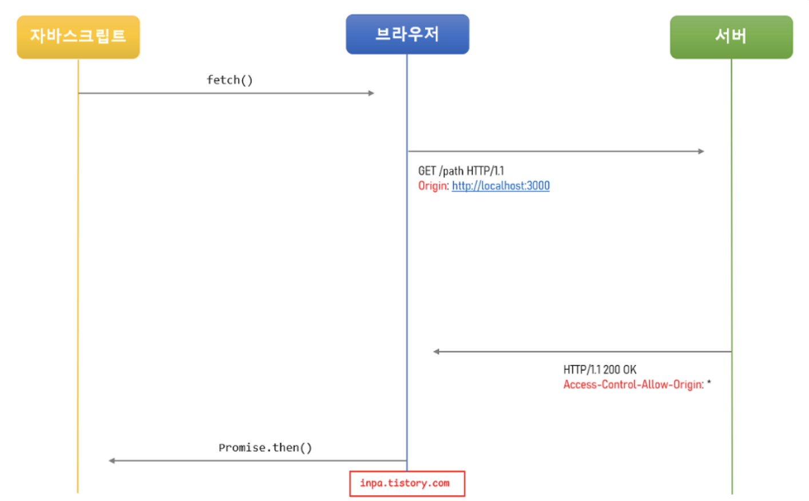
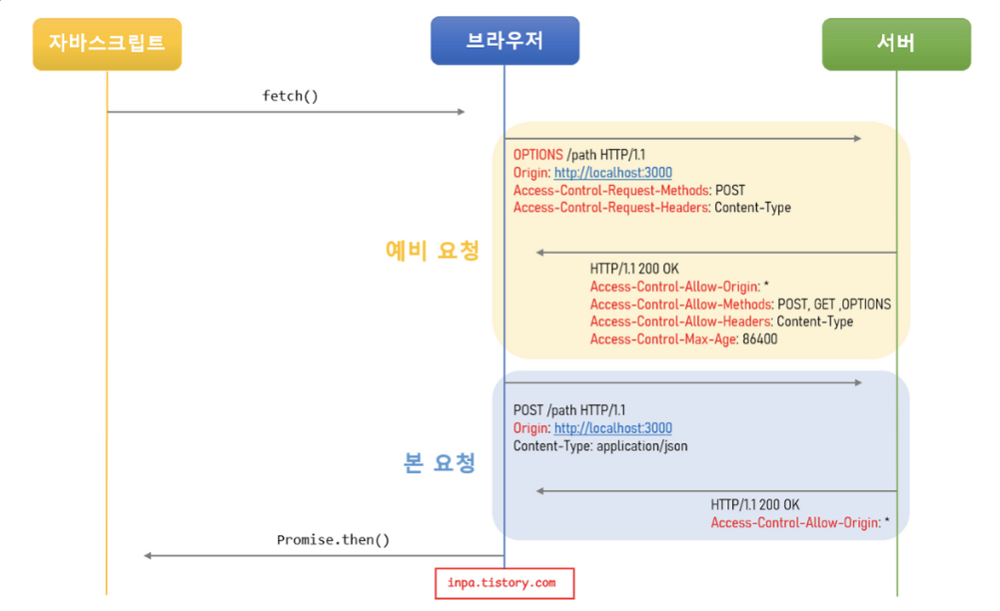
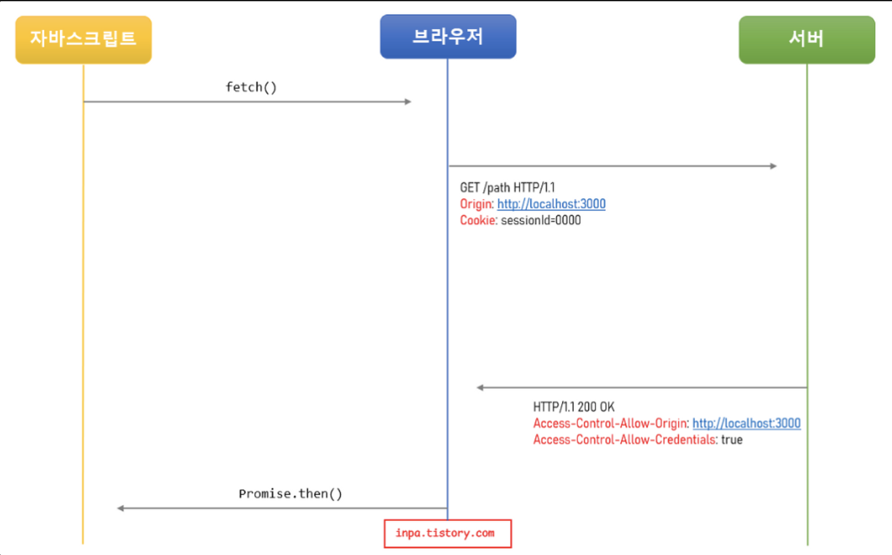

## CORS ( Cross-Origin Resource Sharing )

---

### CORS

`교차 출처 리소스 공유 ( Cross-Origin Resource Sharing, CORS )` 는 웹 애플리케이션에서 `서로 다른 도메인에서 리소스를 요청할 때 발생하는 보안 상의 문제를 해결하기 위한 메커니즘` 이다. 브라우저에서는 보안적인 이유로 다른 출처의 `HTTP 요청`을 제한한다. 그래서 다른 출처의 요청을 하려면 서버의 동의가 필요하다. 이때 사용되는 것이 `CORS` 이다. `CORS` 는 `HTTP 헤더`를 사용하여 허용된 도메인에서만 리소스 요청을 허용하는 방식으로 동작한다. 이를 통해, 웹 애플리케이션이 다른 `Origin`에서 호스팅되어있는 API 나 서비스를 안전하게 사용할 수 있게 됩니다.

> **[ cross-origin ]**  
> 서로 다른 `origin` 간에 리소스를 요청을 허락하지 않겠다는 뜻입니다.

 

> **[ Origin ]**   `origin` 은 `프로토콜, 도메인, 포트넘버`를 합친 것을 말한다. `http://localhost:8000` 과 `http://localhost:3000` 은 서로 다른 `origin` 을 가지고 있으며, `https://locahost` 와 `http://localhost` 역시 서로 다른 `origin` 을 가지고 있다고 볼 수 있습니다.

 

### CORS 의 필요성

다른 도메인으로부터의 요청을 차단하지 않는다면, 악의적인 공격자가 다른 도메인의 리소스에 접근하여 중요한 정보를 탈취하거나 조작할 수 있게된다. 이를 방지하기 위해서, `CORS` 가 필요한 것이며 서버에서는 리소스 요청자의 `Origin` 을 확인하고 믿을 수 있는 요청인지 판단하는 과정이 필요하다.

 

### 브라우저의 CORS 기본동작

실제 `CORS` 동작 방식은 세가지 시나리오가 있지만 `CORS` 동작 흐름을 이해하기 쉽게 기본적인 작동 흐름을 살펴보면 아래 순서와 같다.

1. 클라이언트에서 `HTTP 요청`의 헤더에 `Origin`을 담아 전달한다. 기본적으로 웹은 `HTTP 프로토콜`을 이용해 서버에 요청을 보내게 되는데 이때 브라우저는 요청 헤더에 `Origin` 이라는 필드에 출처를 함께 담아 보낸다.
2. 서버는 응답 헤더에 `Access-Control-Allow-Origin`을 담아 클라이언트로 전달한다. 이후 서버가 이 요청에 대한 응답을 할 때 응답 헤더에 `Access-Control-Allow-Origin` 이라는 필드를 추가하고 값으로 `이 리소스를 접근하는 것이 허용된 출처 url` 을 담는다.
3. 클라이언트에서 `Origin`과 서버가 보내준 `Access-Control-Allow-Origin` 을 비교한다. 이후 응답을 받은 브라우저는 자신이 보냈던 요청의 `Origin` 과 서버가 보내준 응답의 `Access-Control-Allow-Origin` 을 비교해 본 후 차단할지 말지를 결정한다. 만약 유효하지 않다면 그 응답을 사용하지 않고 `CORS` 에러를 발생시킨다.

정리하자면, 결국 `CORS` 해결책은 서버의 허용이 필요하다. 서버에서 `Access-Control-Allow-Origin` 헤더에 허용할 출처를 기재하여 클라이언트에 응답하면 된다.

> **[ 클라이언트에서 Origin 헤더값을 위조하면 안될까? ]**  
> 클라이언트에서 미리 자바스크립트로 `origin` 헤더값을 위조하면 되지 않을까 싶지만, 브라우저에서 이를 감지하여 차단하기 때문에 결론은 불가능하다.

 

### CORS 동작방식

대부분의 `API 요청`은 `예비 요청 ( Preflight Request )` 방식으로 이루어진다.

**[ Simple Request 방식 ]**

예비 요청을 생략하고 바로 서버에 직행으로 본 요청을 보낸 후, 서버가 이에 대한 응답의 헤더에 `Access-Control-Allow-Origin` 헤더를 보내주면 브라우저가 `CORS` 정책 위반 여부를 검사하는 방식이다.

대표적으로 3가지 조건을 만족할때만 가능한 방식이다.

- 요청의 메서드는 `GET`, `HEAD`, `POST` 중 하나여야 한다.
- `Accept`, `Accept-Language`, `Content-Language`, `Content-Type`, `DPR`, `Downlink, Save-Data`, `Viewport-Width`, `Width` 헤더일 경우 에만 적용된다
- `Content-Type` 헤더가 `application/x-www-form-urlencoded`, `multipart/form-data`, `text/plain` 중 하나일 경우에만 가능하다. 아닐 경우 예비 요청으로 동작된다.

조건이 까다롭기 때문에 단순 요청이 일어나는 상황은 드물다. 왜냐하면 대부분 HTTP API 요청은 `text/xml` 이나 `application/json` 으로 통신하기 때문에 3번째 `Content-Type` 을 지키지 못하기 때문이다.

**[ Preflight Request 방식 ]**

브라우저는 요청을 보낼 때 한번에 바로 보내지 않고, 먼저 예비 요청을 보내 서버와 잘 통신되는지 확인 후 본 요청을 보낸다. 즉, 예비 요청의 역할은 본 요청을 보내기 전 브라우저 스스로 안전한 요청인지 미리 확인하는 것이다. 이때 브라우저가 예비 요청을 보내는 것을 `Preflight` 라고 부르며, 이 예비요청의 `HTTP 메소드`는 `GET` 이나 `POST` 가 아닌 `OPTIONS` 라는 요청을 사용한다.

요청 헤더의 `Origin`과 응답 헤더의 `Access-Control-Allow-Origin` 의 `URL`값을 비교하여 `CORS`(다른 출처 리소스 공유)가 허용여부를 결정한다.

**[ Credential Request 방식 ]**

인증 요청 방식은 클라이언트에서 서버에게 `자격 인증 정보 ( Credential )` 을 실어 요청할 때 사용되는 요청 방법이다. 여기서 말하는 자격 인증 정보란 `세션 ID` 가 저장되어 있는 `쿠키` 혹은 `Authorization 헤더`에 설정하는 `토큰` 값 등을 말한다.

즉, 클라이언트에서 일반적인 JSON 데이터 외에도 쿠키 같은 인증 정보를 포함해서 다른 출처의 서버로 전달할 때 `CORS` 의 세가지 요청중 하나인 인증 요청으로 동작한다는 말이며, 이는 기존의 단순 요청이나 예비 요청과는 다르다.

먼저, 클라이언트에서 인증 정보를 보내도록 설정한다. 기본적으로 브라우저가 제공하는 요청 `API` 들은 별도의 옵션 없이 브라우저의 쿠키와 같은 인증과 관련된 데이터를 함부로 요청 데이터에 담지 않도록 되어있다. 이떄 요청에 인증과 관련된 정보를 담을 수 있도록 하는 옵션이 `credentials` 옵션이다. 이를 통해 인증 정보를 담아 서버로 전송한다.

서버에서 인증된 요청에 대한 헤더를 설정한다.

먼저, 응답 헤더의 `Access-Control-Allow-Credentials` 항목을 `true`로 설정한다.

- `Access-Control-Allow-Origin` 값에 와일드카드 ( `*` ) 는 사용할 수 없다.
- `Access-Control-Allow-Methods` 값에 와일드카드 ( `*` ) 는 사용할 수 없다.
- `Access-Control-Allow-Headers` 값에 와일드카드 ( `*` ) 는 사용할 수 없다.

즉, 응답의 `Access-Control-Allow-Origin` 헤더가 와일드카드 ( `*` ) 가 아닌 분명한 `Origin` 을 설정해야 하고 `Access-Control-Allow-Credentials` 헤더는 `true` 로 설정해야 한다. 그렇지 않으면 `CORS` 정책에 의해 응답이 거부된다.

참고로, 인증 요청 역시 예비 요청처럼 `preflight` 가 먼저 일어나지만 위 그림에서는 생략되었다.

 

### CORS 해결방법

`CORS` 를 해결하는 방법으로 크롬 확장 프로그램을 이용하거나 프록시 사이트를 이용하는 방법등이 있으나 서버에서 `Access-Control-Allow-Origin` 헤더를 설정해주는 방법이 가장 정석적인 해결방법이라고 할 수 있다.

 

### [ Reference ]

[🌐 악명 높은 CORS 개념 & 해결법 - 정리 끝판왕 👏](https://inpa.tistory.com/entry/WEB-%F0%9F%93%9A-CORS-%F0%9F%92%AF-%EC%A0%95%EB%A6%AC-%ED%95%B4%EA%B2%B0-%EB%B0%A9%EB%B2%95-%F0%9F%91%8F)

[CORS는 왜 이렇게 우리를 힘들게 하는걸까?](https://evan-moon.github.io/2020/05/21/about-cors/)

[CORS란 무엇인가? – 한윤석 개발 블로그](https://hannut91.github.io/blogs/infra/cors)
