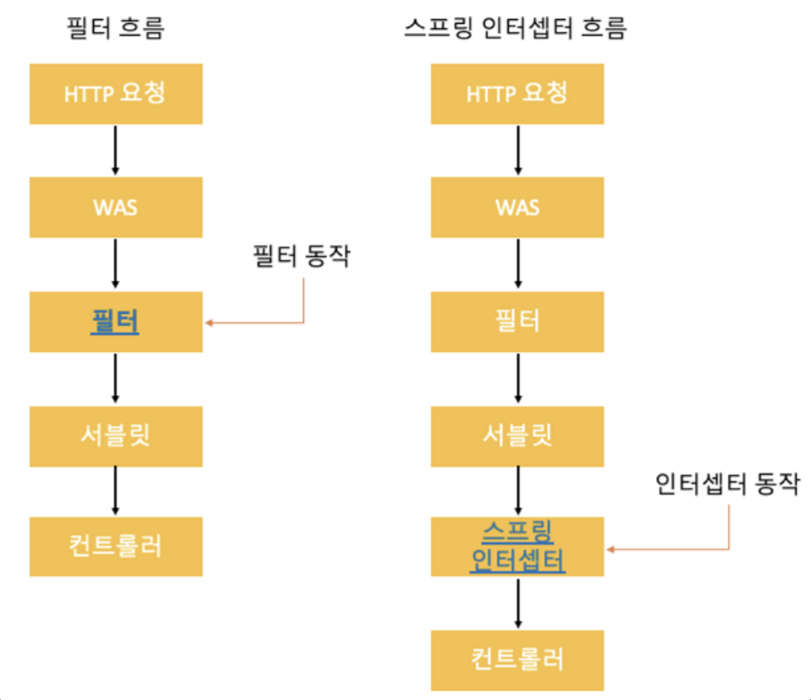
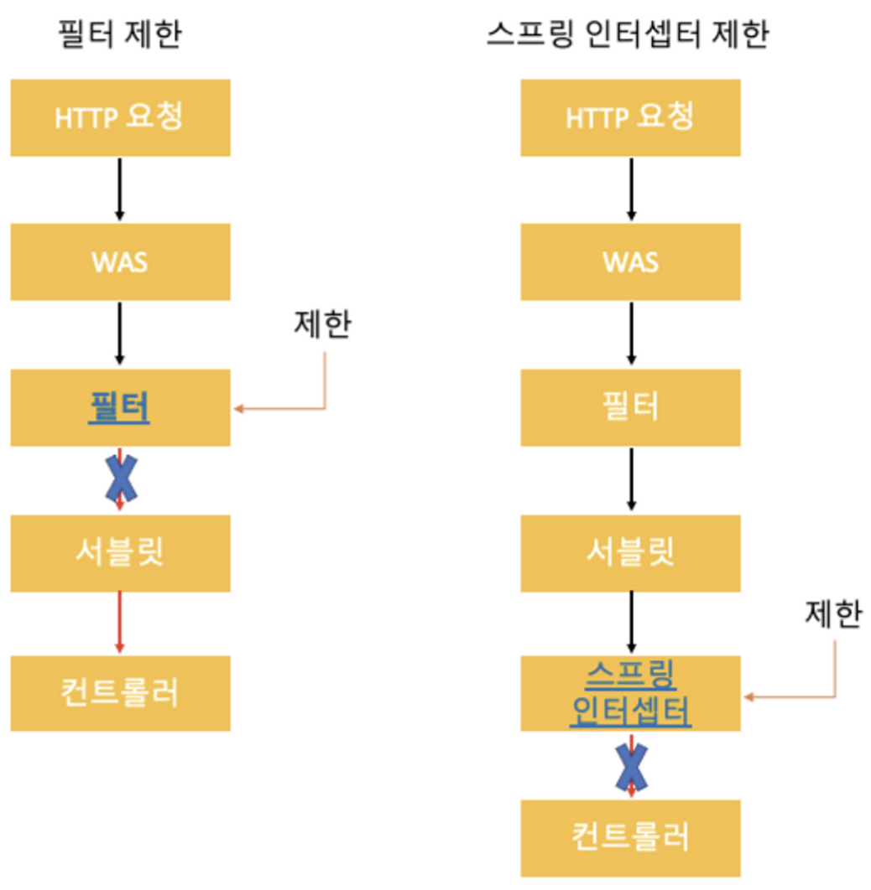

## Filter & Interceptor

---

### 공통관심사항을 처리하는 필터와 인터셉터

여러 로직에서 공통으로 사용하는 공통 부분을 사용하는 로직마다 각각 작성해야 한다면 중복된 코드가 많아져 비효율적이게 된다. 따라서, 공통된 부분은 따로 관리하는 것이 좋은데 이를 위한 방법으로 스프링에서 AOP를 지원한다.

하지만, 웹에 관련된 공통적인 부분은 `스프링 AOP` 보다는 `서블릿 필터` 또는 `스프링 인터셉터`에서 처리하는게 좋다. 왜냐하면 웹과 관련된 공통 부분을 처리할 때는 `HTTP 헤더`나 `URL 정보`가 필요한데 서블릿 필터나 스프링 인터셉터는 `HttpServletRequest`를 제공하기 때문이다.

### 필터

`Dispatcher Servlet` 에 요청이 전달되기 전/후에 URL 패턴에 맞는 모든 요청에 대해 부가작업을 처리할 수 있는 기능을 제공한다. `Dispatcher Servlet` 은 스프링 가장 앞단에 있는 `프론트 컨트롤러`이기 때문에, `필터`는 스프링의 범위 밖에서 동작하며 스프링 컨테이너가 아닌 `웹 컨테이너`에 의해 관리된다.

( 비록 스프링 밖에서 동작하지만 필터도 스프링 빈으로 등록이 가능하다. )

### 필터의 메서드

필터를 사용하기 위해서는 `javax.servlet`의 `Filter` 인터페이스를 구현해야 한다.

[ 필터 인터페이스 ]

```java
public interface Filter {
    public default void init(FilterConfig filterConfig) throws ServletException {}

    public void doFilter(ServletRequest request, ServletResponse response,
            FilterChain chain) throws IOException, ServletException;

    public default void destroy() {}
}
```

- 필터 인터페이스를 구현하면 서블릿 컨테이너가 필터를 등록 후 싱글톤 객체로 생성 및 관리한다.
- `init`, `destroy` 메서드는 `default` 메서드이기 때문에 따로 구현하지 않아도 된다.
- `HTTP` 요청이 오면 `doFilter` 메서드가 호출된다.

### 인터셉터

`Spring` 이 제공하는 기술로 `Dispatcher Servlet` 이 컨트롤러를 호출하기 전과 후에 요청과 응답을 참조하거나 가공할 수 있는 기능을 제공한다. 즉, 컨트롤러에 들어오는 요청 `HttpRequest` 와 컨트롤러가 응답하는 `HttpResponse` 를 조작하는 역할을 한다. `스프링 컨텍스트`에서 동작하며 `스프링 컨테이너`에 의해 관리된다. `Dispatcher Servlet` 의 역할은 핸들러 매핑을 통해 들어온 요청에 대한 적절한 컨트롤러를 찾는다. 그 과정에서 1개 이상의 인터셉터가 등록되어 있다면 순차적으로 등록된 인터셉트들을 거친 후 컨트롤러가 실행된다. 만약, 어떠한 인터셉터도 등록하지 않았다면 바로 컨트롤러를 실행한다.

### 인터셉터 인터페이스

`doFilter` 하나로 로직을 수행하는 서블릿 필터와는 달리 인터셉터는 3가지 단계로 세분화 되어 있다.

```java
public interface HandlerInterceptor {
	default boolean preHandle(HttpServletRequest request, HttpServletResponse response, Object handler)
			throws Exception {

		return true;
	}

	default void postHandle(HttpServletRequest request, HttpServletResponse response, Object handler,
			@Nullable ModelAndView modelAndView) throws Exception {
	}

	default void afterCompletion(HttpServletRequest request, HttpServletResponse response, Object handler,
			@Nullable Exception ex) throws Exception {
	}
}
```

- 컨트롤러 호출 전 ( `preHandler` ) : 반환 타입은 `Boolean` 으로 반환값이 `false` 이면 그 뒤는 진행하지 않는다.
- 컨트롤러 호출 후 ( `postHandler` ) : 핸들러 어댑터 호출 후 호출된다.
- 요청 완료 이후 ( `afterCompletion` ) : 뷰가 렌더링 된 후에 호출된다.

### 필터와 인터셉터의 흐름



- 필터를 적용하면 필터가 호출된 이후 서블릿이 호출된다. ( 서블릿은 스프링의 경우 디스패처 서블릿을 의미 )
- 인터셉터를 적용하면 디스패처 서블릿과 컨트롤러 사이에서 컨트롤러 호출 직전에 인터셉터가 동작한다.
- 필터는 서블릿 호출전에 인터셉터는 서블릿 호출 이후 호출되기 때문에 인터셉터는 서블릿에서 예외가 발생한다면 호출되지 않는다.

### 필터와 인터셉터의 제한



- 필터와 인터셉터는 각각 요청이 적절하지 않을경우 자신의 상태에서 종료할 수 있다.
- 필터는 서블릿까지도 가지 못하지만, 스프링 인터셉터는 서블릿까지 통과 후 제한된다.

### Filter & Interceptor 차이점

- Filter 는 웹 컨테이너에의해 관리되고 Interceptor는 스프링 컨테이너에 의해 관리된다.
- Filter에서 발생하는 예외는 Spring 내 예외처리로 처리가 불가능한 반면 Interceptor는 가능하다.
- 필터의 경우 HttpSevlet request & response 객체를 조작할 수 있지만 Interceptor는 불가능하다.

### [ Reference ]

[7. 로그인 처리2 - 필터, 인터셉터](https://catsbi.oopy.io/9ed2ec2b-b8f3-43f7-99fa-32f69f059171)
