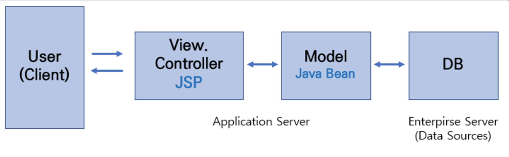
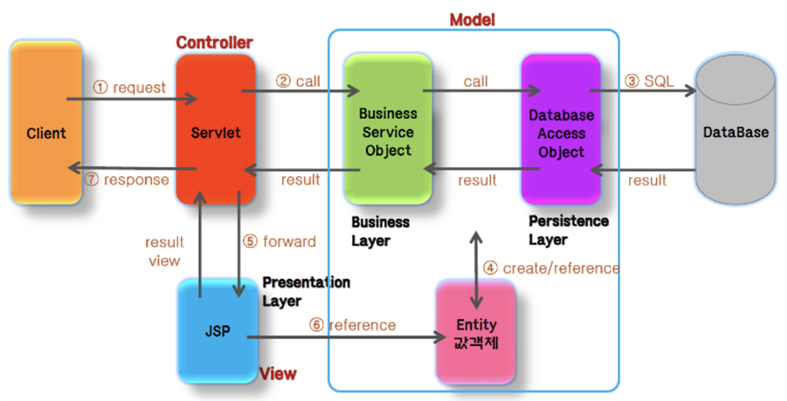
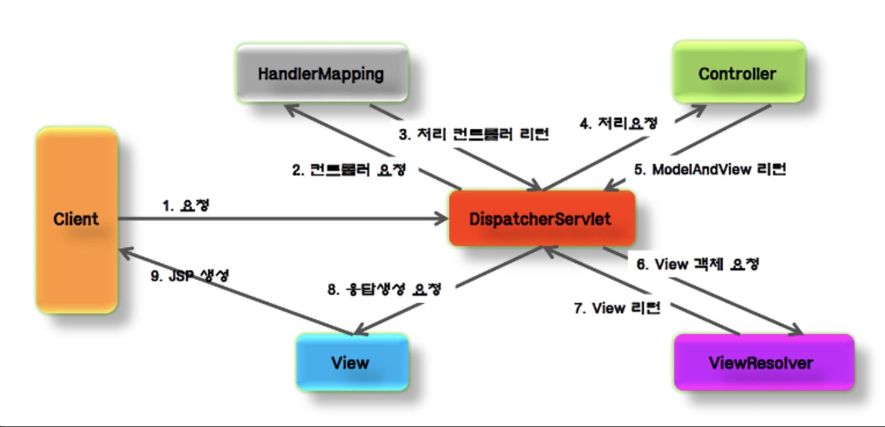
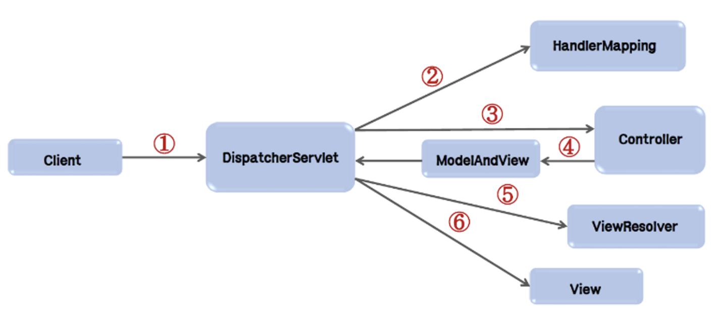

## MVC ( Model-View-Controller ) Pattern

---

### MVC Pattern

애플리케이션의 구조를 `Model-View-Controller` 세가지 영역으로 구분한 개발 방법론을 말한다. 컴포넌트들의 변경이 다른 영역의 컴포넌트에 영향을 미치지 않고 컴포넌트 간의 결합성이 낮은 특징이 있다. 이로 인해 유지보수에 용이하고 확장성이 뛰어나다.

 

### MVC Pattern 장단점

**[장점]**

- 화면과 비즈니스 로직을 분리해서 작업이 가능하다.
- `Model-View-Controller` 영역별 개발로 인하여 확장성이 뛰어나다.

**[단점]**

- 개발과정이 복잡해 초기 개발속도가 느리다.

 

### MVC Pattern 종류

**[ MVC 1 ]**

`MVC1 Pattern` 의 경우 `View` 와 `Controller`를 모두 `JSP`가 담당하는 형태를 갖는다. 즉, `JSP` 하나로 유저의 요청을 받고 응답을 처리하므로 구현 난이도는 낮다.

하지만, 프로젝트 내용이 복잡하고 거대해질수록 이 패턴은 효율적이지 못하다. `JSP` 하나에서 `MVC` 작업이 모두 이루어지다 `Java 코드` 와 `HTML 코드`가 한곳에 혼합되어 있어 가독성이 떨어지며 코드의 재사용성이 낮고 유지보수도 쉽지 않다는 특징이 있다.

**[ MVC 2 ]**

코드가 복잡하고 재사용성이 낮으며 유지보수가 어렵다는 `MVC1 Pattern`의 단점을 보완해 개발된 개발 방법론이다. 설계단계가 복잡해 비용이 많이 들고 개발속도가 느리다는 단점이 있지만 확장이 용이하고 유지보수에 강점을 가지고 있다.

`MVC2 Pattern` 의 경우 `MVC1 Pattern` 과는 달리 `Controller` 그리고 `View` 가 분리되어 있다. `JSP` 는 `View` 의 역할만 수행하고 대신 `Controller` 의 역할은 `Servlet` 이 수행한다. `View` 는 `JSP` 로 구성되나 기존의 `JSP` 와 달리 `Java 코드`를 더이상 포함하지 않고 `JSTL` 을 사용하여 결과를 표현한다. `Model` 은 기존 `MVC1 Pattern` 방식과 동일하다.

 

### Spring MVC

`Spring MVC` 는 `Spring Framework` 의 모듈 중 하나로 웹 계층에서 `서블릿 API`를 기반으로 클라이언트의 요청을 처리하는 기능을 제공한다. 기존의 `MVC2 Pattern` 에 `MVC2 Pattern` 의 단점인 공통 처리가 힘들다는 부분을 해결하기 위해 `FrontController` 패턴을 함께 사용한다.

> **[ Servlet ]**
> 서블릿(Servlet)이란 동적 웹 페이지를 만들 때 사용되는 자바 기반의 웹 애플리케이션 프로그래밍 기술로 클라이언트의 HTTP 요청에 대한 작업을 처리하고 그 결과를 다시 클라이언트로 반환해주는 역할을 하는 자바 클래스이다.

 

### Spring MVC 실행순서

1. `DispatcherServlet`이 요청을 수신한다.
   - 단일 `Front Controller Servlet`
   - 요청을 수신하여 처리를 다른 컴포넌트에 위임한다.
   - 어느 `Controller`에 요청을 전송할지 결정한다.
2. `DispatcherServlet`은 `HandlerMapping`에 어느 `Controller`를 사용할 것인지 문의한다.
   - `URL`과 `Mapping` 한다.
3. `DispatcherServlet`은 요청을 `Controller`에게 전송하고 `Controller`는 요청을 처리한 후 결과를 리턴한다.
   - `Business Logic`을 수행하고 결과 정보(`Model`)가 생성되어 `JSP`와 같은 view에서 사용된다.
4. `ModelAndView Object`에 수행결과가 포함되어 `DispatcherServlet`에 리턴된다.
5. `ModelAndView`는 실제 `JSP` 정보를 갖고 있지 않으며, `ViewResolver`가 논리적 이름을 실제 `JSP` 이름으로 변환한다.
6. `View`는 결과정보를 사용하여 화면을 표현한다.

 

### **Spring MVC의 구성요소**

1. DispatcherServlet(Front Controller)
   ◦ 모든 클라이언트의 요청을 전달받는다.
   ◦ Contrller에게 클라이언트의 요청을 전달하고, Controller가 리턴 한 결과값을 View에게 전달하여 알맞은 응답을 생성한다.
2. HandlerMaping
   ◦ 클라이언트의 요청 URL을 어떤 Controller가 처리할지를 결정한다.
   ◦ URL과 요청 정보를 기준으로 어떤 핸들러 객체를 사용할지 결정하는 객체이며, DispatcherServlet은 하나 이상의 핸들러 매핑을 가질 수 있다.
3. Controller
   ◦ 클라이언트의 요청을 처리한 뒤, Model을 호출하고 그 결과를 DispatcherServlet에 알려준다.
4. ModelAndView
   ◦ Controller가 처리한 데이터 및 화면에 대한 정보를 보유한 객체를 말한다.
5. ViewResolver
   ◦ Controller가 리턴 한 View 이름을 기반으로 Controller의 처리 결과를 보여줄 View를 결정한다.
6. View
   ◦ Controller의 처리결과를 보여줄 응답화면을 생성한다.

 

### [ Reference ]

[[Spring] Spring의 MVC 패턴과 MVC1과 MVC2 비교](https://chanhuiseok.github.io/posts/spring-3/)

[[Spring] MVC Pattern, Spring MVC, Spring Boot](https://velog.io/@arielgv829/Spring-SpringMVC-SpringBoot)
