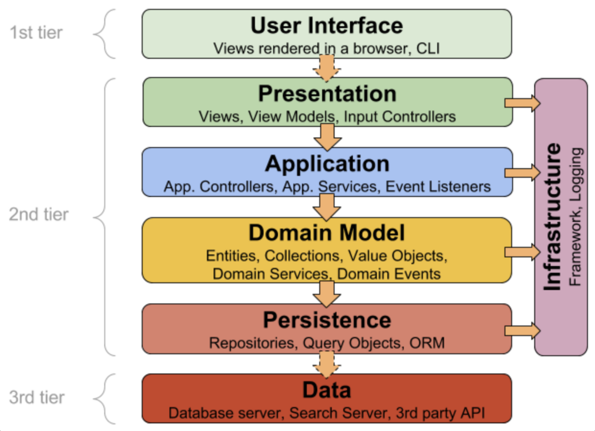
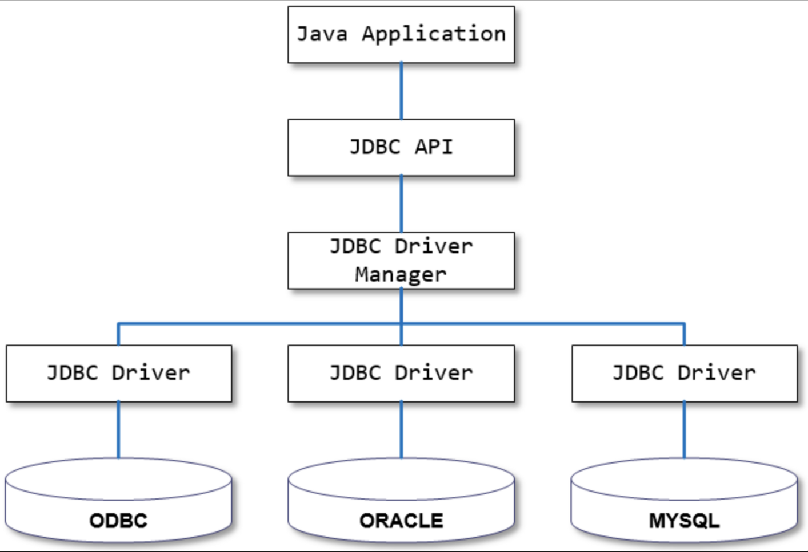
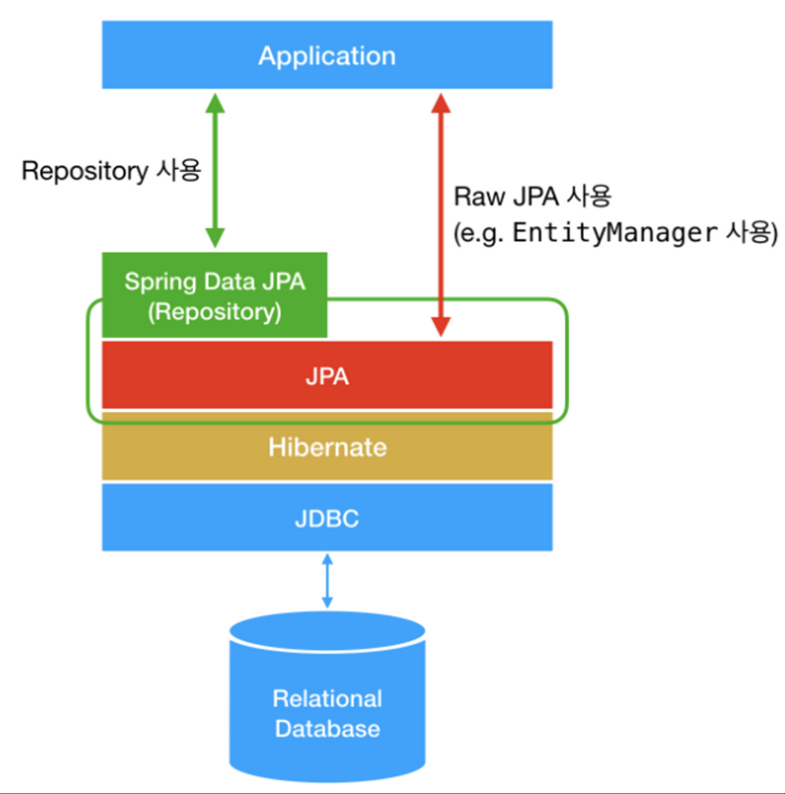

## ORM & Mapper

---

### 영속성 ( Persistence ) 이란?

데이터를 생성한 프로그램이 종료되더라도 사라지지 않는 데이터의 특성을 말한다. 객체지향 프로그램에서 객체의 상태는 메모리에만 존재하고 프로그램이 종료되면 휘발하는 영속성을 부여하지 않은 상태이다. 객체의 상태를 DB에 저장하는 과정을 통해 객체에게 영속성을 부여할 수 있다.

- `Persistence Layer`에서 도메인 모델인 객체에 영속성을 부여할 수 있다.
- `Persistence Layer` 를 구현하는 방법에는 크게 `JDBC` 만을 이용하는 방법과 `Persistence Framework` 를 이용하는 두가지 방법이 있다.
- `Persistence Layer` 를 구현하는 방법에 따라 `JDBC`, `SQL Mapper`, `ORM` 을 구분할 수 있다.

 

### JDBC ( Java Database Connectivity )

`Java` 에서 `DB`에 접속할 수 있도록 하는 `Java API` 를 말한다. `Java 애플리케이션`에서 `DBMS` 에 종속적이지 않고 하나의 `JDBC API`를 이용하여 `DB` 작업을 처리한다. 각각의 `DBMS` 는 이를 구현한 `JDBC 드라이버`를 제공한다. `JDBC` 인터페이스를 구현한 각각의 `DBMS 드라이버`만 바꾸면 `DB` 종류에 상관없이 접근이 가능하다.따라서, `JDBC API` 를 사용하면 하나의 자바 애플리케이션에서 `JDBC 드라이버`를 제공하는 어떤 종류의 관계형 데이터 베이스에서 접근이 가능하다.

 

### JDBC 단점

- `SQL` 을 실행하기 위해 중복적인 코드를 반복적으로 사용
- `Connection`과 같은 공유 자원을 관리해주어야 한다. 만약, `Connection` 과 같은 자원을 제대로 반환해주지 않으면 시스템의 자원이 바닥나는 버그가 발생하기 때문에 이를 수동으로 닫아주는 작업 필요

 

### Persistence Framework

데이터의 저장, 조회, 변경, 삭제를 다루는 클래스 및 설정파일들의 집합이다. `JDBC` 프로그래밍의 복잡함이나 번거로움 없이 간단한 작업만으로 데이터베이스와 연동되는 시스템을 빠르게 개발할 수있으며 안정적인 구동을 보장한다. 모든 `Persistence Framework` 는 내부적으로 `JDBC API` 를 사용한다. 이런 `Persistence Framework` 를 크게 `SQL Mapper` 와 `ORM` 으로 나눌 수 있다.

 

### SQL Mapper

`Java Persistence Framework` 중 하나로 직접 작성한 `SQL` 문의 질의 결과와 객체의 필드를 매핑하여 데이터를 객체화 한다. `SQL Mapper` 에속하는 대표적인 프레임 워크로 `MyBatis` 가 있다.

 

### MyBatis

`Java Persistence Framework` 중 하나로 `SQL Mapper` 에 속하며 반복적인 `JDBC 프로그래밍`을 단순화하고 `SQL 쿼리`들을 `XML 파일`에 작성하여 `DAO`와 `SQL`을 분리하여 관리할 수 있도록 해준다. `JDBC` 를 사용하면 결과를 가져와서 객체에 매핑하는 많은 코드가 필요하지만 `MyBatis` 를 사용하면 그 코드를 작성하지 않아도 된다.

 

### MyBatis 장점

- 상황에 따라 분기처리를 통해 쿼리를 동적으로 만들 수 있는 동적 쿼리를 지원한다.
- 자동으로 `Connection` 관리를 해주기 때문에 `JDBC`를 사용할 때의 중복작업 대부분을 없애준다.
- `DAO` 에서 `SQL` 문을 분리하여 코드의 간결성 및 유지보수성을 향상할 수 있다.

 

### MyBatis 단점

- `SQL`을 개발자가 직접 작성하기 때문에 이로 인한 휴먼에러가 발생할 가능성이 있다.
- `SQL` 은 `DB` 마다 차이가 있기 때문에 `SQL` 을 개발자가 직접 작성하면 결국 특정 `DB`에 종속된다.
- 테이블의 필드가 변경될 경우 이와 관련된 `DAO`와 `SQL` 을 모두 수정해야 한다.
- 테이블마다 비슷한 `CRUD` 의 `SQL` 작성은 `DAO` 개발이 반복되는 비효율적인 작업이다.

> **[ 패러다임의 불일치 문제 ]**  
> 우리가 자주 사용하는 `RDB`의 경우 객체 구조와는 다른 데이터 중심 구조를 가지고 있다. 즉, 객체와 관계형데이터베이스는 지향하는 바가 다르기 때문에 따라서, 추상화 상속 그리고 다형성 같은 개념을 가진 객체의 구조를 테이블에 저장하는데는 한계가 있다.

 

### ORM ( Object Relational Mapping )

객체와 관계형 데이터베이스의 관계를 매핑해주는 프로그래밍 기법이다. `ORM` 은 객체간의 관계를 바탕으로 `SQL` 을 자동으로 생성하고 직관적인 메서드로 데이터를 조작할 수 있도록 기능을 제공한다. `ORM` 의 대표적인 예로는 `JPA` 가 있다.

 

### ORM 장점

- 패러다임 불일치 문제 해결을 통해 객체 지향 언어가 가진 장점을 활용할 수 있다.
- 반복적인 `CRUD`를 위한 `SQL`을 개발자가 작성하지 않아도 된다.
- 데이터 접근을 추상화하여 벤더의 독립성 문제를 해결한다. 즉, 데이터베이스 벤더마다 미묘하게 다른 데이터 타입, `SQL` 문제를 해결해준다.
- 필드 추가, 삭제 시 관련된 `CRUD` 쿼리를 직접 수정하지 않아도 되며 엔티티만 수정하면 된다.

 

### ORM 단점

- 복잡한 쿼리 사용이 어렵기 때문에 JPA 에서는 SQL 과 유사한 기술은 JPQL을 지원한다. 물론 SQL 자체 쿼리를 작성할 수 있도록 지원하며 SQL Mapper와 혼용해서 사용할수도 있다.

 

### JPA ( Java Persistence API )

`JPA` 는 `Java ORM` 기술에 대한 `API` 표준 명세로 인터페이스들을 모아둔 것을 말한다. 따라서, `JPA` 자체는 단순한 명세이기 때문에 `JPA` 만 가지고는 어떤 구현 기술을 사용할 수 없다. 를 사용하려면 `JPA` 인터페이스를 구현한 `ORM 프레임워크`를 사용해야 한다. 대표적인 `ORM Framework`로는 `Hibernate` 가 있다.

 

### JPA 특징

- 반복적으로 SQL 을 작성하지 않고 메서드 호출로 쿼리를 수행할 수 있기 때문에 생산성이 높아진다.
- 테이블 수정 시 테이블과 관련된 DAO의 파라미터, 결과 ,SQL 등을 대신 수정해주기 때문에 유지보수에 유리하다.
- 추상화된 데이터 접근 계층을 제공하기 때문에 특정 `DB` 벤더에 종속적이지 않다.
- 객체와 관계형 데이터베이스와의 패러다임 불일치 문제를 해결할 수 있다.
- `JPA`는 실시간 쿼리에 최적화 되어 있어 복잡한 쿼리를 필요로 하는 경우 `Mapper` 방식이 더 효율적일 수 있다.

 

### Hibernate

`Hibernate` 는 `ORM Framework` 인 `JPA` 명세의 구현체로 `JPA 인터페이스`를 구현하며 내부적으로 `JDBC API` 를 사용한다. `SQL`을 사용하지 않고 직관적인 메소드를 사용해 데이터를 조작할 수 있다.

 

### Hibernate 단점

- 메서드 호출만으로 쿼리를 수행하기 때문에 불필요한 쿼리가 발생해 성능이 좋지 않을 수 있다.

 

### Spring Data JPA

`Spring`에서 제공하는 모듈 중 하나로 `JPA`를 쉽고 편하게 사용할 수 있도록 도와준다. `Spring Data JPA` 는 `JPA`를 한단계 더 추상화 시킨 `Repository` 인터페이스를 제공한다. 즉, `Spring Data JPA`의 `Repository`의 구현에서 `JPA`를 사용하고 있다. 사용자가 `Repository` 인터페이스에 정해준 규칙대로 메서드를 입력하면 `Spring` 이 해당 메서드 이름에 적합한 쿼리를 날리는 구현체를 만들어 `Bean`으로 등록해준다.

**[ JPA 와 Spring Data JPA 와 Hibernate 관계 ]**

 

### Hibernate vs Spring Data JPA

`Spring` 에서 `JPA` 를 사용할 때 `JPA` 의 구현체인 `Hibernate` 등을 직접 다루지 않는다. 이들을 직접 다루려면 데이터 액세스 계층을 구현하는 등 복잡한 코드를 작성해야 한다. `Spring Data JPA` 는 `JPA` 의 구현체들을 복잡한 코드 구현 없이 편리하게 사용할 수 있도록 제공하는 `Spring` 에서 제공하는 모듈이다.

`Hibernate` 는 `JPA 명세`의 구현체이고 `Spring Data JPA` 는 `JPA` 를 사용하기 쉽게 스프링에서 제공하는 모듈로서 내부적으로 `Hibernate` 같은 `JPA의 구현체`를 이용한다.

 

### Spring Data JPA 사용이유

**[ 구현체 교체 용이성 ]**

`Hibernate` 외에 다른 `JPA` 구현체로 쉽게 교체할 수 있다.

**[ 저장소 교체 용이 ]**

관계형 `DB` 외에 다른 저장소로 쉽게 교체할 수 있기 때문이다. 만약, `MongoDB` 를 사용해야 한다면 개발자는 `Spring Data MongoDB` 로 의존성만 교체하면 편리하게 다른 저장소를 사용할 수 있다.

 

### MyBatis vs JPA

`MyBatis` 는 `SQL` 문의 질의 결과와 객체의 필드를 매핑하여 데이터를 객체화 하는 `SQL Mapper`의 한종류로 `SQL`을 `XML` 파일에 작성할 수 있도록 하여 `DAO` 로직과 `SQL` 을 분리하여 관리할 수 있도록 해준다. `SQL` 을 직접 작성해야 하기 때문에 최적화된 쿼리를 구현하고 복잡한 쿼리를 작성할 수 있다는 장점이 있으나 직접적인 쿼리 작성으로 인한 휴먼에러의 가능성이 있고 반복적인 쿼리를 작성해야 하며 스키마 변경시 쿼리를 일일히 수정해야 한다는 단점이 있다.

반면, JPA는 객체와 관계형 데이터베이스의 관계를 매핑해주는 프로그래밍 기법으로 객체간의 관계를 바탕으로 `SQL` 을 자동으로 생성하고 직관적인 메서드로 데이터를 조작할 수 있도록 기능을 제공한다. 이를 통해 `MyBatis`의 단점인 반복적인 쿼리작성 그리고 SQL 작성으로 인해 발생할 수 있는 휴먼에러 등의 문제점을 해결할 수 있으며 스키마 변경시 엔티티만 변경하면 되기 때문에 유지보수 측면에서도 강점을 보인다. 하지만, 로직이 복잡하면 불필요한 쿼리가 발생할 가능성이 있다는 단점도 존재한다.

 

### MyBatis 와 JPA 를 함께 사용해서 얻을 수 있는 장점

`JPA`는 직관적인 메서드를 통해 쿼리를 자동으로 생성해주는 기능을 제공한다. 따라서 직접적 쿼리를 작성할 수 없기에 로직이 복잡할 경우 불필요한 쿼리가 발생할 수 있다는 한계가 있다. 이런 한계를 `MyBatis`를 함께 사용하여 보완할 수 있다. 단순 반복적인 쿼리는 `JPA`를 통해 처리하며 `MyBatis`를 통해 복잡한 쿼리를 직접 작성하여 최적화된 쿼리를 구현할 수 있다.

 

### JPA Dirty Checking

트랜잭션 안에서 `Entity`의 변경이 일어났을 때 이를 감지하고 변경한 내용을 자동으로 `DB`에 반영하는 것을 말한다. ( 이때 변경의 기준은 최초 조회 상태이다. ) `JPA` 에서는 트랜잭션이 끝나는 시점에 변화가 있던 모든 엔티티의 객체를 데이터베이스로 알아서 반영을 시켜준다. 즉, 트랜잭션의 마지막 시점에 다른 점을 발견했을 때 데이터베이스로 `update` 쿼리를 날려준다.

또한, 기본적으로 더티 체킹을 실행하면, `SQL` 에서 변경된 엔티티의 모든 내용을 `update` 쿼리로 만들어 전달하는데, 이때 필드가 많아지면 전체 필드를 `update`하는게 비효율적일 수도 있다. 이때는 `@DynamicUpdate`를 해당 `Entity`에 선언하여 변경 필드만 반영시키도록 만들 수 있다.

더티 체킹을 검사하는 대상은 `영속성 컨텍스트`가 관리하는 `Entity`만 대상으로 한다. 준영속, 비영속 `Entity` 는 값을 변경할지라도 데이터베이스에 반영하지 않는다.

Spring Data JPA 에서는 `@Transactional` 을 사용하여 더티 체킹을 수행할 수 있다.

> `Dirty` 상태의 변화가 생김  
> `Checking` 검사

### Dirty Checking 과정

- `JPA` 에서 `Entity` 를 조회
- 조회된 상태의 `Entity` 에 대한 `스냅샷` 생성
- 트랜잭션 커밋 후 해당 `스냅샷`과 현재 `Entity` 상태의 다른 점을 체크
- 다른 점들을 `update` 쿼리로 데이터베이스에 전달.

### JPA N+1 문제

연관 관계에서 발생하는 이슈로 연관 관계가 설정된 엔티티를 조회할 경우에 조회하려는 엔티티를 조회하기 위한 쿼리의 개수 ( 1개 ) 와 조회된 엔티티의 개수 ( n개 ) 만큼 연관관계의 조회 쿼리가 추가로 발생하여 데이터를 읽어오게 된다. 이를 `N+1 문제`라고 한다.

 

### 지연로딩과 즉시로딩

`N+1 문제` 문제는 지연 로딩과 즉시 로딩 모두에게서 발생할 수 있다. `FetchType.EAGER` 라서 발생한다고 착각할 수 있지만 `FetchType.LAZY` 로 설정해도 단지 `N+1` 발생 시점을 연관 관계 데이터를 사용하는 시점으로 미룰 뿐이다.

 

### JPA N+1 발생이유

`JPARepository` 에 정의한 인터페이스 메서드를 실행하면 `JPA`는 메서드 이름을 분석해서 JPQL 을 생성하여 실행한다. `JPQL` 은 `SQL`을 추상화한 객체지향 쿼리 언어로 특정 `SQL`에 종속되지 않고 엔티티 객체와 필드 이름을 가지고 쿼리를 작성한다. `JPQL` 입장에서는 연관관계 데이터를 무시하고 해당 엔티티 기준으로 쿼리를 조회하기 때문이다. 따라서 연관된 엔티티 데이터가 필요한 경우, `FetchTytpe`으로 지정한 시점에 조회를 별도로 호출하게 된다.

 

### JPA N+1 문제 해결방법

- `Fetch Join`
- `EntityGraph`
- `FetchMode.SUBSELECT`
- `BatchSize`
- `QueryBuilder`

 

### [ Reference ]

[[10분 테코톡] ⏰ 아마찌의 ORM vs SQL Mapper vs JDBC](https://www.youtube.com/watch?v=VTqqZSuSdOk)

[JPA vs MyBatis](https://incheol-jung.gitbook.io/docs/q-and-a/spring/jpa-vs-mybatis)

[N+1 문제](https://incheol-jung.gitbook.io/docs/q-and-a/spring/n+1)
