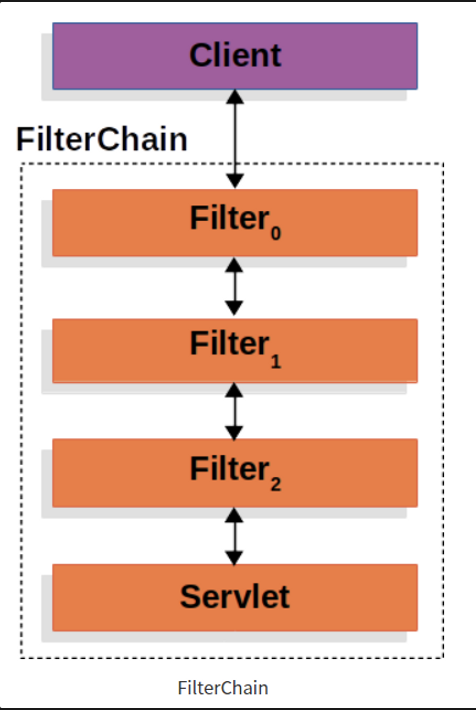
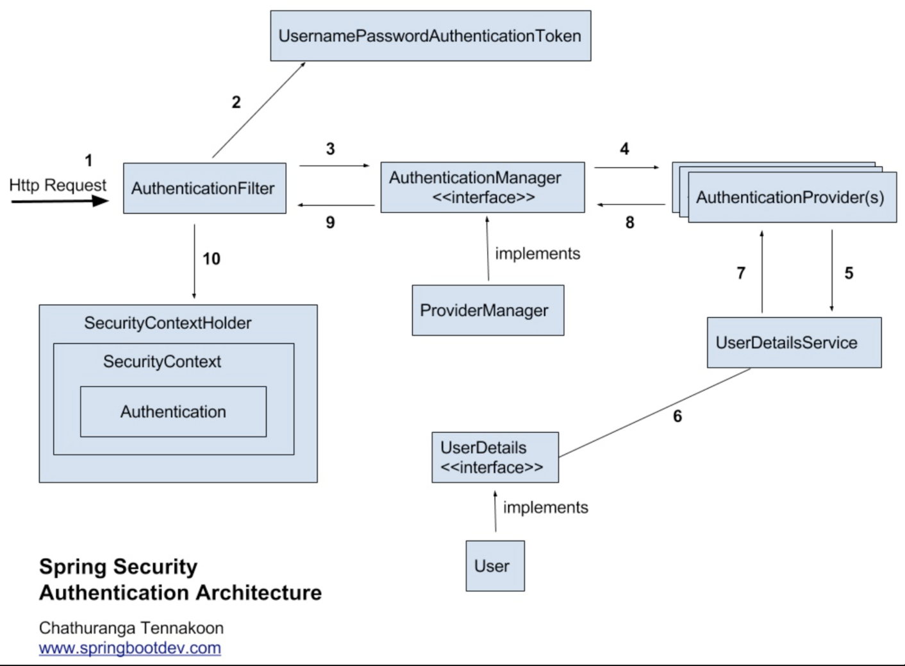

## Spring Security

---

### Spring Security

`API`에 권한 기능이 없으면 아무나 회원 정보를 조회하고 수정하고 삭제할 수 있다. 따라서, 이를 막기 위해 인증된 유저만 `API`를 사용할 수 있도록 해야하는데 이때 사용할 수 있는 해결 책 중 하나가 `Spring Security` 이다.

`Spring Security` 는 스프링 기반 애플리케이션의 보안(인증과 권한)을 담당하는 사용자 인증 및 접근제어 프레임 워크를 말한다. 자바 애플리케이션의 인증 및 권한 부여를 제공하는데 중점을 두고 있으며 다양한 필터를 사용하여 커스텀이 가능하다.

### 스프링 시큐리티와 인증/인가

- 현업에서는 스프링 시큐리티를 사용해서 로그인 로그아웃 기능을 구현한다.
- 아이디와 암호를 이용해서 로그인하는 과정을 **인증(Authentication)** 이라고 한다.
- 네이버 카페를 사용해보면 로그인을 했더라도 특정 카페는 어느정도 등급이 되지 않을 경우 이용을 못하기도 한다. 이 과정을 **인가(Authorization)**라고 한다.
- 스프링 시큐리티를 사용하면 **인증과 인가**를 편리하게 구현할 수 있다.

### 스프링 시큐리티의 특징

- 만약, 스프링 시큐리티를 사용하지 않았다면 자체적으로 세션을 체크하고 리다이렉트 등을 해야한다.
- 스프링 시큐리티는 필터 기반으로 동작하기 떄문에 스프링 MVC와 분리되어 관리 및 동작한다.
- 스프링 시큐리티는 인증과 권한에 대한 부분을 Filter의 흐름에 따라 처리한다.
- 기본적으로 인증 절차를 거친 후 인가 절차를 진행하게 된다. 인가 절차에서 해당 리소스에 대한 접근 권한이 있는지 확인하게 된다.
- 인증과 인가를 위해 접근주체(Principal)을 아이디로 비밀번호(Credential)을 비밀번호로 사용하는 Credential 기반의 인증 방식을 사용한다.
- 참고로 스프링 시큐리티 3.2버전 부터는 XML로 설정하지 않고 자바 config 설정으로 간단하게 설정할 수 있도록 지원하고 있다.

### 스프링 시큐리티 자주 사용하는 보안 용어

- 접근주체(Principal) : 보호된 대상(리소스)에 접근하는 대상(유저).
- 인증(Authentication) : 인증은 “증명하다”라는 의미로 예를 들어, 유저 아이디와 비밀번호를 이용하여 로그인하는 과정을 말한다.
- 인가(Authorization) : “권한부여”나 “허가”와 같은 의미로 사용된다. 즉, 어떤 대상이 특정 목적을 실현하도록 허용 하는 것을 의미한다.
- 권한(접근제어) : 인증된 주체가 애플리케이션의 동작을 수행할 수 있도록 해당 리소스에 접근이 허락되었는지를 결정할 때 사용한다.
  - 인증과정을 통해 접근주체가 증명된 이후 권한을 부여할 수 있다.
- 비밀번호(Credential) : 리소스에 접근하려는 대상의 비밀번호

### 스프링 시큐리티 필터

스프링 시큐리티는 서블릿의 필터를 기반으로 동작한다.

일반적으로 클라이언트에서 서버로 요청을 보내면 DispatcherServlet이라는 하나의 서블릿이 HttpServletRequest를 받아서 요청을 처리하고 HttpServletResponse 응답을 클라이언트로 보낸다.

그런데, 하나 이상의 필터가 포함된다면, 클라이언트에서 보낸 요청이 서블릿으로 전달되기 전에 필터를 거치게 된다.

그림 출처 : https://limdevbasic.tistory.com/19

클라이언트가 애플리케이션에 하나의 요청을 보내면 컨테이너는 하나의 필터 체인을 생성한다. 필터 체인에는 필터와 서블릿이 들어있다.

필터 체인 내부의 필터는 클라이언트에서 보낸 요청이 다음 필터나 서블릿에 전달되지 않도록 걸러낼 수 있다.

또한, 요청을 받은 후 클라이언트가 원래 요청한 자원이 아닌 다른 자원으로 리다이렉트 시킬 수도 있다.

다른 필터는 다음 필터에게 요청과 응답을 전달하지 않고 바로 클라이언트에게 응답하고 끝낼 수도 있다. (이렇게 걸러냈을 경우 필터 내부에서 HttpServletResponse를 만들어 서블릿 대신에 클라이언트에 응답을 보낼 수 있다. 만약, 요청이 다음으로 전달되게 할 경우 HttpServletRequest나 HttpServletResponse의 내용을 변경하여 가공된 데이터를 다음 필터나 서블릿에 전달 할 수 있다.)

이렇게 스프링 시큐리티는 다양한 기능을 가진 필터들을 기본적으로 10개이상 제공한다. 이렇게 제공되는 필터들을 시큐리티 필터 체인(Security Filter Chain)이라고 한다.

### 스프링 시큐리티 인증관련 아키텍처

아이디와 암호를 입력했을 때 이를 처리하는 인증 관련 필터는 **AuthenticationFilter** 이다. 해당 필터는 아래 그림과 같은 순서로 동작한다.

1. 사용자가 입력한 사용자 정보를 가지고 인증을 요청한다. (Http Request)
2. AuthenticationFilter가 이를 가지고 UsernamePasswordAuthenticationToken(인증용 객체) 객체를 생성한다.
3. AuthenticationFilter는 요청을 처리하고 AuthenticationManager의 구현체인 ProviderManager에 Authentication과 UsernamePasswordAuthenticationToken 객체를 전달한다.
4. AuthenticationManager는 검증을 위해 AuthenticationProvider에게 Authentication과 UsernamePasswordAuthenticationToken 객체를 전달한다.
5. DB에 담긴 사용자 인증 정보와 비교하기 위해 UserDetailsService에 사용자 정보를 넘겨준다.
   1. UserDatailService는 인터페이스이다. 해당 인터페이스를 구현한 빈(Bean)을 생성하면 스프링 시큐리티는 해당 빈을 사용하게 된다. 즉, 어떤 데이터베이스로부터 읽어들을지 스프링 시큐리티를 이용하는 개발자가 결정할 수 있다.
6. DB에서 찾은 사용자 정보인 UserDeatils 객체를 만든다.
7. AuthenticationProvider는 UserDetails를 넘겨받아 비교한다.
8. 인증이 완료되면 권한과 사용자 정보를 담은 Authentication 객체가 반환된다.
9. AuthenticationFilter까지 Authentication 정보를 전달한다.
10. Authentication을 Security Context에 저장한다.
    1. Authentication 정보는 SecurityHolderContext 세션 영역에 있는 SecurityContext에 Authentication 객체를 저장한다. 세션에 사용자 정보를 저장하는 것을 통해 전통적인 세션-쿠키 기반의 인증 방식을 사용한다는 것을 알 수 있다.
11. 클라이언트에게 session ID와 함께 응답을 하게 된다.

### [ Reference ]

[스프링 시큐리티 기본 API및 Filter 이해](https://catsbi.oopy.io/c0a4f395-24b2-44e5-8eeb-275d19e2a536)
