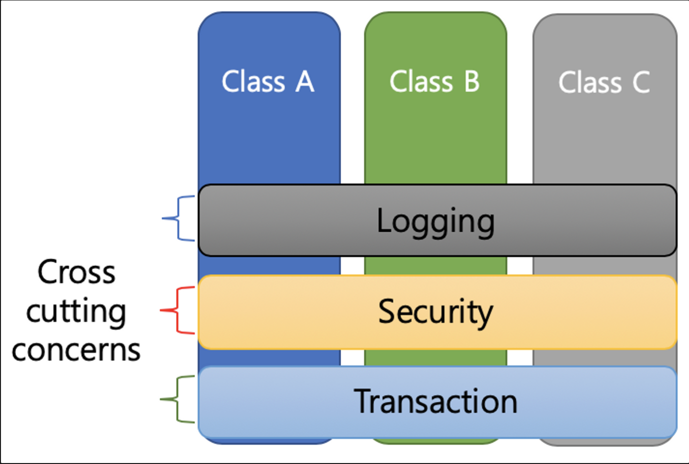

## IoC & DI & AOP & POJO

---

### IOC ( Inversion of Control, 제어의 역전 ) 이란?

`제어의 역전` 코드의 흐름을 제어하는 주체가 바뀌는 패턴을 말한다. 프레임워크를 사용하지 않는 경우 객체의 라이프 사이클 ( 생성, 초기화, 소멸, 호출 등 ) 을 개발자가 직접 관리해야 한다. `new` 키워드를 통해 직접 객체를 생성하고 로직을 구현해야 한다.

```java
// 직접 객체를 관리하며 코드를 제어

public class SampleA{

    private final SampleB sampleB;

    public Sample() {
        this.sampleB = new SampleB();
    }

    ...
}
```

반면, 스프링 프레임워크를 사용하면 개발자가 직접 객체를 제어하지 않고 `IoC 컨테이너`가 객체의 모든 생명주기를 관리한다. 이처럼 객체에 대한 제어권이 개발자에서 스프링 컨테이너로 역전되었기 때문에 흐름 제어의 권한이 바뀌었다고 해서 `제어의 역전` 이라고 부른다. 이를 통해 개발자는 구현 프로그램의 흐름을 고려할 필요없이 구현 로직에 보다 집중할 수 있다.

```java
// 프로그램의 흐름을 직접 제어하는 것이 아닌 외부에서 관리

public class SampleA{

    private final SampleB sampleB;

    @Autowired
    public SampleController(final SampleB sampleB) {
        this.sampleB = sampleB;
    }

    ...
}
```

<br>

### IoC 사용시 장점

- 의존성을 역전시켜 객체간의 결합도를 줄이고 변경에 유연한 코드를 작성할 수 있다.
- 애플리케이션을 지속가능하고 확장성 있게 만든다.
- `스프링 컨테이너`가 `Bean`을 관리해 주기 때문에 객체 관리 대신 비즈니스 로직에 더 집중해서 개발할 수 있다.

<br>

### IoC 를 구현하는 패턴

- Service Locator
- Factory
- Abstract Factory
- Strategy
- Template Method
- Dependency Injection

<br>

### IoC 와 DI

`IoC` 는 객체의 흐름 생명주기 관리 등 제 3자에게 역할과 책임을 위임하는 개념, 즉 원칙 중 하나이고 `DI`는 `IoC` 를 달성하는 디자인 패턴 중 하나로 좀 더 구체적인 행위라고 볼 수 있다.

<br>

### DI ( Dependency Injection, 의존성 주입) 이란?

`의존성 주입` 이란 클래스 사이의 의존관계를 `빈 설정정보`를 바탕으로 `스프링 컨테이너`가 자동으로 연결해주는 기능이다. `스프링 컨테이너` 는 클래스 의존관계를 직접 제어하며 `설정파일(.xml)` 이나 `어노테이션` 을 통해 객체간의 의존관계를 설정한다. 기존에는 필요로 하는 외부객체가 있으면 객체내부에서 직접 생성해서 사용했다면 `Spring DI`의 경우 `스프링 컨테이너`에서 객체를 생성해 의존관계를 설정(주입)해주기 때문에 객체내부에서 직접 객체를 생성하여 사용할 필요가 없다.

<br>

> **[ 빈 ( Bean ) 과 DI ( Dependency Injection ) ]** <br> > `Spring DI` 에서 제어하는 클래스를 `빈(Bean)` 이라고 부르며 `스프링 컨테이너` 실행 시 객체를 주입하기 때문에 `DI` 라고 부른다.

<br>

### DI 충족 조건

- 의존관계는 인터페이스로 추상화 해야 한다.
- 런타임 시점의 의존관계는 컨테이너나 팩토리 같은 제 3의 존재가 결정한다.
- 의존관게는 사용할 객체에 대한 레퍼런스를 외부에서 제공해줌으로써 만들어진다.

<br>

### DI 사용시 장점

- 모듈간 결합도가 낮아져 의존성이 줄어들고 변경에 유연해진다.
- 객체의 생명주기 등 의존관계를 스프링 컨테이너가 관리해준다.
- 가독성이 높아진다.
- 재 사용성이 높아진다.
- 테스트하기 좋은 코드가 된다.

<br>

### 객체 의존관계 설정방법

- `xml 파일`을 이용한 의존관계 설정
- `Annotation`을 이용한 의존관계 설정

<br>

### 의존성 주입 방법

**[ 생성자를 이용한 방법 ]**

- 생성자를 이용한 의존성 주입만 `final` 키워드를 사용해 객체가 생성될 때 한번만 값을 할당하기 때문에 객체의 불변성을 보장할 수 있다.
- `Spring 4.3` 버전부터 `@Autowired` 생략이 가능하다.
- `@RequiredArgsConstructor` 사용시 생성자를 생략해 코드 가독성을 향상시킬 수 있다.
- 가장 권장되는 `의존성 주입` 방법이다.

```java
public class SampleController{

    private final SampleRepository sampleRepository;

    @Autowired
    public SampleController(final SampleRepository sampleRepository) {
        this.sampleRepository = sampleRepository;
    }
    ...
}
```

**[ 필드에 `@Autowired` 추가하는 방법 ]**

- 가장 간단한 `의존성 주입` 방법이다.
- 참조관계를 눈으로 확인하기 어렵고 순환참조가 발생할 수 있다.
- 순환참조가 발생해도 프로그램이 실행되어 코드가 호출되기 전까지 `Error`가 발생하지 않는다.
- 생성자 이후에 호출되기 때문에 `final` 키워드를 사용할 수 없어 객체의 불변성을 보장할 수 없다.

```java
public class SampleController{

    @Autowired
    private SampleRepository sampleRepository;
    ...
}
```

[ `setter`를 이용한 방법 ]

- 생성자 이후에 호출되기 때문에 `final` 키워드를 사용할 수 없어 객체의 불변성을 보장할 수 없다.
- `setter` 를 이용한 수정자 주입의 경우 수정자를 통한 객체 변경의 위험이 존재한다.
- `Spring 3.X` 버전까지는 `DI` 권장 방식 이었지만 현재는 아니다.

```java
public class SampleController{

    private final SampleRepository sampleRepository;

    @Autowired
    public setSampleRepository(final SampleRepository sampleRepository) {
        this.SampleRepository = SampleRepository;
    }
    ...
}
```

<br>

### 세가지 DI 방식 중 가장 권장되는 방식은?

세가지 의존성 주입방법중 `@Autowired`  필드에 추가하는 방법이 제일 편리하지만, `생성자를 이용한 의존성 주입 방법`이 가장 권장된다.

**[ 생성자를 이용한 의존성 주입 방법을 지향해야 하는 이유 ]**

- 필드 주입과 수정자를 이용한 주입방식은 주입 받으려는 빈을 먼저 생성하거나 등록하고 어노테이션이 붙은 필드에 해당하는 빈을 찾아서 주입하는 방식이다. 즉, 빈을 먼저 생성하고 필드에 주입한다. 반면, 생성자를 이용한 주입 방식은 생성자로 객체를 생성하는 시점에 필요한 빈을 주입한다. 따라서, 생성자를 이용한 주입방식만 프로그램 실행 전 순환참조로 인한 문제를 발견할 수 있다. 따라서, 순환참조를 방지하기 위해서는 생성자를 이용한 주입방식을 사용하는 것이 좋다.
- 수정자를 이용한 주입방식을 이용할 경우 수정자를 통한 객체 변경의 위험이 존재한다.
- 대부분의 의존관계는 한번 설정되면 애플리케이션 종료 시점까지 불변해야 한다. 따라서, `final` 키워드를 사용해 객체가 생성될 때 한번만 값을 할당해 객체의 불변성을 보장할 수 있는 생성자를 이용한 의존성 주입 방법을 통해 불변성을 유지할 수 있도록 설계하는 것을 지향해야 한다.

<br>

### AOP ( Aspect Oriented Programming )

공통 ( 횡단 ) 관심사 ( `Cross-Cutting Concern` ) 의 분리를 허용함으로써 모듈성을 증가시키는 것이 목적인 프로그래밍 패러다임을 말한다. `OOP`로 독립적으로 분리하기 어려운 부가 기능을 모듈화하는 방식으로 어떤 로직을 기준으로 핵심적인 관점, 부가적인 관점 ( `Aspect` ) 으로 나누어 여러 객체에 공통으로 적용할 수 있는 기능을 분리하여 개발자는 반복 작업을 줄이고 핵심 기능 개발에만 집중할 수 있게 된다.



즉, 핵심 기능에 공통 기능을 삽입하며 핵심 기능의 코드를 수정하지 않고 공통 기능의 구현을 추가하는 것이 `AOP`의 기본 개념이라고 할 수 있다.

<br>

### POJO ( Plain Old Java Object )

`POJO` 란 객체 지향원리에 충실하고 환경과 기술에 종속되지 않으면서 필요에 따라 재활용 될 수 있는 방식으로 설계된 `Java Object`를 말한다. 이러한 `POJO` 에 애플리케이션의 핵심 로직과 기능을 담아 설계하고 개발하는 방법을 `POJO 프로그래밍`이라고 한다.

<br>

### POJO 조건

- 자바 언어와 관련된 스펙이나 규약 그리고 꼭 필요한 API 외에는 특정 규약에 종속되지 않아야 한다.
- 특정 기업의 프레임워크나 서버에서만 동작 가능한 코드라면 `POJO`라고 할 수 없다. `POJO` 는 환경에 독립적이어야 한다.
- 객체지향의 원리에 충실해야 한다.

<br>

### PSA ( Portable Service Abstraction )

환경의 변화와 관계없이 일관된 방식의 기술로의 접근 환경을 제공하려는 추상화 구조를 말한다.

조금 더 구체적으로 설명하자면 예를 들어 `@Transaction` 어노테이션을 선언하는 것 만으로 별도의 코드 추가 없이 트랜잭션 서비스를 사용할 수 있다. 하지만, `@Transaction` 내부적으로는 트랜잭션 코드가 추상화되어 숨겨져 있다. 이렇게 추상화 계층을 사용하여 어떤 기술을 내부에 숨기고 개발자에게 편의성을 제공하는 것을 `서비스 추상화` 라고 한다.

그리고 `서비스 추상화`로 제공되는 기술을 다른 기술 스택으로 간편하게 바꿀 수 있는 확장성을 가지고 있는 것을 `PSA` 라고 한다. 구체적인 예를 들어 살펴보면 `JDBC` 를 사용하는 `DataSourceTransactionManager` 를 `JPA`를 사용하는 `JPA TransactionManager` 로 그리고 `Hibernate` 를 사용하는 `HibernateTransactionManager`로 기존 코드는 변경하지 않은 상태로 `Transaction`을 실제로 처리하는 구현체를 사용기술에 따라 유연하게 변경하여 사용할 수 있다.

<br>

### [ Reference ]

[의존관계 주입(Dependency Injection) 쉽게 이해하기](https://tecoble.techcourse.co.kr/post/2021-04-27-dependency-injection/)

[[Spring DI/IoC] IoC? DI? 그게 뭔데?](https://velog.io/@ohzzi/Spring-DIIoC-IoC-DI-%EA%B7%B8%EA%B2%8C-%EB%AD%94%EB%8D%B0)

[생성자 주입을 @Autowired를 사용하는 필드 주입보다 권장하는 하는 이유](https://madplay.github.io/post/why-constructor-injection-is-better-than-field-injection)

[AOP 입문자를 위한 개념 이해하기](https://tecoble.techcourse.co.kr/post/2021-06-25-aop-transaction/)

[[10분 테코톡] 봄의 AOP와 SPRING AOP](https://www.youtube.com/watch?v=hjDSKhyYK14)

[[Spring] POJO란?](https://doing7.tistory.com/81)
