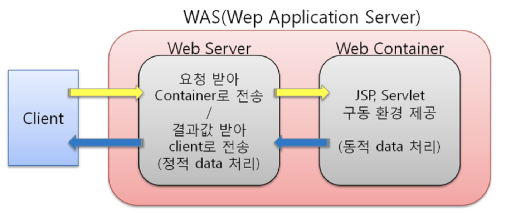
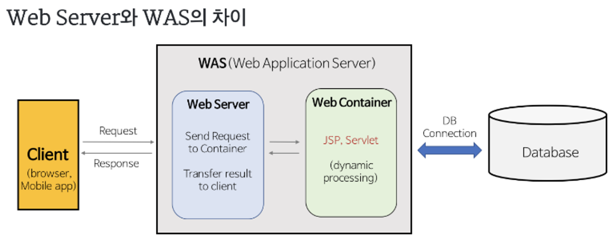

## WebServer & Web Application Server

---

### Web Server

웹 서버란 `HTTP` 프로토콜을 기반으로 클라이언트로 부터 요청을 받아 그에 해당하는 정적 콘텐츠를 제공하는 컴퓨터 프로그램 또는 웹 서버가 설치되어 있는 컴퓨터를 말한다. 이때 정적 콘텐츠는 `HTML`, `CSS`, `이미지` 등 즉시 응답가능한 자원을 말하며 개발자가 변경하지 않는이상 항상 동일하게 유지되는 자원을 말한다.

 

### Web Server 의 기능

- `WAS`를 거치지 않고 바로 정적 컨텐츠를 클라이언트에게 제공
- 동적 콘텐츠 제공을 위해 클라이언트의 요청을 `WAS`에 전달하고 `WAS`가 처리한 결과 ( 응답 ) 를 클라이언트에게 전달한다.

 

### Web Server 종류

- `NginX`
- `Apache Server`
- `IIS ( Window 전용 Web Server )`

 

### Web Application Server

웹 서버와 웹 컨테이너의 기능을 모두 수행하는 프로그램으로 웹 서버가 클라이언트로부터 동적 콘텐츠에 대한 요청을 받을 경우 해당 요청을 전달받아 `DB` 조회 또는 비즈니스 로직 처리 등의 작업을 수행하여 클라이언트에게 동적 컨텐츠를 제공하는 역할을 한다.

 

### Web Application Server 기능

- `WAS = Web Server + Web Container`
- `WAS` 는 웹 컨테이너 혹은 서블릿 컨테이너라고 부르는데 웹 컨테이너는 `JSP` 와 `Servlet` 을 실행시킬 수 있는 구동환경을 제공한다. 즉, 웹 애플리케이션이 배포되는 공간을 말한다.
- `JSP`, `ASP`, `PHP` 와 같은 다양한 언어들을 사용해 동적인 페이지를 생성가능하다. 즉, 여러 웹 애플리케이션의 서비스가 가능하다.

 

### Web Application Server 종류

- `Tomcat`
- `JBoss`
- `Jeus`

 

### Web Server 와 Web Application Server 를 함께 사용하는 이유

- 웹 서버를 통해 정적인 파일들을 `WAS` 까지 가지 않고 앞단에서 빠르게 처리할 수 있다.
- 비즈니스 로직같은 동적인 처리가 필요하면 `WAS`에 위임한다.
- `WAS` 는 기본적으로 애플리케이션 로직을 사용해 동적 페이지를 제공하기 위해 최적화 되어있는 서버이다.
- `Web Server` 와 `Web Application Server` 를 함께 사용하여 효율적인 리소스 처리가 가능해진다. 정적 리소스 요청 증가시 `Web Server` 만 증설할 수 있으며 동적 리소스 요청 증가시 `Web Application Server` 만 증설하여 서버를 안정적으로 관리할 수 있다.

 

### **Web Server와** Web Application Server**를 구분함으로써 얻는 이점**

- WAS 가 웹 서버의 기능을 포함하기 때문에 모든 역할을 혼자 수행할 수 있지만 감당해야 하는 작업이 많아지게 된다. 따라서 기능을 분리하여 각 서버가 담당하는 작업을 줄여 서버 부하 방지하기 위해 서버를 분리한다.
- WAS 에는 웹 애플리케이션이 배포되어 있기 때문에 외부와 직접 연결되어 있다면 중요한 설정이나 파일이 외부로 노출될 위험이 있다. 따라서, 웹 서버를 앞에 위치시켜 물리적으로 분리하여 리소스에 대한 보안을 강화할 수 있다.
- 웹 서버에 여러대의 WAS를 연결 할 수 있다. 로드 밸런싱을 통해 부하를 분산할 수 있으며 무중단 운영을 통해 장애에 쉽게 대응할 수 있다.
- 하나의 서버에서 PHP 애플리케이션과 Java 애플리케이션 등 여러 웹 애플리케이션이 서비스 가능하다.
