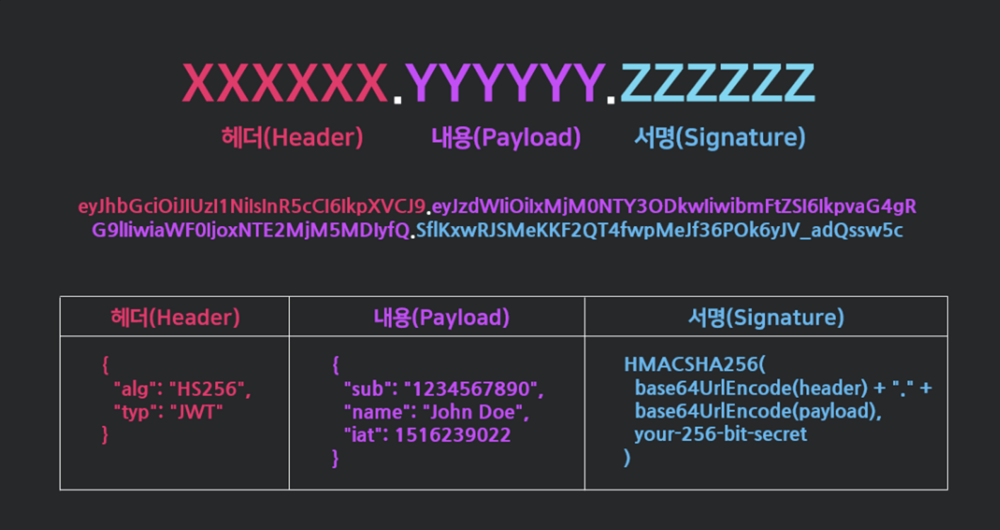
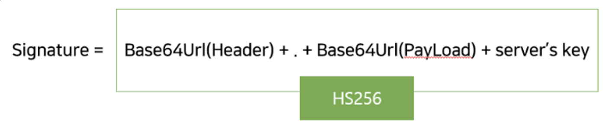
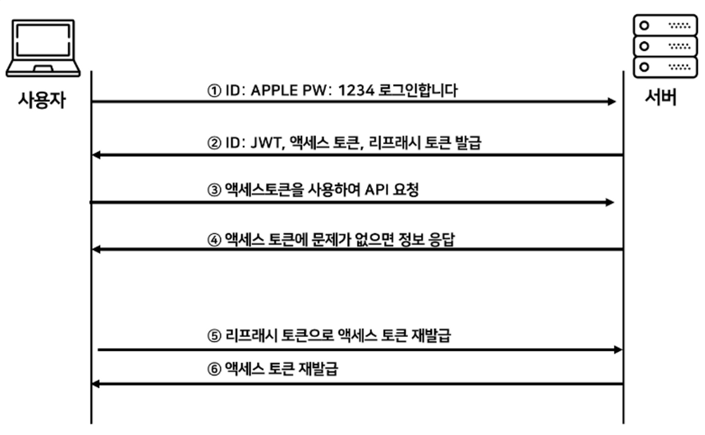
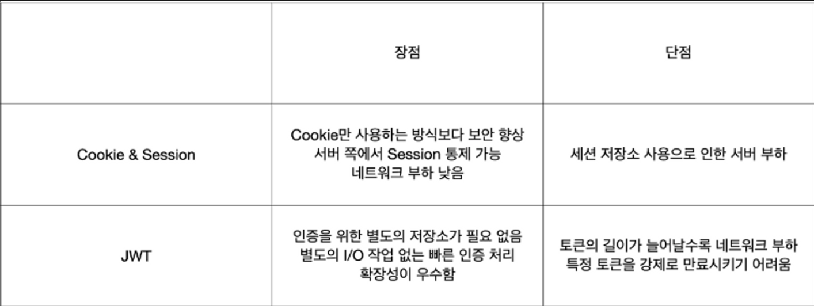

## 인증 & 인가 ( 쿠키 vs 세션 vs 토큰 )

---

### 인증 방식 종류

보통 서버가 클라이언트 인증을 확인하는 방법은 대표적으로 `쿠키`, `세션`, `토큰` 이용하는 3가지 방식이 있다.

<br>

### 쿠키 ( Cookie )

쿠키란 사용자의 웹 브라우저에 저장하는 작은 데이터 기록 파일로 `key-value` 형식의 문자열로 구성된다. 서버는 클라이언트의 사용자 정보를 웹 브라우저에 저장하기 위한 목적으로 쿠키를 사용하는데 이는 `HTTP 프로토콜`은 `비연결` 그리고 `무상태` 특성 때문이다. 이런 특성으로 인해 서버는 클라이언트를 매 연결시 확인해야 하는 비효율적인 상황이 발생한다. 따라서 이 특징을 보완하기 위한 방법중 하나가 쿠키를 사용한다. 클라이언트의 상태 정보를 담은 쿠키를 통해 사용자의 웹 브라우저에 를 저장하면 이후의 요청은 사용자가 별도로 요청하지 않아도 브라우저가 요청시에 `Request Header` 에 담아 자동으로 서버에 전송한다.

쿠키는 사용자 인증이 유효한 시간을 명시할 수 있으며 유효 시간이 정해지면 브라우저가 종료 되어도 클라이언트에 쿠키를 보관하고 있어 인증을 유지할 수 있다는 특징을 가지고 있으며 최대 `4KB`까지 데이터를 저장할 수 있다.

<br>

### 쿠키의 인증방식

1. 클라이언트 ( 브라우저 ) 가 서버에 요청 ( 접속 ) 을 보낸다.
2. 서버는 클라이언트의 요청에 대한 응답을 작성할 때 클라이언트 측에 저장하고 싶은 정보를 응답헤더의 `Set-Cookie` 에 담는다. ( 쿠키 생성 & 쿠키 전달 )
3. 이후 해당 클라이언트는 요청을 보낼 때마다, 매번 저장된 쿠키를 요청 헤더에 담아 보낸다. 서버는 쿠키에 담긴 정보를 바탕으로 해당 요청의 클라이언트를 식별하는 등의 작업을 수행한다.

<br>

### 쿠키 방식의 단점

- 쿠키는 용량제한이 있어 많은 정보를 담을 수 없다.
- 웹 브라우저 마다 쿠키에 대한 지원 형태가 다르기 때문에 브라우저간 공유가 불가능하다.
- 쿠키의 사이즈가 커질수록 요청시 보내야하는 데이터의 크기가 증가하기 때문에 네트워크 부하가 심해지다.
- 쿠키의 데이터가 클라이언트 측에서 파일 형태로 관리되기 때문에 유출 및 조작 당할 위험이 존재해 보안에 취약하다. 따라서, 중요한 데이터를 저장하면 안된다. )

<br>

### 쿠키 특징

- `HTTPS` 통신일 경우에만 쿠키를 전송할 수 있다.
- 쿠키는 서버의 응답헤더에서 설정 할 수 있지만 자바스크립트에서도 `document.cookie`로 접근하여 조회 및 수정이 가능하다. 하지만, `HttpOnly` 속성을 `true`로 설정하면 자바 스크립트에서 쿠키의 값을 변경하거나 조회할 수 없다.
- 쿠키는 만료기한을 설정할 수 있으며 만료일이 지날경우 삭제된다.

<br>

### 쿠키 사용 예시

- 로그인 기능
- 쇼핑몰의 장바구니 기능

<br>

### 세션 ( Session )

세션이란 브라우저에서 웹 서버에 접속한 시점부터 브라우저를 종료하여 연결을 끝내는 시점까지의 기간동안 일련의 요청을 하나의 상태로 간주하고 그 상태를 유지하는 기술을 말한다. 세션은 쿠키를 사용하기는 하지만 사용자 정보를 브라우저에 저장하는 쿠키와 달리 서버측에서 사용자 정보를 관리한다.

클라이언트를 구분하기 위해 `세션ID`를 부여하며 웹 브라우저가 서버에 접속해서 브라우저를 종료할 때까지 인증상태를 유지한다. 사용자 정보를 서버에서 보관하기 때문에 쿠키와 비교하여 보안적인 측면에서 강점이 있지만 사용자가 많아질수록 서버 메모리를 많이 차지하게 된다. 이로 인해 서버에 과부하를 주게되어 성능 저하의 요인이 되기도 한다.

<br>

### 세션 인증 방식

1. 클라이언트가 서버에 접속시 세션이 서버 메모리 ( 혹은 데이터베이스 ) 상에 저장된다. 이때, 세션을 식별하기 위한 `세션ID`를 기준으로 사용자 정보를 저장한다.
2. 서버에서 클라이언트 ( 브라우저 ) 의 쿠키에 `세션ID` 를 저장한다.
3. 쿠키에 정보가 담겨있기 때문에 브라우저는 해당 사이트에 대한 모든 요청에 `세션ID` 를 쿠키에 담아 전송한다.
4. 서버는 클라이언트가 보낸 `세션ID` 와 서버 메모리로 관리하고 있는 `세션ID` 를 비교하여 인증을 수행한다.

<br>

### 세션의 단점

- 서버에 세션 저장소를 사용하므로 요청이 많아지면 서버에 부하가 심해진다.
- 쿠키를 포함한 요청이 외부에 노출되더라도 `세션ID` 자체는 유의미한 개인정보를 담고 있지 않다. 하지만 세션ID 자체를 탈취당할 경우 클라이언트로 위장할 수 있다는 한계가 존재한다.

<br>

### 세션 특징

- 서버에 세션 객체를 생성하고 각 클라이언트마다 고유한 `세션ID` 값을 부여한다.
- `세션ID` 값을 클라이언트에게 전송할 때 쿠키를 사용한다.
- 웹 브라우저가 종료되면 세션쿠키는 삭제된다.
- 사용자가 많아질수록 서버 메모리를 많이 차지하게 된다. ( 서버 메모리에만 저장하는 것은 아니고 서버의 로컬 파일이나 데이터베이스에 저장하기도 한다. )

<br>

### 세션 사용 예시

- 로그인같은 보안상 중요한 작업을 수행할 경우

<br>

### 쿠키와 세션의 차이

- 쿠키와 세션은 사용자 정보의 저장 위치가 다르다. 쿠키는 클라이언트에 사용자 정보를 저장하기 때문에 서버의 자원을 사용하지 않지만 세션은 서버에 사용자 정보를 저장하기 때문에 서버의 자원을 사용한다.
- 사용자 정보의 보관측면에서도 차이가 있다. 쿠키는 만료시간을 설정해 파일로 저장되기 때문에 브라우저를 종료해도 계속해서 정보가 남아 있을 수 있다. 세션도 만료시간을 설정할 수 있지만 브라우저가 종료되면 만료시간에 상관없이 삭제된다.
- 속도 측면에서는 세션이 쿠키에 비해 빠르다. 그 이유는 쿠키는 클라이언트 로컬환경에 사용자 정보가 저장되기 때문에 서버 요청시에 별도의 처리가 필요하지 않아 속도가 빠르다. 하지만, 세션은 사용자 정보가 저장되어 있기 때문에 서버의 처리가 필요하기 때문에 쿠키에 비해 상대적으로 속도가 느리다.
- 보안 측면에서 세션이 쿠키보다 우수한데 그 이유는 쿠키는 클라이언트 로컬에 저장하기 때문에 데이터가 유출되거나 변질될 우려가 있어 보안에 취약하지만 세션은 쿠키를 이용해서 `세션ID` 만 저장하고 `세션ID` 로 클라이언트를 구분해서 서버에서 처리하기 때문에 비교적 보안이 뛰어나다.

<br>

### 세션보다 쿠키를 사용하는 이유는?

세션은 서버의 자원을 사용하기 때문에 클라이언트의 증가로 인한 무분별한 세션의 생성은 서버의 메모리에 부담을 주게 되어 서버에 과부하가 걸릴 수 있다.

<br>

### 서버(세션) 기반 인증 시스템

서버의 세션을 사용해 사용자 인증을 하는 방법으로 서버측에서 사용자의 인증정보를 관리하는 것을 의미한다. 따라서 클라이언트로부터 요청을 받으면 클라이언트의 상태를 계속해서 유지해놓고 사용한다. ( `Stateful` ) 이는 사용자가 증가함에 따라 성능의 문제를 일으킬 수 있으며 확장성이 어렵다는 단점을 지닌다.

<br>

### 토큰 기반 인증 시스템

서버 기반의 인증 시스템의 단점을 보완할 수 있는 시스템이다. 인증받은 사용자에게 토큰을 발급하고, 로그인이 필요한 작업일 경우 헤더에 토큰을 함께 보내 인증받은 사용자인지 확인한다. 이는 서버 기반 인증 시스템과 달리 상태를 유지하지 않으므로 `Stateless` 한 특징을 가지고 있다.

<br>

### Token 인증

토큰 기반 인증 시스템은 클라이언트가 서버에 접속하면 서버에서 해당 클라이언트에게 인증되었다는 의미로 토큰을 부여한다. 이 토큰은 유일하며 토큰을 발급받은 클라이언트는 또 다시 서버에 요청을 보낼 때 요청 헤더에 토큰을 담아서 보낸다. 그러면 서버에서는 클라이언트로부터 받은 토큰을 서버에서 제공한 토큰과 헤더의 일치 여부를 체크하여 인증 과정을 처리하게 된다.

기존의 세션기반 인증은 서버가 파일이나 데이터베이스에 세션정보를 가지고 있어야 하고 이를 조회하는 과정이 필요하기 때문에 많은 오버헤드가 발생한다. 하지만 토큰은 세션과는 달리 서버가 아닌 클라이언트에 저장되기 때문에 메모리나 스토리지 등을 통해 세션을 관리했던 서버의 부담을 덜 수 있다. 토큰 자체에 데이터가 들어있기 때문에 서버는 클라이언트에서 토큰을 받아 위조되었는지 판별만 하면 되기 때문에다.

토큰은 앱과 서버가 통신 및 인증할 때 가장 많이 사용된다. 왜냐하면 웹이는 쿠키와 세션이 있지만 앱에는 없기 때문이다.

<br>

### 토큰 인증방식

1. 사용자가 아이디와 비밀번호로 로그인한다.
2. 서버 측에서 사용자 ( 클라이언트 ) 에게 토큰을 발급한다.
3. 클라이언트는 서버 측에서 전달받은 토큰을 쿠키나 스토리에 저장해 두고, 서버에 요청을 할 때마다 해당 토큰을 HTTP 요청 헤더에 포함시켜 전달한다.
4. 서버는 전달받은 토큰을 검증하고 요청에 응답한다. 토큰에는 요청한 사람의 정보가 담겨있기에 서버는 데이터베이스를 조회하지 않고 누가 요청하는지 알 수 있다.

<br>

### 토큰 방식의 단점

- 쿠키나 세션과 달리 토큰 자체의 데이터 길이가 길어 인증 요청이 많아질수록 네트워크 부하가 심해질 수 있다.
- `Payload` 자체는 암호화되지 않기 때문에 유저의 중요한 정보는 담을 수 없다.
- 토큰을 탈취당할경우 대처가 어렵다. ( 토큰의 유효기간을 설정하는 식으로 해결 )

<br>

### JWT ( Json Web Token )

`JWT` 는 인증에 필요한 정보들을 암호화 시킨 JSON 토큰을 의미한다. `JWT` 는 `JSON` 데이터를 `Base64 URL-safe Encode` 를 통해 인코딩하여 직렬화한 것이며, 토큰 내부에는 위변조 방지를 위해 개인키를 통한 전자서명도 들어가 있다. 따라서, 사용자가 JWT 를 서버로 전송하면 서버는 서명을 검증하는 과정을 거치게 되며 검증이 완료되면 요청한 응답을 돌려준다.

<br>

### JWT 구조

`JWT` 는 `.` 을 구분자로 나누어지는 세가지 문자열의 조합이다. `.` 을 기준으로 좌측부터 `Header`, `Payload`, `Signature` 를 의미한다.



`Header` 에는 `JWT` 에서 사용할 `타입`과 `해시 알고리즘`의 종류가 담겨 있으며, `Payload` 는 서버에서 저장한 `사용자 권한 정보`와 `데이터`가 담겨있다. 마지막으로 `Signature`에는 `Header`, `Payload` 를 `Base64` 로 인코딩한 이후 `Header` 에 명시된 해시함수를 적용하고, 개인키로 서명한 `전자서명`이 담겨있다.

`Header`와 `Payload` 는 단순히 인코딩된 값이기 때문에 제 3자가 복호화 및 조작할 수 있지만, `Signature`는 서버 측에서 관리하는 비밀키가 유출되지 않는 이상 복호화할 수 없다. 따라서 `Signature`는 `토큰의 위변조 여부를 확인`하는데 사용된다.

<br>

### JWT - Header

- `alg` : 서명 암호화 알고리즘 ( ex : SHA256, RSA 등 )
- `typ` : 토큰 유형

```json
{
  "alg": "HS256",
  "typ": "JWT"
}
```

<br>

### JWT - Payload

토큰에서 사용할 정보의 조각들인 `Claim` 이 담겨있다. ( 실제 `JWT` 를 통해서 알 수 있는 데이터 )

즉, 서버와 클라이언트가 주고받는 시스템에서 실제로 사용될 정보에 대한 내용을 담고 있는 부분이다.

> [ `Claim` ] <br>
> key-value 형식으로 이루어진 한 쌍의 저보를 `Claim` 이라고 한다.

```json
{
  "sub": "1234567890",
  "name": "Jermoe",
  "iat": "1516239022"
}
```

페이로드는 정해진 데이터 타입은 없지만 대표적으로 `Registered claims`, `Public claims`, `Private claims` 이렇게 세 가지로 나뉜다.

[ `Registered claims` ]

미리 정의된 클래임을 말한다.

- `iss(issuer; 발행자)`
- `exp(expireation time; 만료 시간)`
- `sub(subject; 제목)`
- `iat(issued At; 발행 시간)`
- `jti(JWI ID)`

[ `Public claims` ]

사용자가 정의할 수 있는 클레임 공개용 정보 전달을 위해 사용한다.

[ `Private claims` ]

해당하는 당사자들 간에 정보를 공유하기 위해 만들어진 사용자 지정 클레임이다. 외부에 공개되어도 상관없지만 해당 유저를 특정할 수 있는 정보들을 담는다.

<br>

### Signature

시그니처에서 사용하는 알고리즘은 헤더에서 정의한 알고리즘 방식 ( `alg` ) 을 활용한다. 시그니처의 구조는 ( `헤더 + 페이로드` ) 와 서버가 갖고 있는 유일한 `key` 값을 합친 것을 헤더에서 정의한 알고리즘으로 암호화를 한다.



<br>

### JWT를 이용한 인증과정 ( Access Token + Refresh Token )



1. 사용자가 서버에 로그인 인증을 요청한다.
2. 서버에서 클라이언트로부터 인증 요청을 받으면 Header, Payload, Signature를 정의하고 각각 Base64로 암호화하여 JWT를 생성하고 쿠키에 담아 클라이언트에게 발급한다.
3. 클라이언트는 서버로부터 받은 JWT를 저장한다. ( 쿠키, 로컬 스토리지 등 ) 이후 API를 서버에 요청할 때 Authorization header 에 Access Token 을 담아서 보낸다.
4. 서버가 할 일은 클라이언트가 Header에 담아 보낸 JWT가 내 서버에서 발행한 토큰인지 일치 여부를 확인하여 일치한다면 인증을 통과시키고 아니라면 통과시키지 않ㅇ는다. 인증이 통과되었다면 Payload 에 들어있는 유저의 정보를 조회하여 클라이언트에게 반환한다.
5. 클라이언트가 서버에 요청했는데 만약 액세스 토큰의 기간이 만료되면 클라이언트는 리프레시 토큰을 이용해서 서버로부터 새로운 액세스 토큰을 발급받는다.

<br>

### 토큰 인증이 신뢰성을 가지는 이유

토큰을 탈취당하여 토큰내의 데이터가 임의로 조작되어도 서버에서 유효성검사를 통해 토큰의 조작여부를 파악할 수 있다. 서버는 토큰내의 정보가 중요한것이 아니라 해당 토큰이 유효한 토큰인지 확인하는 것이 중요하다. 따라서, 클라이언트로부터 받은 `JWT`의 헤더, `페이로드를` 서버의 `key` 값을 이용해 시그니처를 다시 만들고 이를 비교하며 일치했을 경우 인증을 통과시킨다.

> **[ JWT 는 서명(인증)이 목적이다. ]** <br> `JWT`는 `Base64`로 암호화하기 때문에 디버거를 사용해서 `JWT`를 복호화 할 수 있다. 이럴 경우 사용자의 데이터를 담은 `Payload`는 그대로 노출된다. 그래서 `Payload`에는 비밀번호같은 민감한 정보는 저장하지 않아야 한다.
> 비록, 데이터가 쉽게 유출될 수 있지만 `JWT`의 진짜 목적은 정보 보호가 아닌 위조 방지이다. 서버의 비밀키가 노출되지 않는 이상 데이터를 위조해도 시그니처 부분에서 이를 감지할 수 있다.

<br>

### JWT 장단점



<br>

### JWT 장단점

**[장점]**

- `Header`와 `Payload`를 가지고 `Signature`를 생성하므로 데이터 위변조를 막을 수 있다.
- 인증 정보에 대한 별도의 저장소가 필요없다.
- `JWT`는 토큰에 대한 기본 정보와 전달할 정보 및 토큰이 검증되었음을 증명하는 서명 등 필요한 모든 정보를 자체적으로 지니고 있다.
- 클라이언트 인증 정보를 저장하는 세션과 다르게, 서버가 `무상태(Stateless)`가 되어 서버 확장성이 우수해질 수 있다.
- 토큰 기반으로 다른 로그인 시스템에 접근 및 권한 공유가 가능하다. ( 쿠키와 차이 )
- `OAuth`의 경우 소셜 계정을 이용해 다른 웹서비스에서도 로그인이 가능하다.
- 모바일 어플리케이션 환경에서 동작이 가능하다. ( 모바일은 세션 사용 불가능 )

**[단점]**

- 토큰 자체에 정보를 담고있기 때문에 보안적인 측면에서 위험성이 존재한다.
- 토큰의 `Payload` 에 3종류의 클레임을 저장하기 때문에, 정보가 많아질수록 토큰의 길이가 늘어나 네트워크에 부하를 줄 수 있다.
- `Payload` 는 암호화 된 것이 아니라 `Base64`로 인코딩 된 것이기 때문에 탈취당할 경우 디코딩하여 데이터를 확인할 수 있어 중요 데이터를 넣지 않는것이 좋다.
- 서버는 `Stateless` 특징을 가지기 때문에 토큰은 클라이언트 측에서 관리하고 저장한다. 따라서 토큰 자체를 탈취당하면 대처하기가 어렵게 된다.

<br>

### AccessToken & RefreshToken

`JWT` 3자에게 탈취의 위험성이 있기 때문에 `AccessToken` 그리고 `RefreshToken` 으로 이중으로 나누어 인증을 하는 방식을 취한다. 두 토큰은 단지 어디에 저장되고 관리하느냐에 따른 사용 차이만 있을 뿐이다.

`AccessToken` 은 클라이언트가 가지고 있는 실제로 유저의 정보를 저장하는 토큰으로 클라이언트에서 요청이 오면 서버에서 해당 토큰에 있는 정보를 활용하여 사용자 정보에 맞게 응답을 진행한다.

`RefreshToken` 은 새로운 `AccessToken` 을 발급해주기 위해 사용하는 토큰으로 짧은 수명을 가지는 `AccessToken` 에게 새로운 토큰을 발급해주기위해 사용한다. 해당 토큰은 보통 데이터베이스에 유저 정보와 함께 기록한다.

정리하자면, `AccessToken` 은 접근에 관여하는 토큰, `RefreshToken` 은 재발급에 관여하는 토큰이라고 정리할 수 있다.

> **[ AccessToken & RefreshToken 함께 사용하는 이유 ]** <br> `JWT` 인증 방식을 `AccessToken` 만을 이용하면 탈취될 경우 토큰을 획득한 사람은 누구나 권한 접근이 가능해지는 문제가 있다. 따라서 토큰의 유효시간을 부여하여 탈취 문제에 대응하기도 하지만 유효 기간이 짧을경우 사용자는 로그인을 자주해야 하는 번거로움이 있다. 따라서 이러한 문제를 해결하기 위해 `RefreshToken`이라는 추가적인 토큰을 활용하여 보안을 강화한다.

<br>

### 클라이언트에서 AccessToken의 저장위치는 어디가 좋을까?

웹 브라우저에서 무언가를 저장하기 위해서 사용하는 공간은 크게 쿠키와 웹 스토리지로 나눌 수 있고 웹 스토리지는 다시 세션 스토리지와 로컬 스토리지로 나눌 수 있다.

세션 스토리지는 세션이 종료되면 저장되어 있던 데이터가 모두 삭제된다는 특징이 있다. 또한, 서버에서 접근할 수 없기 때문에 클라이언트에서 스토리지의 값을 꺼내서 서버에 전달해 주어야 한다.

로컬 스토리지는 반 영구적으로 데이터 저장이 가능하다. 하지만 세션 스토리지처럼 서버에서 접근이 불가능해 클라이언트에서 값을 꺼내 서버에 전달해주어야 한다.

로컬 스토리지로 구분할 수 있는 웹 스토리지에 저장된 값은 자바스크립트 코드를 통해 접근이 가능하다. 이는 웹 사이트에 악의적인 스크립트를 넣어 의도하지 않은 동작을 발생시키는 XSS 공격에 취약하다.

반면 쿠키는 `HttpOnly` 속성을 통해 자바크립트를 통한 접근을 막을 수 있다. 물론 그렇다고 해서 XSS 공격에 완전히 안전하지는 않지만 상대적으로 웹 스토리지만큼 취약하지는 않다. 또한, 쿠키는 `sameSite 플래그`와 `anti-CRSF token` 을 사용하여 `CSRF` 공격문제를 해결할 수 있다. 따라서, 보안적인 측면을 생각한다면 쿠키에 저장하는 것이 좋은 방법이 될 수 있다.

<br>

### 로컬 스토리지보다 쿠키가 더 좋은 이유

`cookies`가 취약점이 여전히 존재함에도 불구하고 `localStorage` 보다 더 선호되는 이유는 아래와 같다.

- 쿠키의 `HttpOnly` 속성을 사용하면 쿠키가 공격자가 접근하기 조금 더 어려워진다.
- 쿠키는 CSRF 공격에 취약하지만 `sameSite 플래그`와 `anti-CRSF token` 을 사용하여 어느정도 예방이 가능하다.
- `Authorization: Bearer header`를 사용해야 하거나 `JWT` 크기가 `4KB`보다 큰 경우에도 작동 가능하게 할 수 있다.

<br>

### [ Reference ]

[🌐 JWT 토큰 인증 이란? (쿠키 vs 세션 vs 토큰)](https://inpa.tistory.com/entry/WEB-%F0%9F%93%9A-JWTjson-web-token-%EB%9E%80-%F0%9F%92%AF-%EC%A0%95%EB%A6%AC)

[쿠키와 세션 개념](https://interconnection.tistory.com/74)

[🌐 Access Token & Refresh Token 원리](https://inpa.tistory.com/entry/WEB-%F0%9F%93%9A-Access-Token-Refresh-Token-%EC%9B%90%EB%A6%AC-feat-JWT)

[LocalStorage vs. Cookies: JWT 토큰을 안전하게 저장하기 위해 알아야할 모든것](https://hshine1226.medium.com/localstorage-vs-cookies-jwt-%ED%86%A0%ED%81%B0%EC%9D%84-%EC%95%88%EC%A0%84%ED%95%98%EA%B2%8C-%EC%A0%80%EC%9E%A5%ED%95%98%EA%B8%B0-%EC%9C%84%ED%95%B4-%EC%95%8C%EC%95%84%EC%95%BC%ED%95%A0-%EB%AA%A8%EB%93%A0%EA%B2%83-4fb7fb41327c)
